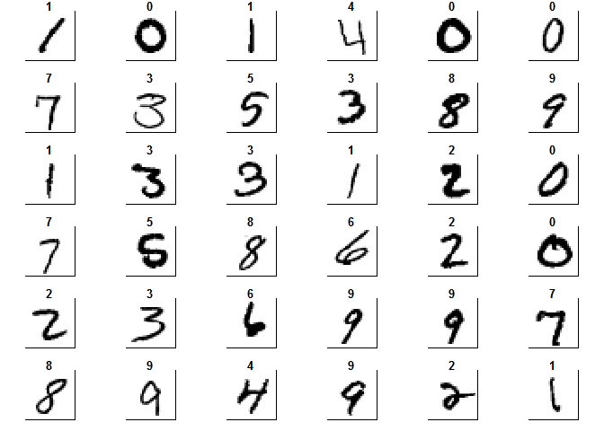
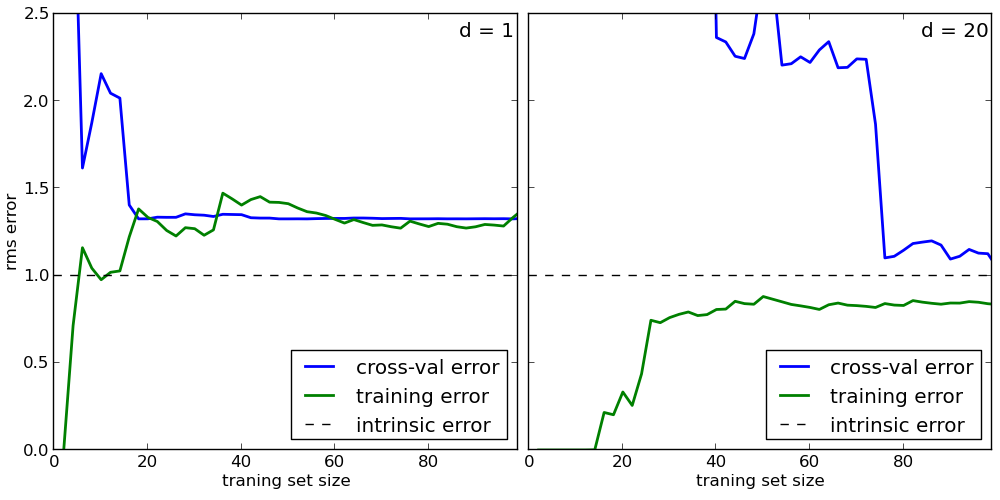
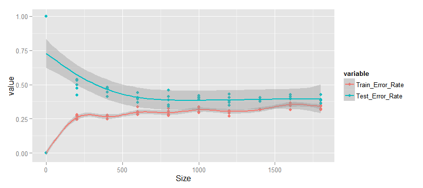
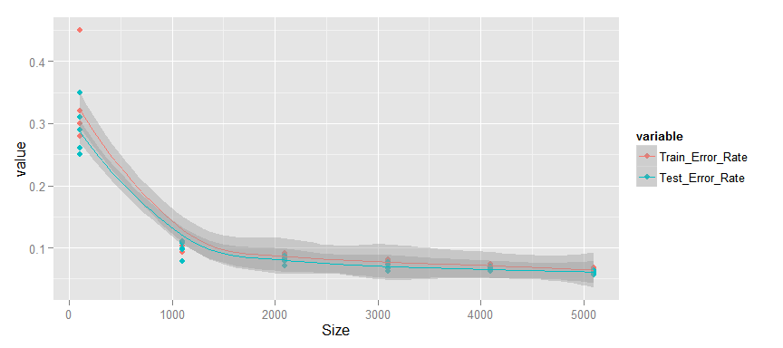
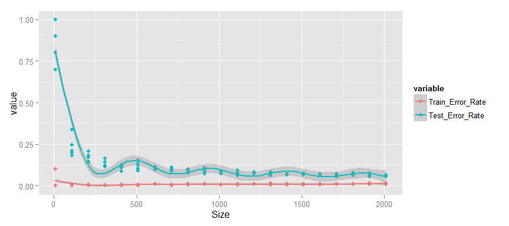

# Исследование зависимости показателя качества предсказательной модели от размера обучающей выборки
Морозов Глеб  
20 августа 2015 г.  


Данная работа исследует влияние размера обучающей выборки на качество предсказательной модели на примере данных представленных в рамках соревнования [Digit Recognizer](https://www.kaggle.com/c/digit-recognizer) проводимого на сайте [Kaggle](https://www.kaggle.com). В качестве инструмента проведения исследования используется язык R.

### Вступление
В процессе работы над анализом данных встречаются ситуации, когда размер выборки доступной для исследования является препятствием. С таким примером я встретился при участии в соревновании [Digit Recognizer](https://www.kaggle.com/c/digit-recognizer) проводимого на сайте [Kaggle](https://www.kaggle.com). В качестве объекта соревнования выбрана база изображений вручную написанных цифр - [The MNIST database of handwritten digits](http://yann.lecun.com/exdb/mnist/). Изображения были отцентрованы и приведены к одинаковому размеру. В качестве обучающей выборки предлагается выборка состоящая из 42000 таких цифр. Каждая цифра разложена в строку из 784 признаков, значение в каждом является его яркостью.

Для начала, загрузим полную тренировочную выборку в R.


```r
library(readr)
require(magrittr)
require(dplyr)
require(caret)
data_train <- read_csv("train.csv")
```

Теперь, для получения представления о предоставленных данных, изобразим цифры в привычном для человеческого глаза виде.


```r
colors<-c('white','black')
cus_col<-colorRampPalette(colors=colors)

default_par <- par()
par(mfrow=c(6,6),pty='s',mar=c(1,1,1,1),xaxt='n',yaxt='n')

for(i in 1:36)
{
        z<-array(as.matrix(data_train)[i,-1],dim=c(28,28))
        z<-z[,28:1] 
        image(1:28,1:28,z,main=data_train[i,1],col=cus_col(256))
}
```

 

```r
par(default_par)
```

Дальше можно было бы приступить к построению различных моделей, выбору параметров и т.д. Но, давайте посмотрим на данные. 42000 объектов и 784 признака. При попытке построения более комплексных моделей, таких как Random Forest или Support Vector Machine я получил ошибку о нехватке памяти, а обучение даже на небольшой части от полной выборки уже происходит далеко не минуты. Один из вариантов борьбы с этим - это использование существенно более мощной машины для вычисления, либо создание кластеров из нескольких компьтеров. Но в данной работе я решил исследовать, как влияет на качество модели использование для обучение части от всех предоставленных данных.

### теория обучающей кривой.

В качестве инструмента для исследования я использую Learning Curve или обучающую кривую, которая представляет собой график, состоящий из зависимости средней ошибки модели на данных использованных для обучения и зависимости средней ошибки на тестовых данных. В теории существуют два основных варианта, которые получатся при построении данного графика.



Первый вариант - когда модель недообучена или имеет высокое смещение (High bias). Основной признак такой ситуации - это высокая средняя ошибка как для тренировочных данных так и для тестовых. В этом случае привлечение дополнительных данных не улучшит качество модели.
Второй вариант - когда модель переобучена или имеет большую вариативность (High variance). Визуально можно определить по наличию большого разрыва между тестовой и тренировочной кривыми и низкой тренировочной ошибкой. Тут наоборот больше данных может привести к улучшению тестовой ошибки и, соответственно, к улучшению модели.

### Обработка данных

Разобъём выборку на тренировочную и тестовую в соотношении 60/40.


```r
data_train$label <- as.factor(data_train$label)
set.seed(111)
split <- createDataPartition(data_train$label, p = 0.6, list = FALSE)
train <- slice(data_train, split)
test <- slice(data_train, -split)
```

Если посмотреть на изображения цифр, приведённые выше, то можно увидеть, что, т.к. они отцентрованы, то по краям много пространства, на котором никогда не бывает самой цифры. То есть, в данных эта особенность будет выражена в признаках, которые имеют постоянное значение для всех объектов. Во-первых, такие признаки не несут никакой информации для модели и, во-вторых, для многих моделей, за исключением основанных на деревьях, могут приводить к ошибкам при обучении. Поэтому, можно удалить эти признаки из данных.


```r
zero_var_col <- nearZeroVar(train, saveMetrics = T)
sum(zero_var_col$nzv)
```

```
## [1] 532
```

```r
train_nzv <- train[, !zero_var_col$nzv]
test_nzv <- test[, !zero_var_col$nzv]
```

Таких признаков оказалось 532 из 784. Чтобы проверить как повлияло это существенное изменение на качество моделей, проведём обучение простой CART модели (на которую не должно отрицательно влиять наличие постоянных признаков) на данных до изменения и после. В качестве оценки приведено средний процент ошибки на тестовых данных.


```r
library(rpart)
model_tree <- rpart(label ~ ., data = train, method="class" )
predict_data_test <- predict(model_tree, newdata = test, type = "class")
sum(test$label != predict_data_test)/nrow(test)
```

```
## [1] 0.383507
```


```r
model_tree_nzv <- rpart(label ~ ., data = train_nzv, method="class" )
predict_data_test_nzv <- predict(model_tree_nzv, newdata = test_nzv, type = "class")
sum(test_nzv$label != predict_data_test_nzv)/nrow(test_nzv)
```

```
## [1] 0.3838642
```

Т.к. изменения затронули сотую часть процента, то можно в дальнейшем использовать данные с удалёнными признаками


```r
train <- train[, !zero_var_col$nzv]
test <- test[, !zero_var_col$nzv]
```

### CART
Построим, наконец, саму обучающую кривую. Была применена простая CART модель без изменения параметров по умолчанию. Для получения статистически значимых результатов, каждая оценка проводилась на каждом значении размера выборки пять раз.


```r
learn_curve_data <- data.frame(integer(),
                               double(),
                               double())
for (n in 1:5 )
{
        for (i in seq(1, 2000, by = 200))
        {
                train_learn <- train[sample(nrow(train), size = i),]
                test_learn <- test[sample(nrow(test), size = i),]
                model_tree_learn <- rpart(label ~ ., data = train_learn, method="class" )
                predict_train_learn <- predict(model_tree_learn, type = "class")
                error_rate_train_rpart <- sum(train_learn$label != predict_train_learn)/i
                predict_test_learn <- predict(model_tree_learn, newdata = test_learn, type = "class")
                error_rate_test_rpart <- sum(test_learn$label != predict_test_learn)/i
                learn_curve_data <- rbind(learn_curve_data, c(i, error_rate_train_rpart, error_rate_test_rpart))
        }
}
```

Усреднение проводилось при помощи модели GAM.


```r
colnames(learn_curve_data) <- c("Size", "Train_Error_Rate", "Test_Error_Rate")
library(reshape2)
library(ggplot2)
learn_curve_data_long <- melt(learn_curve_data, id = "Size")
ggplot(data=learn_curve_data_long, aes(x=Size, y=value, colour=variable)) + 
        geom_point() + stat_smooth(method = "gam", formula = y ~ s(x), size = 1)
```

 

Что же мы видим? 

- Изменение среднего процента ошибки происходит монотонно, начиная с 500 объектов в выборке.
- Ошибка как для тренировочных, так и для тестовых данных достаточно высока.
- Разрыв между тестовыми и тренировочными данными мал.
- Тестовая ошибка не уменьшается.

Если суммировать - то CART модель явно недообучена, т.е. имеет постоянное высокое смещение. Увеличение выборки для обучения не приведёт к улучшению качества предсказания на тестовых данных. Для того, чтобу улучшить результаты этой модели необходимо улучшать саму модель, например вводом дополнительных значимых признаков. 


### Random Forest
Теперь, проведём оценку Random Forest модели. Опять же модель применялась "как есть", никакие параметры не изменялись. Начальный размер выборки изменён на 100, т.к. модель не может быть построена, если признаков существенно больше, чем объектов.


```r
library(randomForest)
learn_curve_data <- data.frame(integer(),
                               double(),
                               double())
for (n in 1:5 )
{
        for (i in seq(100, 5100, by = 1000))
        {
                train_learn <- train[sample(nrow(train), size = i),]
                test_learn <- test[sample(nrow(test), size = i),]
                model_learn <- randomForest(label ~ ., data = train_learn)
                predict_train_learn <- predict(model_learn)
                error_rate_train <- sum(train_learn$label != predict_train_learn)/i
                predict_test_learn <- predict(model_learn, newdata = test_learn)
                error_rate_test <- sum(test_learn$label != predict_test_learn)/i
                learn_curve_data <- rbind(learn_curve_data, c(i, error_rate_train, error_rate_test))
        }
}
```


```r
colnames(learn_curve_data) <- c("Size", "Train_Error_Rate", "Test_Error_Rate")
learn_curve_data_long <- melt(learn_curve_data, id = "Size")
ggplot(data=learn_curve_data_long, aes(x=Size, y=value, colour=variable)) + 
        geom_point() + stat_smooth()
```

 

Тут мы видим другую ситуацию.

- Изменение среднего процента ошибки также происходит монотонно.
- Тестовая и тренировочная ошибка малы и продолжают уменьшаться.
- Разрыв между тестовыми и тренировочными данными мал.

Я считаю, что данный график показывает возможный третий вариант, т.е. здесь нет переобучения, т.к. нет разрыва между кривыми, но и нет явного недообучения. Я бы сказал, что при увеличенни выборки будет происходить постепенное снижение тестовой и тренировочной ошибки, пока они не достигнут ограничении внутренне свойственных модели и улучшение не прекратится. В этом случае график будет похож на недообученную. Поэтому, я думаю, что увеличение размера выборки должно привести, пусть к небольшому, но улучшению качества модели и, соответственно, имеет смысл.


### Support Vector Machine
Прежде чем приступить к исследованию третьей модели - Support Vector Machine, необходимо ещё раз обработать данные. Проведём их стандартизацию, т.к. это необходимо для "сходимости" алгоритма.


```r
library("e1071")
scale_model <- preProcess(train[, -1], method = c("center", "scale"))
train_scale <- predict(scale_model, train[, -1])
train_scale <- cbind(train[, 1], train_scale)
test_scale <- predict(scale_model, test[, -1])
test_scale <- cbind(test[, 1], test_scale)
```

Теперь построим график.


```r
learn_curve_data <- data.frame(integer(),
                               double(),
                               double())
for (n in 1:5 )
{
        for (i in seq(10, 2010, by = 100))
        {
                train_learn <- train_scale[sample(nrow(train_scale), size = i),]
                test_learn <- test_scale[sample(nrow(test_scale), size = i),]
                model_learn <- svm(label ~ ., data = train_learn, kernel = "radial", scale = F)
                predict_train_learn <- predict(model_learn)
                error_rate_train <- sum(train_learn$label != predict_train_learn)/i
                predict_test_learn <- predict(model_learn, newdata = test_learn)
                error_rate_test <- sum(test_learn$label != predict_test_learn)/i
                learn_curve_data <- rbind(learn_curve_data, c(i, error_rate_train, error_rate_test))
        }
}
```


```r
colnames(learn_curve_data) <- c("Size", "Train_Error_Rate", "Test_Error_Rate")
learn_curve_data_long <- melt(learn_curve_data, id = "Size")
ggplot(data=learn_curve_data_long, aes(x=Size, y=value, colour=variable)) + 
        geom_point() + stat_smooth(method = "gam", formula = y ~ s(x), size = 1)
```

 

- Тренировочная ошибка очень мала.
- Наблюдается существенный разрыв между тестовой и тренировочной кривой, который монотонно уменьшается.
- Тестовая ошибка достаточно мала и продолжает уменьшаться.

Я думаю, что перед нами, как раз, второй вариант из теории, т.е. модель переобучена или имеет высокую вариативность. Исходя их этого вывода, можно уверенно сказать, что увеличение размера обучающей выборки приведёт к существенному улучшению качества модели.

### Выводы

Данная работа показала, что обучающая кривая (Learning Curve) является хорошим инструментом в арсенале исследователя данных как для оценки используемых моделей, так и для оценки необходимости в увеличении выборки используемых данных.


