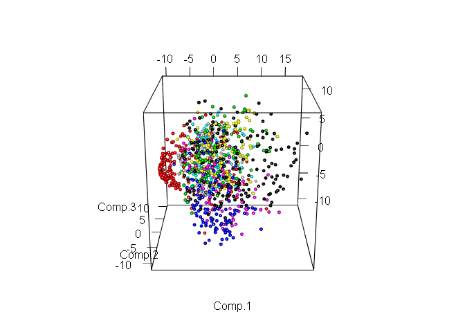
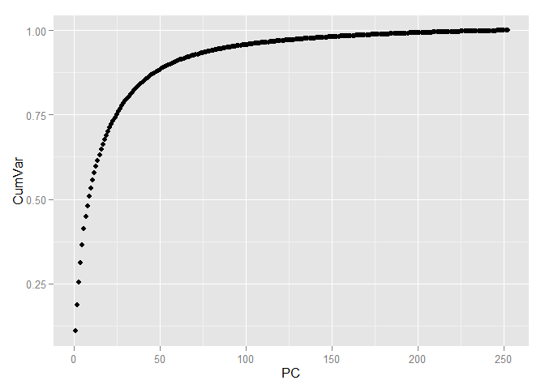

# Применение метода PCA для построения предсказательной модели
Морозов Глеб  
24 августа 2015 г.  

В данной работе показано применения PCA (метода главных компонент) с целью уменьшения размерности данных на примере данных представленных в рамках соревнования [Digit Recognizer](https://www.kaggle.com/c/digit-recognizer) проводимого на сайте [Kaggle](https://www.kaggle.com). В качестве инструмента проведения исследования используется язык R.

### Вступление
Данная работа является естественным продолжением [исследования](https://github.com/MorozovG/Kaggle_Digit_Recognizer/blob/master/Digit_Recognizer.md), изучающего зависимость качества модели от размера выборки. В ней для была показана возможность уменьшения количества используемых объектов в обучающей выборке с целью получения приемлимых результатов в условиях ограниченных вычислительных ресурсов. Но, кроме количества объектов, на размер данных влияет и количество используемых признаков. Рассмотрим эту возможность на тех же данных. Используемые данные были подробно изучены в предыдущей работе, поэтому просто загрузим тренировочную выборку в R. 


```r
library(readr)
library(caret)
library(ggbiplot)
library(ggplot2)
library(dplyr)
library(rgl)
```


```r
data_train <- read_csv("train.csv")
```

```
## 
|================================================================================| 100%   73 MB
```

Как мы уже знаем данные имеют 42000 объектов и 784 признака, представляющие собой значение яркости каждого из пикселей составляющего изображение цифры. Разобъём выборку на тренировочную и тестовую в соотношении 60/40.


```r
set.seed(111)
split <- createDataPartition(data_train$label, p = 0.6, list = FALSE)
train <- slice(data_train, split)
test <- slice(data_train, -split)
```

Теперь удалим признаки, имеющие константное значение.


```r
zero_var_col <- nearZeroVar(train, saveMetrics = T)
train <- train[, !zero_var_col$nzv]
test <- test[, !zero_var_col$nzv]
dim(train)
```

```
## [1] 25201   253
```

В итоге осталось 253 признака.

### Теория

Метод главных компонент (PCA) преобразует базовые признаки в новые, каждый из которых является линейной комбинацией изначальных таким образом, что разброс данных (то есть среднеквадратичное отклонение от среднего значения) вдоль них максимален. Метод применяется для визуализации данных и для уменьшения размерности данных (сжатия).

### PCA

Для большей наглядности случайным образом отберём из тренировочной выборки 1000 объектов и изобразим их в пространстве первых двух признаков.


```r
train_1000 <- train[sample(nrow(train), size = 1000),]
ggplot(data = train_1000, aes(x = pixel152, y = pixel153, color = factor(label))) + geom_point()
```

 

Очевидно, что объекты перемешаны и выделить среди них группы объектов принадлежащих одному классу проблематично. Проведём преобразование данных по методу главных компонент и изобразим в пространстве первых двух компонент. Замечу, что компоненты расположены в убывающем порядке в зависимости от разброса данных, который приходится вдоль них.


```r
pc <- princomp(train_1000[, -1], cor=TRUE, scores=TRUE)
ggbiplot(pc, obs.scale = 1, var.scale = 1, groups = factor(train_1000$label),
         ellipse = TRUE, circle = F, var.axes = F) + 
        scale_color_discrete(name = '') + 
        theme(legend.direction = 'horizontal', legend.position = 'top')
```

 

Очевидно, что даже в пространстве всего лишь двух признаков уже можно выделить явные группы объектов. Теперь рассмотрим те же данные, но уже в пространстве первых трёх компонент. (Трёхмерное изображение можно вращать и приближать)


```r
plot3d(pc$scores[,1:3], col= train_1000$label + 1, size = 0.7, type = "s")
```

<script src="CanvasMatrix.js" type="text/javascript"></script>
<canvas id="unnamed_chunk_7textureCanvas" style="display: none;" width="256" height="256">
<br>
Your browser does not support the HTML5 canvas element.</canvas>
<!-- ****** spheres object 7 ****** -->
<script id="unnamed_chunk_7vshader7" type="x-shader/x-vertex">
attribute vec3 aPos;
attribute vec4 aCol;
uniform mat4 mvMatrix;
uniform mat4 prMatrix;
varying vec4 vCol;
varying vec4 vPosition;
attribute vec3 aNorm;
uniform mat4 normMatrix;
varying vec3 vNormal;
void main(void) {
vPosition = mvMatrix * vec4(aPos, 1.);
gl_Position = prMatrix * vPosition;
vCol = aCol;
vNormal = normalize((normMatrix * vec4(aNorm, 1.)).xyz);
}
</script>
<script id="unnamed_chunk_7fshader7" type="x-shader/x-fragment"> 
#ifdef GL_ES
precision highp float;
#endif
varying vec4 vCol; // carries alpha
varying vec4 vPosition;
varying vec3 vNormal;
void main(void) {
vec3 eye = normalize(-vPosition.xyz);
const vec3 emission = vec3(0., 0., 0.);
const vec3 ambient1 = vec3(0., 0., 0.);
const vec3 specular1 = vec3(1., 1., 1.);// light*material
const float shininess1 = 50.;
vec4 colDiff1 = vec4(vCol.rgb * vec3(1., 1., 1.), vCol.a);
const vec3 lightDir1 = vec3(0., 0., 1.);
vec3 halfVec1 = normalize(lightDir1 + eye);
vec4 lighteffect = vec4(emission, 0.);
vec3 n = normalize(vNormal);
n = -faceforward(n, n, eye);
vec3 col1 = ambient1;
float nDotL1 = dot(n, lightDir1);
col1 = col1 + max(nDotL1, 0.) * colDiff1.rgb;
col1 = col1 + pow(max(dot(halfVec1, n), 0.), shininess1) * specular1;
lighteffect = lighteffect + vec4(col1, colDiff1.a);
gl_FragColor = lighteffect;
}
</script> 
<!-- ****** text object 9 ****** -->
<script id="unnamed_chunk_7vshader9" type="x-shader/x-vertex">
attribute vec3 aPos;
attribute vec4 aCol;
uniform mat4 mvMatrix;
uniform mat4 prMatrix;
varying vec4 vCol;
varying vec4 vPosition;
attribute vec2 aTexcoord;
varying vec2 vTexcoord;
uniform vec2 textScale;
attribute vec2 aOfs;
void main(void) {
vCol = aCol;
vTexcoord = aTexcoord;
vec4 pos = prMatrix * mvMatrix * vec4(aPos, 1.);
pos = pos/pos.w;
gl_Position = pos + vec4(aOfs*textScale, 0.,0.);
}
</script>
<script id="unnamed_chunk_7fshader9" type="x-shader/x-fragment"> 
#ifdef GL_ES
precision highp float;
#endif
varying vec4 vCol; // carries alpha
varying vec4 vPosition;
varying vec2 vTexcoord;
uniform sampler2D uSampler;
void main(void) {
vec4 colDiff = vCol;
vec4 lighteffect = colDiff;
vec4 textureColor = lighteffect*texture2D(uSampler, vTexcoord);
if (textureColor.a < 0.1)
discard;
else
gl_FragColor = textureColor;
}
</script> 
<!-- ****** text object 10 ****** -->
<script id="unnamed_chunk_7vshader10" type="x-shader/x-vertex">
attribute vec3 aPos;
attribute vec4 aCol;
uniform mat4 mvMatrix;
uniform mat4 prMatrix;
varying vec4 vCol;
varying vec4 vPosition;
attribute vec2 aTexcoord;
varying vec2 vTexcoord;
uniform vec2 textScale;
attribute vec2 aOfs;
void main(void) {
vCol = aCol;
vTexcoord = aTexcoord;
vec4 pos = prMatrix * mvMatrix * vec4(aPos, 1.);
pos = pos/pos.w;
gl_Position = pos + vec4(aOfs*textScale, 0.,0.);
}
</script>
<script id="unnamed_chunk_7fshader10" type="x-shader/x-fragment"> 
#ifdef GL_ES
precision highp float;
#endif
varying vec4 vCol; // carries alpha
varying vec4 vPosition;
varying vec2 vTexcoord;
uniform sampler2D uSampler;
void main(void) {
vec4 colDiff = vCol;
vec4 lighteffect = colDiff;
vec4 textureColor = lighteffect*texture2D(uSampler, vTexcoord);
if (textureColor.a < 0.1)
discard;
else
gl_FragColor = textureColor;
}
</script> 
<!-- ****** text object 11 ****** -->
<script id="unnamed_chunk_7vshader11" type="x-shader/x-vertex">
attribute vec3 aPos;
attribute vec4 aCol;
uniform mat4 mvMatrix;
uniform mat4 prMatrix;
varying vec4 vCol;
varying vec4 vPosition;
attribute vec2 aTexcoord;
varying vec2 vTexcoord;
uniform vec2 textScale;
attribute vec2 aOfs;
void main(void) {
vCol = aCol;
vTexcoord = aTexcoord;
vec4 pos = prMatrix * mvMatrix * vec4(aPos, 1.);
pos = pos/pos.w;
gl_Position = pos + vec4(aOfs*textScale, 0.,0.);
}
</script>
<script id="unnamed_chunk_7fshader11" type="x-shader/x-fragment"> 
#ifdef GL_ES
precision highp float;
#endif
varying vec4 vCol; // carries alpha
varying vec4 vPosition;
varying vec2 vTexcoord;
uniform sampler2D uSampler;
void main(void) {
vec4 colDiff = vCol;
vec4 lighteffect = colDiff;
vec4 textureColor = lighteffect*texture2D(uSampler, vTexcoord);
if (textureColor.a < 0.1)
discard;
else
gl_FragColor = textureColor;
}
</script> 
<!-- ****** lines object 12 ****** -->
<script id="unnamed_chunk_7vshader12" type="x-shader/x-vertex">
attribute vec3 aPos;
attribute vec4 aCol;
uniform mat4 mvMatrix;
uniform mat4 prMatrix;
varying vec4 vCol;
varying vec4 vPosition;
void main(void) {
vPosition = mvMatrix * vec4(aPos, 1.);
gl_Position = prMatrix * vPosition;
vCol = aCol;
}
</script>
<script id="unnamed_chunk_7fshader12" type="x-shader/x-fragment"> 
#ifdef GL_ES
precision highp float;
#endif
varying vec4 vCol; // carries alpha
varying vec4 vPosition;
void main(void) {
vec4 colDiff = vCol;
vec4 lighteffect = colDiff;
gl_FragColor = lighteffect;
}
</script> 
<!-- ****** text object 13 ****** -->
<script id="unnamed_chunk_7vshader13" type="x-shader/x-vertex">
attribute vec3 aPos;
attribute vec4 aCol;
uniform mat4 mvMatrix;
uniform mat4 prMatrix;
varying vec4 vCol;
varying vec4 vPosition;
attribute vec2 aTexcoord;
varying vec2 vTexcoord;
uniform vec2 textScale;
attribute vec2 aOfs;
void main(void) {
vCol = aCol;
vTexcoord = aTexcoord;
vec4 pos = prMatrix * mvMatrix * vec4(aPos, 1.);
pos = pos/pos.w;
gl_Position = pos + vec4(aOfs*textScale, 0.,0.);
}
</script>
<script id="unnamed_chunk_7fshader13" type="x-shader/x-fragment"> 
#ifdef GL_ES
precision highp float;
#endif
varying vec4 vCol; // carries alpha
varying vec4 vPosition;
varying vec2 vTexcoord;
uniform sampler2D uSampler;
void main(void) {
vec4 colDiff = vCol;
vec4 lighteffect = colDiff;
vec4 textureColor = lighteffect*texture2D(uSampler, vTexcoord);
if (textureColor.a < 0.1)
discard;
else
gl_FragColor = textureColor;
}
</script> 
<!-- ****** lines object 14 ****** -->
<script id="unnamed_chunk_7vshader14" type="x-shader/x-vertex">
attribute vec3 aPos;
attribute vec4 aCol;
uniform mat4 mvMatrix;
uniform mat4 prMatrix;
varying vec4 vCol;
varying vec4 vPosition;
void main(void) {
vPosition = mvMatrix * vec4(aPos, 1.);
gl_Position = prMatrix * vPosition;
vCol = aCol;
}
</script>
<script id="unnamed_chunk_7fshader14" type="x-shader/x-fragment"> 
#ifdef GL_ES
precision highp float;
#endif
varying vec4 vCol; // carries alpha
varying vec4 vPosition;
void main(void) {
vec4 colDiff = vCol;
vec4 lighteffect = colDiff;
gl_FragColor = lighteffect;
}
</script> 
<!-- ****** text object 15 ****** -->
<script id="unnamed_chunk_7vshader15" type="x-shader/x-vertex">
attribute vec3 aPos;
attribute vec4 aCol;
uniform mat4 mvMatrix;
uniform mat4 prMatrix;
varying vec4 vCol;
varying vec4 vPosition;
attribute vec2 aTexcoord;
varying vec2 vTexcoord;
uniform vec2 textScale;
attribute vec2 aOfs;
void main(void) {
vCol = aCol;
vTexcoord = aTexcoord;
vec4 pos = prMatrix * mvMatrix * vec4(aPos, 1.);
pos = pos/pos.w;
gl_Position = pos + vec4(aOfs*textScale, 0.,0.);
}
</script>
<script id="unnamed_chunk_7fshader15" type="x-shader/x-fragment"> 
#ifdef GL_ES
precision highp float;
#endif
varying vec4 vCol; // carries alpha
varying vec4 vPosition;
varying vec2 vTexcoord;
uniform sampler2D uSampler;
void main(void) {
vec4 colDiff = vCol;
vec4 lighteffect = colDiff;
vec4 textureColor = lighteffect*texture2D(uSampler, vTexcoord);
if (textureColor.a < 0.1)
discard;
else
gl_FragColor = textureColor;
}
</script> 
<!-- ****** lines object 16 ****** -->
<script id="unnamed_chunk_7vshader16" type="x-shader/x-vertex">
attribute vec3 aPos;
attribute vec4 aCol;
uniform mat4 mvMatrix;
uniform mat4 prMatrix;
varying vec4 vCol;
varying vec4 vPosition;
void main(void) {
vPosition = mvMatrix * vec4(aPos, 1.);
gl_Position = prMatrix * vPosition;
vCol = aCol;
}
</script>
<script id="unnamed_chunk_7fshader16" type="x-shader/x-fragment"> 
#ifdef GL_ES
precision highp float;
#endif
varying vec4 vCol; // carries alpha
varying vec4 vPosition;
void main(void) {
vec4 colDiff = vCol;
vec4 lighteffect = colDiff;
gl_FragColor = lighteffect;
}
</script> 
<!-- ****** text object 17 ****** -->
<script id="unnamed_chunk_7vshader17" type="x-shader/x-vertex">
attribute vec3 aPos;
attribute vec4 aCol;
uniform mat4 mvMatrix;
uniform mat4 prMatrix;
varying vec4 vCol;
varying vec4 vPosition;
attribute vec2 aTexcoord;
varying vec2 vTexcoord;
uniform vec2 textScale;
attribute vec2 aOfs;
void main(void) {
vCol = aCol;
vTexcoord = aTexcoord;
vec4 pos = prMatrix * mvMatrix * vec4(aPos, 1.);
pos = pos/pos.w;
gl_Position = pos + vec4(aOfs*textScale, 0.,0.);
}
</script>
<script id="unnamed_chunk_7fshader17" type="x-shader/x-fragment"> 
#ifdef GL_ES
precision highp float;
#endif
varying vec4 vCol; // carries alpha
varying vec4 vPosition;
varying vec2 vTexcoord;
uniform sampler2D uSampler;
void main(void) {
vec4 colDiff = vCol;
vec4 lighteffect = colDiff;
vec4 textureColor = lighteffect*texture2D(uSampler, vTexcoord);
if (textureColor.a < 0.1)
discard;
else
gl_FragColor = textureColor;
}
</script> 
<!-- ****** lines object 18 ****** -->
<script id="unnamed_chunk_7vshader18" type="x-shader/x-vertex">
attribute vec3 aPos;
attribute vec4 aCol;
uniform mat4 mvMatrix;
uniform mat4 prMatrix;
varying vec4 vCol;
varying vec4 vPosition;
void main(void) {
vPosition = mvMatrix * vec4(aPos, 1.);
gl_Position = prMatrix * vPosition;
vCol = aCol;
}
</script>
<script id="unnamed_chunk_7fshader18" type="x-shader/x-fragment"> 
#ifdef GL_ES
precision highp float;
#endif
varying vec4 vCol; // carries alpha
varying vec4 vPosition;
void main(void) {
vec4 colDiff = vCol;
vec4 lighteffect = colDiff;
gl_FragColor = lighteffect;
}
</script> 
<script type="text/javascript">
var min = Math.min;
var max = Math.max;
var sqrt = Math.sqrt;
var sin = Math.sin;
var acos = Math.acos;
var tan = Math.tan;
var SQRT2 = Math.SQRT2;
var PI = Math.PI;
var log = Math.log;
var exp = Math.exp;
var rglClass = function() {
this.zoom = new Array();
this.FOV  = new Array();
this.userMatrix = new CanvasMatrix4();
this.viewport = new Array();
this.listeners = new Array();
this.clipplanes = new Array();
this.opaque = new Array();
this.transparent = new Array();
this.subscenes = new Array();
this.flags = new Array();
this.prog = new Array();
this.ofsLoc = new Array();
this.origLoc = new Array();
this.sizeLoc = new Array();
this.usermatLoc = new Array();
this.vClipplane = new Array();
this.texture = new Array();
this.texLoc = new Array();
this.sampler = new Array();
this.origsize = new Array();
this.values = new Array();
this.offsets = new Array();
this.normLoc = new Array();
this.clipLoc = new Array();
this.centers = new Array();
this.f = new Array();
this.buf = new Array();
this.ibuf = new Array();
this.mvMatLoc = new Array();
this.prMatLoc = new Array();
this.textScaleLoc = new Array();
this.normMatLoc = new Array();
this.IMVClip = new Array();
this.drawFns = new Array();
this.clipFns = new Array();
this.prMatrix = new CanvasMatrix4();
this.mvMatrix = new CanvasMatrix4();
this.vp = null;
this.prmvMatrix = null;
this.origs = null;
this.gl = null;
};
(function() {
this.getShader = function( gl, id ){
var shaderScript = document.getElementById ( id );
var str = "";
var k = shaderScript.firstChild;
while ( k ){
if ( k.nodeType == 3 ) str += k.textContent;
k = k.nextSibling;
}
var shader;
if ( shaderScript.type == "x-shader/x-fragment" )
shader = gl.createShader ( gl.FRAGMENT_SHADER );
else if ( shaderScript.type == "x-shader/x-vertex" )
shader = gl.createShader(gl.VERTEX_SHADER);
else return null;
gl.shaderSource(shader, str);
gl.compileShader(shader);
if (gl.getShaderParameter(shader, gl.COMPILE_STATUS) == 0)
alert(gl.getShaderInfoLog(shader));
return shader;
}
this.multMV = function(M, v) {
return [M.m11*v[0] + M.m12*v[1] + M.m13*v[2] + M.m14*v[3],
M.m21*v[0] + M.m22*v[1] + M.m23*v[2] + M.m24*v[3],
M.m31*v[0] + M.m32*v[1] + M.m33*v[2] + M.m34*v[3],
M.m41*v[0] + M.m42*v[1] + M.m43*v[2] + M.m44*v[3]];
}
this.f_is_lit = 1;
this.f_is_smooth = 2;
this.f_has_texture = 4;
this.f_is_indexed = 8;
this.f_depth_sort = 16;
this.f_fixed_quads = 32;
this.f_is_transparent = 64;
this.f_is_lines = 128;
this.f_sprites_3d = 256;
this.f_sprite_3d = 512;
this.f_is_subscene = 1024;
this.f_is_clipplanes = 2048;
this.f_reuse = 4096;
this.whichList = function(id) {
if (this.flags[id] & this.f_is_subscene)
return "subscenes";
else if (this.flags[id] & this.f_is_clipplanes)
return "clipplanes";
else if (this.flags[id] & this.f_is_transparent)
return "transparent";
else
return "opaque"; 
}
this.inSubscene = function(id, subscene) {
var thelist = this.whichList(id);
return this[thelist][subscene].indexOf(id) > -1;
}
this.addToSubscene = function(id, subscene) {
var thelist = this.whichList(id);
if (this[thelist][subscene].indexOf(id) == -1)
this[thelist][subscene].push(id);
}
this.delFromSubscene = function(id, subscene) {
var thelist = this.whichList(id);
var i = this[thelist][subscene].indexOf(id);
if (i > -1)
this[thelist][subscene].splice(i, 1);
}
this.setSubsceneEntries = function(ids, subscene) {
this.subscenes[subscene] = [];
this.clipplanes[subscene] = [];
this.transparent[subscene] = [];
this.opaque[subscene] = [];
for (var i = 0; i < ids.length; i++)
this.addToSubscene(ids[i], subscene);
}
this.getSubsceneEntries = function(subscene) {
return(this.subscenes[subscene].concat(this.clipplanes[subscene]).
concat(this.transparent[subscene]).concat(this.opaque[subscene]));
}
}).call(rglClass.prototype);
var unnamed_chunk_7rgl = new rglClass();
unnamed_chunk_7rgl.start = function() {
var debug = function(msg) {
document.getElementById("unnamed_chunk_7debug").innerHTML = msg;
}
debug("");
var canvas = document.getElementById("unnamed_chunk_7canvas");
if (!window.WebGLRenderingContext){
debug("<br> Your browser does not support WebGL. See <a href=\"http://get.webgl.org\">http://get.webgl.org</a>");
return;
}
try {
// Try to grab the standard context. If it fails, fallback to experimental.
this.gl = canvas.getContext("webgl") 
|| canvas.getContext("experimental-webgl");
}
catch(e) {}
if ( !this.gl ) {
debug("<br> Your browser appears to support WebGL, but did not create a WebGL context.  See <a href=\"http://get.webgl.org\">http://get.webgl.org</a>");
return;
}
var gl = this.gl;
var width = 673;  var height = 481;
canvas.width = width;   canvas.height = height;
var normMatrix = new CanvasMatrix4();
var saveMat = new Object();
var distance;
var posLoc = 0;
var colLoc = 1;
var activeSubscene = 1;
this.flags[1] = 1195;
this.zoom[1] = 1;
this.FOV[1] = 30;
this.viewport[1] = [0, 0, 672, 480];
this.userMatrix[1] = new CanvasMatrix4();
this.userMatrix[1].load([
1, 0, 0, 0,
0, 0.3420201, -0.9396926, 0,
0, 0.9396926, 0.3420201, 0,
0, 0, 0, 1
]);
this.clipplanes[1] = [];
this.opaque[1] = [7,9,10,11,12,13,14,15,16,17,18];
this.transparent[1] = [];
this.subscenes[1] = [];
function getPowerOfTwo(value) {
var pow = 1;
while(pow<value) {
pow *= 2;
}
return pow;
}
function handleLoadedTexture(texture, textureCanvas) {
gl.pixelStorei(gl.UNPACK_FLIP_Y_WEBGL, true);
gl.bindTexture(gl.TEXTURE_2D, texture);
gl.texImage2D(gl.TEXTURE_2D, 0, gl.RGBA, gl.RGBA, gl.UNSIGNED_BYTE, textureCanvas);
gl.texParameteri(gl.TEXTURE_2D, gl.TEXTURE_MAG_FILTER, gl.LINEAR);
gl.texParameteri(gl.TEXTURE_2D, gl.TEXTURE_MIN_FILTER, gl.LINEAR_MIPMAP_NEAREST);
gl.generateMipmap(gl.TEXTURE_2D);
gl.bindTexture(gl.TEXTURE_2D, null);
}
function loadImageToTexture(filename, texture) {   
var canvas = document.getElementById("unnamed_chunk_7textureCanvas");
var ctx = canvas.getContext("2d");
var image = new Image();
image.onload = function() {
var w = image.width;
var h = image.height;
var canvasX = getPowerOfTwo(w);
var canvasY = getPowerOfTwo(h);
canvas.width = canvasX;
canvas.height = canvasY;
ctx.imageSmoothingEnabled = true;
ctx.drawImage(image, 0, 0, canvasX, canvasY);
handleLoadedTexture(texture, canvas);
unnamed_chunk_7rgl.drawScene();
}
image.src = filename;
}  	   
function drawTextToCanvas(text, cex) {
var canvasX, canvasY;
var textX, textY;
var textHeight = 20 * cex;
var textColour = "white";
var fontFamily = "Arial";
var backgroundColour = "rgba(0,0,0,0)";
var canvas = document.getElementById("unnamed_chunk_7textureCanvas");
var ctx = canvas.getContext("2d");
ctx.font = textHeight+"px "+fontFamily;
canvasX = 1;
var widths = [];
for (var i = 0; i < text.length; i++)  {
widths[i] = ctx.measureText(text[i]).width;
canvasX = (widths[i] > canvasX) ? widths[i] : canvasX;
}	  
canvasX = getPowerOfTwo(canvasX);
var offset = 2*textHeight; // offset to first baseline
var skip = 2*textHeight;   // skip between baselines	  
canvasY = getPowerOfTwo(offset + text.length*skip);
canvas.width = canvasX;
canvas.height = canvasY;
ctx.fillStyle = backgroundColour;
ctx.fillRect(0, 0, ctx.canvas.width, ctx.canvas.height);
ctx.fillStyle = textColour;
ctx.textAlign = "left";
ctx.textBaseline = "alphabetic";
ctx.font = textHeight+"px "+fontFamily;
for(var i = 0; i < text.length; i++) {
textY = i*skip + offset;
ctx.fillText(text[i], 0,  textY);
}
return {canvasX:canvasX, canvasY:canvasY,
widths:widths, textHeight:textHeight,
offset:offset, skip:skip};
}
// ****** sphere object ******
this.sphereverts = new Float32Array([
-1, 0, 0,
1, 0, 0,
0, -1, 0,
0, 1, 0,
0, 0, -1,
0, 0, 1,
-0.7071068, 0, -0.7071068,
-0.7071068, -0.7071068, 0,
0, -0.7071068, -0.7071068,
-0.7071068, 0, 0.7071068,
0, -0.7071068, 0.7071068,
-0.7071068, 0.7071068, 0,
0, 0.7071068, -0.7071068,
0, 0.7071068, 0.7071068,
0.7071068, -0.7071068, 0,
0.7071068, 0, -0.7071068,
0.7071068, 0, 0.7071068,
0.7071068, 0.7071068, 0,
-0.9349975, 0, -0.3546542,
-0.9349975, -0.3546542, 0,
-0.77044, -0.4507894, -0.4507894,
0, -0.3546542, -0.9349975,
-0.3546542, 0, -0.9349975,
-0.4507894, -0.4507894, -0.77044,
-0.3546542, -0.9349975, 0,
0, -0.9349975, -0.3546542,
-0.4507894, -0.77044, -0.4507894,
-0.9349975, 0, 0.3546542,
-0.77044, -0.4507894, 0.4507894,
0, -0.9349975, 0.3546542,
-0.4507894, -0.77044, 0.4507894,
-0.3546542, 0, 0.9349975,
0, -0.3546542, 0.9349975,
-0.4507894, -0.4507894, 0.77044,
-0.9349975, 0.3546542, 0,
-0.77044, 0.4507894, -0.4507894,
0, 0.9349975, -0.3546542,
-0.3546542, 0.9349975, 0,
-0.4507894, 0.77044, -0.4507894,
0, 0.3546542, -0.9349975,
-0.4507894, 0.4507894, -0.77044,
-0.77044, 0.4507894, 0.4507894,
0, 0.3546542, 0.9349975,
-0.4507894, 0.4507894, 0.77044,
0, 0.9349975, 0.3546542,
-0.4507894, 0.77044, 0.4507894,
0.9349975, -0.3546542, 0,
0.9349975, 0, -0.3546542,
0.77044, -0.4507894, -0.4507894,
0.3546542, -0.9349975, 0,
0.4507894, -0.77044, -0.4507894,
0.3546542, 0, -0.9349975,
0.4507894, -0.4507894, -0.77044,
0.9349975, 0, 0.3546542,
0.77044, -0.4507894, 0.4507894,
0.3546542, 0, 0.9349975,
0.4507894, -0.4507894, 0.77044,
0.4507894, -0.77044, 0.4507894,
0.9349975, 0.3546542, 0,
0.77044, 0.4507894, -0.4507894,
0.4507894, 0.4507894, -0.77044,
0.3546542, 0.9349975, 0,
0.4507894, 0.77044, -0.4507894,
0.77044, 0.4507894, 0.4507894,
0.4507894, 0.77044, 0.4507894,
0.4507894, 0.4507894, 0.77044
]);
this.spherefaces=new Uint16Array([
0, 18, 19,
6, 20, 18,
7, 19, 20,
19, 18, 20,
4, 21, 22,
8, 23, 21,
6, 22, 23,
22, 21, 23,
2, 24, 25,
7, 26, 24,
8, 25, 26,
25, 24, 26,
7, 20, 26,
6, 23, 20,
8, 26, 23,
26, 20, 23,
0, 19, 27,
7, 28, 19,
9, 27, 28,
27, 19, 28,
2, 29, 24,
10, 30, 29,
7, 24, 30,
24, 29, 30,
5, 31, 32,
9, 33, 31,
10, 32, 33,
32, 31, 33,
9, 28, 33,
7, 30, 28,
10, 33, 30,
33, 28, 30,
0, 34, 18,
11, 35, 34,
6, 18, 35,
18, 34, 35,
3, 36, 37,
12, 38, 36,
11, 37, 38,
37, 36, 38,
4, 22, 39,
6, 40, 22,
12, 39, 40,
39, 22, 40,
6, 35, 40,
11, 38, 35,
12, 40, 38,
40, 35, 38,
0, 27, 34,
9, 41, 27,
11, 34, 41,
34, 27, 41,
5, 42, 31,
13, 43, 42,
9, 31, 43,
31, 42, 43,
3, 37, 44,
11, 45, 37,
13, 44, 45,
44, 37, 45,
11, 41, 45,
9, 43, 41,
13, 45, 43,
45, 41, 43,
1, 46, 47,
14, 48, 46,
15, 47, 48,
47, 46, 48,
2, 25, 49,
8, 50, 25,
14, 49, 50,
49, 25, 50,
4, 51, 21,
15, 52, 51,
8, 21, 52,
21, 51, 52,
15, 48, 52,
14, 50, 48,
8, 52, 50,
52, 48, 50,
1, 53, 46,
16, 54, 53,
14, 46, 54,
46, 53, 54,
5, 32, 55,
10, 56, 32,
16, 55, 56,
55, 32, 56,
2, 49, 29,
14, 57, 49,
10, 29, 57,
29, 49, 57,
14, 54, 57,
16, 56, 54,
10, 57, 56,
57, 54, 56,
1, 47, 58,
15, 59, 47,
17, 58, 59,
58, 47, 59,
4, 39, 51,
12, 60, 39,
15, 51, 60,
51, 39, 60,
3, 61, 36,
17, 62, 61,
12, 36, 62,
36, 61, 62,
17, 59, 62,
15, 60, 59,
12, 62, 60,
62, 59, 60,
1, 58, 53,
17, 63, 58,
16, 53, 63,
53, 58, 63,
3, 44, 61,
13, 64, 44,
17, 61, 64,
61, 44, 64,
5, 55, 42,
16, 65, 55,
13, 42, 65,
42, 55, 65,
16, 63, 65,
17, 64, 63,
13, 65, 64,
65, 63, 64
]);
var sphereBuf = gl.createBuffer();
gl.bindBuffer(gl.ARRAY_BUFFER, sphereBuf);
gl.bufferData(gl.ARRAY_BUFFER, unnamed_chunk_7rgl.sphereverts, gl.STATIC_DRAW);
var sphereIbuf = gl.createBuffer();
gl.bindBuffer(gl.ELEMENT_ARRAY_BUFFER, sphereIbuf);
gl.bufferData(gl.ELEMENT_ARRAY_BUFFER, unnamed_chunk_7rgl.spherefaces, gl.STATIC_DRAW);
// ****** spheres object 7 ******
this.flags[7] = 3;
this.prog[7]  = gl.createProgram();
gl.attachShader(this.prog[7], this.getShader( gl, "unnamed_chunk_7vshader7" ));
gl.attachShader(this.prog[7], this.getShader( gl, "unnamed_chunk_7fshader7" ));
//  Force aPos to location 0, aCol to location 1 
gl.bindAttribLocation(this.prog[7], 0, "aPos");
gl.bindAttribLocation(this.prog[7], 1, "aCol");
gl.linkProgram(this.prog[7]);
this.offsets[7]={vofs:0, cofs:3, nofs:-1, radofs:7, oofs:-1, tofs:-1, stride:8};
var v=new Float32Array([
0.799596, 5.390058, -1.524905, 0, 1, 1, 1, 0.2801099,
-7.625386, -0.7284612, -1.77685, 1, 0, 0, 1, 0.2801099,
2.196646, 0.9316109, 5.131953, 1, 1, 0, 1, 0.2801099,
3.425542, -7.207276, -7.434476, 0, 0, 1, 1, 0.2801099,
10.72343, -3.372319, 0.1624414, 1, 0, 1, 1, 0.2801099,
-0.9951475, -6.454574, 6.32471, 0, 0, 1, 1, 0.2801099,
-6.478766, 2.199038, -1.479881, 0, 1, 1, 1, 0.2801099,
2.163725, 7.562675, -2.254157, 0, 1, 1, 1, 0.2801099,
-9.062917, -5.998622, 2.467003, 1, 0, 0, 1, 0.2801099,
4.895022, 4.525136, -0.5698325, 1, 1, 0, 1, 0.2801099,
8.180725, 1.108492, 8.528413, 1, 1, 0, 1, 0.2801099,
12.06038, 3.651509, 3.480993, 0, 0, 0, 1, 0.2801099,
-0.7806875, -9.23578, 4.611284, 0, 0.8039216, 0, 1, 0.2801099,
1.223753, 7.055116, -6.11435, 0.7450981, 0.7450981, 0.7450981, 1, 0.2801099,
-8.049096, 0.5447184, -2.965833, 1, 0, 0, 1, 0.2801099,
-0.04731373, 4.49163, -2.099907, 1, 0, 0, 1, 0.2801099,
-5.345419, -0.755712, 3.062835, 1, 0, 1, 1, 0.2801099,
4.555445, 0.4316083, 2.865721, 0, 0.8039216, 0, 1, 0.2801099,
1.512989, -0.6627749, 1.739812, 0, 0, 0, 1, 0.2801099,
3.36168, -2.17848, 2.512115, 1, 0, 1, 1, 0.2801099,
-7.205021, -2.331095, -0.1238443, 1, 0, 0, 1, 0.2801099,
0.2635718, -2.809881, -2.433633, 0, 0, 1, 1, 0.2801099,
6.133564, -9.921781, -3.120189, 0, 0, 1, 1, 0.2801099,
6.615468, 0.5764304, 1.651237, 1, 1, 0, 1, 0.2801099,
2.096896, -3.672978, -3.140015, 0, 0, 0, 1, 0.2801099,
0.788746, -4.66571, -0.2104896, 0, 0, 1, 1, 0.2801099,
8.229995, 5.105753, 1.732512, 0, 1, 1, 1, 0.2801099,
1.699538, 7.627888, 5.161441, 1, 0, 0, 1, 0.2801099,
-7.31142, -0.3581633, -2.316206, 1, 0, 0, 1, 0.2801099,
2.121802, 10.08062, -2.147103, 0.7450981, 0.7450981, 0.7450981, 1, 0.2801099,
-0.2925966, -9.9973, 2.705711, 0, 0.8039216, 0, 1, 0.2801099,
-1.013657, 5.146993, 5.634638, 0.7450981, 0.7450981, 0.7450981, 1, 0.2801099,
-4.908068, 0.5278363, -2.508677, 1, 0, 0, 1, 0.2801099,
0.3741953, 5.627453, -1.638791, 0, 1, 1, 1, 0.2801099,
-0.2743998, 6.687319, 2.694326, 1, 0, 0, 1, 0.2801099,
-0.4230863, 6.103876, 2.57585, 0, 0, 1, 1, 0.2801099,
4.78857, 3.705287, -1.660826, 1, 0, 0, 1, 0.2801099,
2.710092, -0.3631535, -5.156765, 0, 0, 0, 1, 0.2801099,
-5.480883, 0.3994979, 2.570883, 1, 0, 0, 1, 0.2801099,
-5.21703, 2.386063, 1.534565, 0, 1, 1, 1, 0.2801099,
-2.129306, -4.519552, -4.453219, 0, 0, 1, 1, 0.2801099,
-9.044104, -2.337157, -0.736618, 1, 0, 0, 1, 0.2801099,
-0.3016351, -5.350797, -7.407668, 0, 0, 1, 1, 0.2801099,
2.431873, -4.707956, -1.515386, 1, 1, 0, 1, 0.2801099,
6.576289, -11.28337, 0.07986359, 0, 0, 0, 1, 0.2801099,
6.007614, 7.159538, -2.796277, 0, 1, 1, 1, 0.2801099,
-4.47058, -0.2996552, 1.887435, 0.7450981, 0.7450981, 0.7450981, 1, 0.2801099,
-5.938884, 2.040752, -2.348057, 1, 0, 0, 1, 0.2801099,
-4.55103, 2.134655, 3.218163, 0, 1, 1, 1, 0.2801099,
-3.336082, 5.595621, 2.153625, 0, 1, 1, 1, 0.2801099,
3.411144, 5.273038, -4.290582, 1, 0, 0, 1, 0.2801099,
4.379055, 7.84868, -5.981626, 0.7450981, 0.7450981, 0.7450981, 1, 0.2801099,
2.634718, 0.4536181, 1.870895, 0, 0.8039216, 0, 1, 0.2801099,
-3.000004, 4.024697, 1.326521, 0.7450981, 0.7450981, 0.7450981, 1, 0.2801099,
5.695747, -1.754564, -3.806776, 0, 0, 0, 1, 0.2801099,
-4.883135, 0.06528058, -0.5985761, 0, 0, 1, 1, 0.2801099,
0.4286077, -7.967102, -5.785388, 0, 0, 1, 1, 0.2801099,
2.950607, -7.593212, -1.456225, 0, 0, 0, 1, 0.2801099,
-4.424665, 2.966042, -1.662937, 0.7450981, 0.7450981, 0.7450981, 1, 0.2801099,
-0.445057, 5.664824, -6.048536, 0, 1, 1, 1, 0.2801099,
-1.241973, 0.8034652, -0.9420816, 1, 1, 0, 1, 0.2801099,
1.662948, -4.027225, -7.854203, 0, 0, 1, 1, 0.2801099,
-2.046016, 5.623618, 3.497867, 0.7450981, 0.7450981, 0.7450981, 1, 0.2801099,
4.589833, -3.943738, -7.788106, 1, 0, 1, 1, 0.2801099,
3.07557, 7.913129, 2.009343, 0.7450981, 0.7450981, 0.7450981, 1, 0.2801099,
7.233488, -4.832242, 7.666775, 0, 0.8039216, 0, 1, 0.2801099,
12.29202, -1.900745, 3.586301, 0, 0, 0, 1, 0.2801099,
-3.462412, -3.216277, -2.473512, 0, 0, 0, 1, 0.2801099,
1.866681, -2.942456, 1.945175, 1, 1, 0, 1, 0.2801099,
-2.211013, 6.10066, -5.366028, 0.7450981, 0.7450981, 0.7450981, 1, 0.2801099,
-9.917118, -2.581881, 0.5386978, 1, 0, 0, 1, 0.2801099,
-2.443147, -4.589651, 5.733812, 0, 0, 0, 1, 0.2801099,
1.25158, -9.101812, -0.7499657, 0, 0.8039216, 0, 1, 0.2801099,
-4.637506, -3.007209, -2.559225, 0, 0, 0, 1, 0.2801099,
-0.4009725, -4.78862, 4.267118, 0, 0, 1, 1, 0.2801099,
-1.051928, 8.0017, 0.7152357, 0.7450981, 0.7450981, 0.7450981, 1, 0.2801099,
1.978975, -0.4202284, 3.784859, 0, 0, 0, 1, 0.2801099,
-1.387261, 7.036205, -2.686155, 0.7450981, 0.7450981, 0.7450981, 1, 0.2801099,
-4.544837, 0.2498163, -0.2499522, 1, 0, 1, 1, 0.2801099,
3.51086, -8.66321, -7.201427, 0, 0, 1, 1, 0.2801099,
7.144267, 0.06632172, -6.873478, 0, 0, 1, 1, 0.2801099,
4.295633, -10.44817, -2.965359, 0, 0, 1, 1, 0.2801099,
5.751532, -5.642829, -3.305168, 1, 0, 1, 1, 0.2801099,
4.650019, -3.552137, 8.284636, 1, 1, 0, 1, 0.2801099,
8.891085, -0.9658342, 10.62054, 0, 0, 0, 1, 0.2801099,
9.193889, -8.997133, -6.08191, 0, 0, 1, 1, 0.2801099,
2.62675, -2.457019, -5.947219, 0, 0, 1, 1, 0.2801099,
3.232466, 2.319641, 0.08764966, 1, 0, 1, 1, 0.2801099,
-0.5274445, 7.758105, -1.735165, 0.7450981, 0.7450981, 0.7450981, 1, 0.2801099,
2.987534, -8.802681, -6.369176, 0, 0, 1, 1, 0.2801099,
-9.747634, -1.330682, -0.6109586, 1, 0, 0, 1, 0.2801099,
-0.4016212, 0.9939806, 2.226171, 1, 1, 0, 1, 0.2801099,
-3.571902, -4.849449, 5.70121, 0, 0, 0, 1, 0.2801099,
-2.066862, 6.042785, 2.525574, 1, 0, 0, 1, 0.2801099,
7.447649, 4.348575, 3.292517, 1, 1, 0, 1, 0.2801099,
-3.131676, -4.292346, -5.75528, 0, 0, 1, 1, 0.2801099,
1.704192, -2.419348, -1.711917, 1, 0, 1, 1, 0.2801099,
3.063274, 6.854639, -0.1330733, 0, 1, 1, 1, 0.2801099,
-8.963953, -5.042998, 3.500432, 1, 0, 0, 1, 0.2801099,
-2.139091, 5.58426, 3.113135, 0, 1, 1, 1, 0.2801099,
5.414857, 4.69929, 0.4555527, 1, 1, 0, 1, 0.2801099,
2.745684, -7.10851, -6.213822, 0, 0, 1, 1, 0.2801099,
-1.449279, 4.89593, 3.917087, 0.7450981, 0.7450981, 0.7450981, 1, 0.2801099,
3.959233, -6.015285, -5.349391, 1, 0, 1, 1, 0.2801099,
4.236182, 8.785914, 3.017133, 1, 0, 0, 1, 0.2801099,
-4.644116, -1.395049, 7.523406, 0, 0, 0, 1, 0.2801099,
-0.6790574, -5.529929, -0.1840761, 0, 0.8039216, 0, 1, 0.2801099,
0.7352113, 5.085712, -6.750312, 1, 0, 0, 1, 0.2801099,
1.109573, 5.510268, -5.549778, 0, 1, 1, 1, 0.2801099,
-3.573256, -3.701398, 4.440104, 0, 0, 0, 1, 0.2801099,
-1.654618, -0.9357476, 4.841085, 0, 0, 0, 1, 0.2801099,
1.355544, -4.124373, -1.160836, 0, 0, 1, 1, 0.2801099,
4.110611, -6.427176, 4.131071, 0, 0.8039216, 0, 1, 0.2801099,
-8.221002, -7.544134, 4.842487, 1, 0, 0, 1, 0.2801099,
-0.8112503, 0.6552469, -0.8881032, 0.7450981, 0.7450981, 0.7450981, 1, 0.2801099,
2.781192, 3.820688, 1.85699, 1, 1, 0, 1, 0.2801099,
-1.098158, -4.075156, 0.1616491, 0, 0.8039216, 0, 1, 0.2801099,
-4.212878, 1.954017, 0.2403313, 1, 1, 0, 1, 0.2801099,
-2.395934, -2.400983, 1.819486, 1, 1, 0, 1, 0.2801099,
-2.513912, 2.209175, 1.624347, 0, 0.8039216, 0, 1, 0.2801099,
-2.485755, 7.681164, -4.00274, 0.7450981, 0.7450981, 0.7450981, 1, 0.2801099,
-2.215577, -4.716017, -6.157841, 0, 0, 1, 1, 0.2801099,
-2.574811, 4.742854, -5.671575, 0, 1, 1, 1, 0.2801099,
-4.568534, -0.2366533, 3.124944, 1, 0, 1, 1, 0.2801099,
-0.5856292, 8.637761, -1.539416, 0.7450981, 0.7450981, 0.7450981, 1, 0.2801099,
-2.624895, 5.329083, -6.263539, 0.7450981, 0.7450981, 0.7450981, 1, 0.2801099,
-9.632293, -1.076754, -1.047422, 1, 0, 0, 1, 0.2801099,
4.88004, 1.30768, 8.589758, 0, 0, 0, 1, 0.2801099,
-0.06981793, -4.495916, -2.331745, 0, 0, 1, 1, 0.2801099,
-9.385468, -1.151264, -0.9857122, 1, 0, 0, 1, 0.2801099,
12.29907, -1.183875, 0.9679754, 0, 0, 0, 1, 0.2801099,
-5.322229, -1.822987, 2.176226, 0, 0, 0, 1, 0.2801099,
-0.9423574, -6.27313, -4.749712, 0, 0, 1, 1, 0.2801099,
5.674142, -2.635353, 5.163726, 0, 0, 0, 1, 0.2801099,
1.999443, -3.016737, 1.560664, 0, 0, 0, 1, 0.2801099,
-3.547932, -2.494843, -3.458967, 0, 0, 0, 1, 0.2801099,
-3.851963, 5.430082, 1.7318, 1, 0, 0, 1, 0.2801099,
13.61678, -3.857046, 0.3022055, 0, 0, 0, 1, 0.2801099,
-7.821844, -3.961959, 3.576681, 1, 0, 0, 1, 0.2801099,
-1.377745, -3.333785, -5.500215, 0, 0, 1, 1, 0.2801099,
-3.244065, 3.046958, 0.3801273, 1, 0, 1, 1, 0.2801099,
-1.22977, 3.03524, 3.156156, 1, 1, 0, 1, 0.2801099,
-7.968361, -2.539869, 1.314614, 1, 0, 0, 1, 0.2801099,
-2.763532, -4.203629, -2.739219, 0, 0, 1, 1, 0.2801099,
-8.616867, -3.823745, 2.830164, 1, 0, 0, 1, 0.2801099,
0.486227, 3.137109, 2.373893, 1, 1, 0, 1, 0.2801099,
-8.043513, -1.793809, 2.209224, 0.7450981, 0.7450981, 0.7450981, 1, 0.2801099,
1.359449, -3.200335, -5.395339, 0, 0, 1, 1, 0.2801099,
8.051183, 4.229895, 4.612336, 0, 0.8039216, 0, 1, 0.2801099,
-0.6282952, 1.238576, 0.879413, 1, 1, 0, 1, 0.2801099,
-4.712013, -1.044577, -1.605599, 0, 0, 0, 1, 0.2801099,
1.929699, 6.706733, -0.9983196, 1, 0, 0, 1, 0.2801099,
0.7656616, 0.8848525, 0.9231328, 0, 0, 0, 1, 0.2801099,
-5.184145, -0.1123188, -3.385683, 0, 0, 0, 1, 0.2801099,
-4.702809, 2.094263, -4.466737, 1, 0, 0, 1, 0.2801099,
-5.90288, 1.36346, 0.1918864, 0, 0, 0, 1, 0.2801099,
0.1093157, 7.806827, 3.181686, 0.7450981, 0.7450981, 0.7450981, 1, 0.2801099,
-8.882621, -1.768019, -1.726682, 1, 0, 0, 1, 0.2801099,
-7.870526, -2.73839, 0.660514, 1, 0, 0, 1, 0.2801099,
-2.517232, 7.94766, 0.3643975, 0.7450981, 0.7450981, 0.7450981, 1, 0.2801099,
-3.980783, -0.2764995, -0.2110519, 0, 0.8039216, 0, 1, 0.2801099,
8.631124, -2.333646, 0.642145, 0, 0, 0, 1, 0.2801099,
1.904506, -2.773829, -2.098679, 0, 0, 0, 1, 0.2801099,
3.929697, 2.571103, 1.781311, 1, 1, 0, 1, 0.2801099,
-1.927768, 4.115088, 1.201823, 0, 0.8039216, 0, 1, 0.2801099,
1.892661, -0.08087453, 0.1287461, 0, 0, 0, 1, 0.2801099,
0.7640092, 5.798143, 1.850765, 1, 1, 0, 1, 0.2801099,
-8.469105, -3.031805, -0.6035389, 1, 0, 0, 1, 0.2801099,
10.96773, -3.18142, -3.130625, 0, 0, 0, 1, 0.2801099,
-3.152749, -3.917607, 0.8832666, 0, 0, 0, 1, 0.2801099,
8.650971, -4.087877, 5.314148, 0, 0.8039216, 0, 1, 0.2801099,
1.105038, 8.231091, 0.6515768, 1, 0, 0, 1, 0.2801099,
0.7664441, -5.95015, -7.467289, 0, 0, 1, 1, 0.2801099,
10.54795, 1.473139, 5.624197, 0, 0.8039216, 0, 1, 0.2801099,
-0.6394569, 8.321569, -0.8458289, 0.7450981, 0.7450981, 0.7450981, 1, 0.2801099,
-8.702951, -4.121193, 0.2379169, 1, 0, 0, 1, 0.2801099,
-0.3448964, 1.739517, -7.043997, 1, 0, 0, 1, 0.2801099,
11.73338, -4.342257, -0.7711772, 0, 0, 0, 1, 0.2801099,
0.9667687, 0.117948, -1.276147, 1, 1, 0, 1, 0.2801099,
3.303315, 0.5131006, 6.568679, 1, 1, 0, 1, 0.2801099,
0.00305779, -2.773502, 2.142439, 0, 0, 0, 1, 0.2801099,
-7.025819, 0.01543457, 3.625769, 1, 0, 0, 1, 0.2801099,
-2.415144, -2.163112, 2.342225, 0, 0, 0, 1, 0.2801099,
7.040749, 8.973081, -2.330982, 1, 0, 0, 1, 0.2801099,
-1.114789, -5.892696, -7.026129, 0, 0, 1, 1, 0.2801099,
-0.4896435, -1.969714, 6.092369, 1, 1, 0, 1, 0.2801099,
7.645085, -6.805161, -3.711427, 0, 0, 1, 1, 0.2801099,
-3.060877, 4.968498, -1.54807, 0, 1, 1, 1, 0.2801099,
5.204404, -7.608037, -0.5766094, 1, 0, 1, 1, 0.2801099,
-2.119858, -1.166724, 1.246033, 0, 0, 0, 1, 0.2801099,
2.154391, 5.89325, 5.473782, 0.7450981, 0.7450981, 0.7450981, 1, 0.2801099,
-7.359177, -3.623296, 5.388549, 1, 0, 0, 1, 0.2801099,
1.343599, -5.075339, -2.099539, 0, 0, 0, 1, 0.2801099,
2.417751, 1.049166, 6.56259, 0, 0.8039216, 0, 1, 0.2801099,
-0.3293987, -0.247494, -2.773, 1, 1, 0, 1, 0.2801099,
-3.268925, -0.5441734, -1.769465, 0, 0.8039216, 0, 1, 0.2801099,
2.401497, -9.137614, -6.15671, 0, 0, 1, 1, 0.2801099,
-4.755309, -6.859068, -1.426787, 0, 0.8039216, 0, 1, 0.2801099,
-1.21266, 0.2526096, 8.463399, 1, 0, 0, 1, 0.2801099,
-0.7469988, 8.183386, 2.151313, 0, 1, 1, 1, 0.2801099,
-1.407218, -3.798173, 1.252002, 1, 0, 1, 1, 0.2801099,
4.426837, 6.599357, -2.548584, 0, 1, 1, 1, 0.2801099,
-3.053258, 5.021956, 1.479121, 1, 0, 0, 1, 0.2801099,
-0.3600612, -6.696246, -1.164579, 0, 0, 1, 1, 0.2801099,
10.52572, -0.5352097, 2.830321, 0, 0, 0, 1, 0.2801099,
-3.455019, 2.991372, 3.113192, 0, 0.8039216, 0, 1, 0.2801099,
2.995453, -4.735053, 0.7417487, 1, 1, 0, 1, 0.2801099,
4.25833, 5.653234, -3.356968, 1, 0, 0, 1, 0.2801099,
-3.104644, 6.594753, -1.171411, 1, 0, 0, 1, 0.2801099,
-5.331688, -2.350823, -0.3563359, 0, 0, 0, 1, 0.2801099,
-8.468237, -2.66168, -0.5947548, 1, 0, 0, 1, 0.2801099,
9.016755, 7.790681, -5.388335, 0.7450981, 0.7450981, 0.7450981, 1, 0.2801099,
8.5502, -0.02387067, 8.683925, 0, 0, 0, 1, 0.2801099,
-9.690702, -1.943787, -0.7722465, 1, 0, 0, 1, 0.2801099,
-1.555063, -5.247539, -0.07003123, 1, 0, 1, 1, 0.2801099,
5.2992, 1.528933, -2.643664, 0, 0, 0, 1, 0.2801099,
1.329765, 6.550275, -2.524908, 0.7450981, 0.7450981, 0.7450981, 1, 0.2801099,
-1.289185, -1.95934, -0.3317602, 0, 0, 1, 1, 0.2801099,
-0.4219313, 7.634418, -6.808012, 0.7450981, 0.7450981, 0.7450981, 1, 0.2801099,
-9.364646, -5.208572, 2.310192, 1, 0, 0, 1, 0.2801099,
7.294231, 2.36831, -4.654428, 0, 0, 0, 1, 0.2801099,
0.6861413, -1.990581, 4.403219, 0, 0.8039216, 0, 1, 0.2801099,
0.6871365, 3.677272, -3.077494, 0, 1, 1, 1, 0.2801099,
-6.58578, -1.650526, 5.219202, 1, 1, 0, 1, 0.2801099,
-2.853182, 4.095199, 1.160127, 1, 0, 1, 1, 0.2801099,
2.700557, 6.886396, -4.391909, 0, 1, 1, 1, 0.2801099,
-4.24019, 4.458718, -2.522954, 1, 0, 0, 1, 0.2801099,
7.140045, -2.745964, -3.553576, 0, 0, 0, 1, 0.2801099,
0.4334518, 7.193582, -1.719467, 1, 0, 0, 1, 0.2801099,
1.287855, -4.600353, -4.923884, 1, 0, 1, 1, 0.2801099,
-1.058829, 7.318518, -4.027229, 0.7450981, 0.7450981, 0.7450981, 1, 0.2801099,
2.854689, -6.680292, -8.86551, 0, 0, 1, 1, 0.2801099,
-2.49099, 7.429772, 1.30036, 0.7450981, 0.7450981, 0.7450981, 1, 0.2801099,
-3.807303, 1.506178, 6.625899, 0, 1, 1, 1, 0.2801099,
-1.674686, 4.433392, -6.041327, 1, 0, 0, 1, 0.2801099,
10.61085, -3.580736, -3.855869, 1, 0, 1, 1, 0.2801099,
1.400445, 0.725472, 0.5481561, 1, 1, 0, 1, 0.2801099,
0.234355, 1.476875, -3.754189, 1, 0, 1, 1, 0.2801099,
-2.529416, 6.365525, -2.054985, 0, 1, 1, 1, 0.2801099,
6.041964, 9.852975, -2.723123, 0.7450981, 0.7450981, 0.7450981, 1, 0.2801099,
-1.361125, 5.525465, -1.937736, 1, 1, 0, 1, 0.2801099,
-1.745277, -5.117268, -2.76532, 0, 0, 1, 1, 0.2801099,
-1.597979, -0.6779706, 0.4399, 1, 1, 0, 1, 0.2801099,
-3.065543, -1.356864, 2.947812, 0, 0, 0, 1, 0.2801099,
3.989684, -7.744979, 1.429578, 0, 0, 1, 1, 0.2801099,
-1.654653, 8.333979, 0.2364547, 0.7450981, 0.7450981, 0.7450981, 1, 0.2801099,
11.81905, -2.246884, 6.312812, 0, 0, 0, 1, 0.2801099,
-0.8676494, -2.987401, 3.540161, 0, 0.8039216, 0, 1, 0.2801099,
-3.468993, -0.6666506, -5.280779, 0, 0, 0, 1, 0.2801099,
1.513624, 3.555623, 2.809643, 1, 1, 0, 1, 0.2801099,
12.62532, -0.2218972, 5.181784, 1, 1, 0, 1, 0.2801099,
-6.160181, 4.284748, -2.089951, 0.7450981, 0.7450981, 0.7450981, 1, 0.2801099,
-3.550292, 7.800171, -1.544138, 0.7450981, 0.7450981, 0.7450981, 1, 0.2801099,
-9.027428, -0.035654, -1.851827, 1, 0, 0, 1, 0.2801099,
1.169799, -5.835488, 1.355853, 0, 0.8039216, 0, 1, 0.2801099,
-1.054184, -8.600068, -3.663079, 0, 0, 1, 1, 0.2801099,
1.602583, 5.441042, -1.061407, 0, 1, 1, 1, 0.2801099,
15.37398, -0.9005577, 0.6837173, 0, 0, 0, 1, 0.2801099,
-2.716242, 0.2564327, 5.003604, 0, 1, 1, 1, 0.2801099,
-0.1001056, 7.102776, 4.151426, 0.7450981, 0.7450981, 0.7450981, 1, 0.2801099,
7.394922, -2.516943, -1.318297, 1, 1, 0, 1, 0.2801099,
-4.315507, 3.983299, 0.5852342, 1, 0, 0, 1, 0.2801099,
3.986066, 0.9402988, -0.538866, 1, 0, 1, 1, 0.2801099,
4.167623, 2.01248, 7.465787, 0, 0, 0, 1, 0.2801099,
6.007796, -4.940399, -3.623943, 0, 0, 0, 1, 0.2801099,
15.3558, -4.741135, 2.683486, 0, 0, 0, 1, 0.2801099,
1.526508, 6.07629, -4.263648, 0, 1, 1, 1, 0.2801099,
-0.1163291, 3.7065, -3.121096, 0.7450981, 0.7450981, 0.7450981, 1, 0.2801099,
0.7308349, -7.671768, -7.235365, 0, 0, 1, 1, 0.2801099,
3.273381, 6.445952, -3.029842, 1, 0, 0, 1, 0.2801099,
2.044155, -5.306612, -7.789714, 1, 0, 1, 1, 0.2801099,
1.735847, -3.811348, 1.701169, 1, 1, 0, 1, 0.2801099,
1.463504, -5.947331, 1.034935, 0, 0, 1, 1, 0.2801099,
6.046168, 8.505198, 2.907229, 0, 1, 1, 1, 0.2801099,
7.792796, -6.323034, -1.607551, 1, 1, 0, 1, 0.2801099,
-5.728691, 3.814886, 0.07317381, 1, 0, 0, 1, 0.2801099,
-3.143404, -2.35007, 8.660878, 1, 0, 1, 1, 0.2801099,
5.104786, -6.711397, -4.318325, 1, 0, 1, 1, 0.2801099,
6.631593, 0.2414855, 8.095477, 1, 1, 0, 1, 0.2801099,
4.372334, 9.096835, -1.899144, 0, 1, 1, 1, 0.2801099,
3.386443, -9.945677, 6.643431, 0, 0.8039216, 0, 1, 0.2801099,
-1.148669, 7.101505, -2.97586, 0, 1, 1, 1, 0.2801099,
-4.219066, -0.4274333, 7.686699, 0, 0, 0, 1, 0.2801099,
-1.985901, 3.266459, -0.2989641, 0, 0, 0, 1, 0.2801099,
2.276767, -0.02791175, 6.398241, 0, 0.8039216, 0, 1, 0.2801099,
-2.122623, -0.1706383, -3.47049, 1, 0, 1, 1, 0.2801099,
-1.371674, 7.274676, 2.594882, 0, 1, 1, 1, 0.2801099,
-0.06144213, -7.049973, -5.197759, 0, 0, 1, 1, 0.2801099,
4.59302, 8.617295, -1.853122, 0.7450981, 0.7450981, 0.7450981, 1, 0.2801099,
-2.992024, 7.496351, 3.249467, 0.7450981, 0.7450981, 0.7450981, 1, 0.2801099,
5.108284, -4.725669, -0.5002119, 0, 0, 0, 1, 0.2801099,
-2.72882, -2.14683, 6.487105, 0, 0.8039216, 0, 1, 0.2801099,
-7.335288, -6.280478, 3.300545, 1, 0, 0, 1, 0.2801099,
3.68383, -5.361251, -0.9925218, 0, 0, 0, 1, 0.2801099,
3.692844, -5.499472, -6.758876, 0, 0, 0, 1, 0.2801099,
2.802834, -0.7670299, 1.2772, 0, 0, 0, 1, 0.2801099,
1.622311, -4.576944, -6.003642, 0, 0, 1, 1, 0.2801099,
9.844921, 0.9745933, 7.249961, 0, 0, 0, 1, 0.2801099,
2.198586, -0.5934041, -1.330987, 0, 0, 0, 1, 0.2801099,
-7.815132, -0.3443277, -1.55448, 1, 0, 0, 1, 0.2801099,
-6.669045, 2.216006, 2.504817, 0.7450981, 0.7450981, 0.7450981, 1, 0.2801099,
10.93743, -4.730089, -5.335476, 1, 0, 1, 1, 0.2801099,
6.754866, 1.766456, 0.6633602, 1, 1, 0, 1, 0.2801099,
2.158179, -0.1234341, -0.4174685, 1, 1, 0, 1, 0.2801099,
-8.08354, -0.2884741, -1.602764, 1, 0, 0, 1, 0.2801099,
-1.423236, 1.359895, 5.365393, 0, 0.8039216, 0, 1, 0.2801099,
7.995852, 0.9209291, 0.9726533, 0, 0, 0, 1, 0.2801099,
0.6559181, -5.231216, -8.05093, 0, 0, 1, 1, 0.2801099,
-6.760025, 1.542224, 1.118877, 0.7450981, 0.7450981, 0.7450981, 1, 0.2801099,
1.710731, 4.910489, -7.862209, 0.7450981, 0.7450981, 0.7450981, 1, 0.2801099,
-1.710425, 3.107876, 5.43489, 0, 1, 1, 1, 0.2801099,
2.134588, -4.214252, -0.767257, 0, 0.8039216, 0, 1, 0.2801099,
4.797488, -6.371, 4.606458, 0, 0, 0, 1, 0.2801099,
6.186503, -4.326631, 10.44085, 0, 0.8039216, 0, 1, 0.2801099,
5.4452, -0.6715026, -0.3943774, 0, 0.8039216, 0, 1, 0.2801099,
7.851832, -7.16823, -4.386271, 1, 0, 1, 1, 0.2801099,
4.374471, 0.9527585, 2.09681, 0, 0.8039216, 0, 1, 0.2801099,
4.583429, -3.764065, 1.801326, 0, 0, 1, 1, 0.2801099,
-2.102255, -6.015803, 0.1709384, 0, 0.8039216, 0, 1, 0.2801099,
-1.279325, -5.984873, 0.5079774, 0, 0.8039216, 0, 1, 0.2801099,
-4.454112, -1.281447, -3.549566, 0, 0, 0, 1, 0.2801099,
-0.9279323, 5.544103, 3.116003, 0.7450981, 0.7450981, 0.7450981, 1, 0.2801099,
-3.693632, 7.561044, -2.615523, 0.7450981, 0.7450981, 0.7450981, 1, 0.2801099,
2.264079, 7.813066, 1.723713, 0.7450981, 0.7450981, 0.7450981, 1, 0.2801099,
0.3022748, 0.1911356, 8.117699, 0, 0.8039216, 0, 1, 0.2801099,
5.103737, -2.984038, 6.084553, 0, 0.8039216, 0, 1, 0.2801099,
-2.782257, -3.133124, 0.6973214, 1, 1, 0, 1, 0.2801099,
2.063989, -0.6810701, 0.7136895, 1, 1, 0, 1, 0.2801099,
-7.913159, -3.785652, 1.148932, 1, 0, 0, 1, 0.2801099,
5.819632, 3.37118, -1.216208, 0, 1, 1, 1, 0.2801099,
-5.56615, 1.628208, 0.4126828, 1, 0, 1, 1, 0.2801099,
-2.540665, 4.089165, -4.600777, 0.7450981, 0.7450981, 0.7450981, 1, 0.2801099,
-1.803979, -3.469033, -7.67126, 0, 0, 1, 1, 0.2801099,
-3.627885, 2.068451, 3.413049, 0, 1, 1, 1, 0.2801099,
5.264925, -1.47669, 0.4021832, 0, 0, 0, 1, 0.2801099,
-6.886179, -5.291732, 6.016899, 1, 0, 0, 1, 0.2801099,
5.578701, 8.571129, -1.203393, 0.7450981, 0.7450981, 0.7450981, 1, 0.2801099,
4.321246, 9.835035, 3.156412, 0, 1, 1, 1, 0.2801099,
-8.90059, -4.206729, 2.178862, 1, 0, 0, 1, 0.2801099,
-1.953757, -2.111041, -0.9035243, 0, 0.8039216, 0, 1, 0.2801099,
-8.103781, -0.7128298, -2.275986, 1, 0, 0, 1, 0.2801099,
0.41495, -0.03988276, -2.510836, 0, 0, 0, 1, 0.2801099,
0.8331753, -3.428357, 0.005988745, 1, 1, 0, 1, 0.2801099,
6.722005, -2.932609, -5.787277, 1, 0, 1, 1, 0.2801099,
4.563045, -3.359121, -2.218883, 0, 0, 0, 1, 0.2801099,
-5.385986, -3.050745, 3.594693, 1, 0, 0, 1, 0.2801099,
-3.403486, -1.603549, 4.675337, 0, 0, 0, 1, 0.2801099,
-2.79244, -1.016046, 3.246615, 0, 0, 1, 1, 0.2801099,
0.7059122, 0.515169, 6.95578, 1, 1, 0, 1, 0.2801099,
9.556377, -3.248757, 6.975887, 0, 0, 0, 1, 0.2801099,
1.289786, 6.536845, -4.504575, 1, 0, 0, 1, 0.2801099,
6.038975, -0.5515519, 1.62589, 0, 0, 0, 1, 0.2801099,
-0.3944411, 2.361755, 3.521596, 1, 1, 0, 1, 0.2801099,
12.52253, -2.698678, -0.264448, 0, 0, 0, 1, 0.2801099,
4.745606, 9.813004, 2.854527, 1, 0, 0, 1, 0.2801099,
6.094009, 2.444476, 3.040929, 1, 1, 0, 1, 0.2801099,
-0.6573042, -3.960783, -10.51089, 0, 0, 1, 1, 0.2801099,
0.9957622, -7.109319, -7.000219, 0, 0, 1, 1, 0.2801099,
4.676744, -3.667294, 2.297865, 0, 0, 0, 1, 0.2801099,
4.604653, 4.923548, -5.195815, 0, 1, 1, 1, 0.2801099,
-7.129237, -2.978376, 2.161688, 1, 0, 0, 1, 0.2801099,
-3.348303, 1.189508, -0.6286207, 1, 1, 0, 1, 0.2801099,
-1.267047, -1.67361, -5.183526, 1, 0, 1, 1, 0.2801099,
1.223881, -8.729119, -2.899535, 0, 0, 1, 1, 0.2801099,
3.362912, -3.300785, -2.381012, 1, 0, 1, 1, 0.2801099,
-5.854053, 0.004339223, 3.326316, 1, 1, 0, 1, 0.2801099,
0.3084487, 5.740653, -1.922508, 0, 1, 1, 1, 0.2801099,
10.05948, -0.7475657, -0.1873877, 0, 0, 0, 1, 0.2801099,
2.02398, 1.865766, -3.510246, 1, 0, 1, 1, 0.2801099,
0.5661708, 0.388442, 3.015304, 1, 1, 0, 1, 0.2801099,
-5.957256, 1.17006, 1.378085, 0, 1, 1, 1, 0.2801099,
-5.706006, 5.450645, -1.388425, 0.7450981, 0.7450981, 0.7450981, 1, 0.2801099,
8.146111, -4.772466, -2.913282, 1, 0, 1, 1, 0.2801099,
5.627436, -4.583239, -4.49483, 0, 0, 0, 1, 0.2801099,
1.355584, -2.080067, 0.1142911, 0, 0.8039216, 0, 1, 0.2801099,
10.53157, -0.8003815, 3.165992, 0, 0, 0, 1, 0.2801099,
4.884204, -3.07922, -3.236032, 1, 0, 1, 1, 0.2801099,
1.002044, 0.2857869, 0.9388413, 0, 0, 1, 1, 0.2801099,
-9.823245, -2.407438, -0.2363732, 1, 0, 0, 1, 0.2801099,
6.360346, 7.733337, 2.849106, 0, 1, 1, 1, 0.2801099,
-2.006103, 1.425534, 0.6705768, 1, 1, 0, 1, 0.2801099,
-3.059479, -3.055694, 1.514504, 1, 0, 1, 1, 0.2801099,
-9.072612, -4.039424, 0.346035, 1, 0, 0, 1, 0.2801099,
11.44914, -2.583027, 1.698649, 0, 0, 0, 1, 0.2801099,
1.904576, -1.489687, 1.219932, 1, 1, 0, 1, 0.2801099,
0.005014512, -2.060083, 4.994973, 1, 0, 1, 1, 0.2801099,
-0.6221899, -1.210648, 4.142951, 1, 1, 0, 1, 0.2801099,
3.097924, -6.818419, -6.011911, 0, 0, 1, 1, 0.2801099,
6.107492, -0.4214925, -3.568986, 0, 0, 0, 1, 0.2801099,
2.284402, -3.598083, 7.126425, 0, 0, 1, 1, 0.2801099,
0.9814651, 4.930754, -2.200993, 0, 1, 1, 1, 0.2801099,
-2.634235, 0.7888649, -5.59848, 0, 0, 0, 1, 0.2801099,
7.33535, 4.14795, 6.471664, 1, 1, 0, 1, 0.2801099,
-3.419944, -3.941047, -5.213392, 0, 0, 1, 1, 0.2801099,
-3.313231, -0.02299396, 0.4742529, 0, 0.8039216, 0, 1, 0.2801099,
5.111023, -0.1740845, 7.487236, 1, 1, 0, 1, 0.2801099,
-3.032929, 7.717934, -0.8468366, 0.7450981, 0.7450981, 0.7450981, 1, 0.2801099,
8.950934, 3.108298, 4.277311, 0, 0, 0, 1, 0.2801099,
-3.621242, 3.481656, 0.3834024, 1, 0, 0, 1, 0.2801099,
-9.692525, -3.029209, 0.14312, 1, 0, 0, 1, 0.2801099,
-9.081285, -5.300441, 2.851081, 1, 0, 0, 1, 0.2801099,
0.4187172, 2.347367, -4.562957, 0, 1, 1, 1, 0.2801099,
-2.265455, 1.139079, -0.5388641, 0, 0.8039216, 0, 1, 0.2801099,
-2.2961, -2.146521, 11.03026, 0, 0, 0, 1, 0.2801099,
-4.873613, 0.7512581, 4.861544, 0, 1, 1, 1, 0.2801099,
-2.864146, 4.567941, -3.881375, 0, 1, 1, 1, 0.2801099,
3.412426, 6.371684, -3.57793, 0, 1, 1, 1, 0.2801099,
1.886761, 7.26673, -1.095607, 0.7450981, 0.7450981, 0.7450981, 1, 0.2801099,
-0.4253088, 7.962311, 0.5851308, 0.7450981, 0.7450981, 0.7450981, 1, 0.2801099,
-3.606706, 4.893971, -1.251234, 0, 1, 1, 1, 0.2801099,
13.17126, -2.641774, -2.075435, 0, 0, 0, 1, 0.2801099,
16.40725, -1.010015, 4.376065, 0, 0, 0, 1, 0.2801099,
-8.457927, -6.183036, 4.450307, 1, 0, 0, 1, 0.2801099,
-0.7603488, -3.480973, -6.328307, 0, 0, 0, 1, 0.2801099,
2.944345, -4.606661, 1.113098, 1, 1, 0, 1, 0.2801099,
6.839553, -2.800792, 3.139695, 0, 0.8039216, 0, 1, 0.2801099,
0.08231982, 1.700831, 9.370326, 0, 0.8039216, 0, 1, 0.2801099,
-3.229825, 4.136093, -5.768916, 1, 0, 0, 1, 0.2801099,
-0.8454869, -1.844547, 6.583737, 0, 0.8039216, 0, 1, 0.2801099,
-0.7396182, 4.199895, -4.462249, 0, 1, 1, 1, 0.2801099,
-6.412688, -0.6826132, -3.362836, 1, 0, 0, 1, 0.2801099,
-3.763628, -3.605324, -4.714563, 0, 0, 1, 1, 0.2801099,
9.059768, -1.301682, -2.544966, 0, 0, 0, 1, 0.2801099,
-9.600228, -2.790951, 0.2661982, 1, 0, 0, 1, 0.2801099,
0.6761715, 4.998742, -5.187984, 0, 1, 1, 1, 0.2801099,
4.089459, -7.571521, -8.197787, 0, 0, 1, 1, 0.2801099,
-0.4469256, -3.016537, -3.759338, 0, 0, 1, 1, 0.2801099,
0.0715064, -2.5739, 3.451741, 0, 0, 0, 1, 0.2801099,
0.7705406, -5.151805, -7.803375, 0, 0, 1, 1, 0.2801099,
-9.91394, -2.474631, 0.227247, 1, 0, 0, 1, 0.2801099,
-2.162685, 0.4817142, 4.39677, 0, 1, 1, 1, 0.2801099,
4.045999, -2.562401, -7.575785, 1, 0, 1, 1, 0.2801099,
-3.27986, -6.26329, -6.719765, 0, 0, 1, 1, 0.2801099,
-8.200106, -3.686037, 5.830069, 1, 0, 0, 1, 0.2801099,
-4.569355, 4.367952, -3.666382, 0, 0, 1, 1, 0.2801099,
0.2617081, 1.747506, -7.133901, 0, 0, 0, 1, 0.2801099,
-6.143567, -0.2121182, 2.885131, 1, 0, 0, 1, 0.2801099,
-0.6185688, 5.809538, 2.744387, 0, 1, 1, 1, 0.2801099,
-5.853059, -1.935509, 5.808493, 1, 0, 0, 1, 0.2801099,
-2.457996, -2.87068, 4.530154, 0, 0.8039216, 0, 1, 0.2801099,
1.245826, 5.716151, 4.567922, 0.7450981, 0.7450981, 0.7450981, 1, 0.2801099,
4.075408, 5.061245, -0.1809738, 0, 1, 1, 1, 0.2801099,
-1.855785, 6.191608, 2.706602, 0.7450981, 0.7450981, 0.7450981, 1, 0.2801099,
-6.858985, 1.645476, -1.648863, 0.7450981, 0.7450981, 0.7450981, 1, 0.2801099,
2.21334, 3.572726, -4.743433, 1, 0, 0, 1, 0.2801099,
-0.4447109, 6.194763, 3.731151, 1, 0, 0, 1, 0.2801099,
-2.321333, 5.866086, 4.100951, 0.7450981, 0.7450981, 0.7450981, 1, 0.2801099,
0.1899908, -2.805287, 3.90866, 1, 1, 0, 1, 0.2801099,
4.104994, -7.448273, -5.331298, 1, 0, 1, 1, 0.2801099,
-7.813126, -1.702162, -1.629334, 1, 0, 0, 1, 0.2801099,
-0.5817087, -0.12182, 0.9751363, 0, 0.8039216, 0, 1, 0.2801099,
-8.780688, 0.2080056, -1.360163, 1, 0, 0, 1, 0.2801099,
-9.421251, -4.923918, 1.863645, 1, 0, 0, 1, 0.2801099,
8.951578, -2.079449, 4.492929, 0, 0, 0, 1, 0.2801099,
-1.413201, 8.778129, -3.748091, 0.7450981, 0.7450981, 0.7450981, 1, 0.2801099,
0.5058038, 7.499927, 5.177361, 0, 1, 1, 1, 0.2801099,
0.46123, 4.528511, -3.122803, 1, 0, 0, 1, 0.2801099,
-2.738834, -3.908137, -0.6456636, 0, 0, 1, 1, 0.2801099,
-5.914811, 2.603929, 1.211272, 1, 0, 0, 1, 0.2801099,
0.9149108, -4.568334, -6.873163, 0, 0, 1, 1, 0.2801099,
0.9557487, -4.189849, 4.123648, 0, 0, 0, 1, 0.2801099,
-3.153738, -2.252493, 0.4925975, 0, 0, 0, 1, 0.2801099,
2.799881, 1.679403, -3.480201, 0, 0, 0, 1, 0.2801099,
-1.767184, -3.893464, 0.9693168, 1, 1, 0, 1, 0.2801099,
3.449376, -6.531622, 5.728742, 1, 0, 1, 1, 0.2801099,
-5.771093, 1.312187, 0.09789662, 1, 0, 0, 1, 0.2801099,
-0.6106225, 4.953945, 2.938849, 1, 0, 0, 1, 0.2801099,
-2.988945, 4.914492, -5.529813, 0.7450981, 0.7450981, 0.7450981, 1, 0.2801099,
2.692628, -8.718128, -4.857231, 0, 0, 1, 1, 0.2801099,
0.1979975, -3.96939, 7.474252, 0, 0, 0, 1, 0.2801099,
0.6370065, 5.428461, -4.470841, 1, 0, 0, 1, 0.2801099,
-1.314833, -3.359365, 2.531885, 1, 1, 0, 1, 0.2801099,
-1.903209, 1.008031, -0.5715185, 1, 0, 1, 1, 0.2801099,
2.046861, 3.508447, -1.128515, 1, 1, 0, 1, 0.2801099,
2.259585, -4.764149, -7.38629, 1, 0, 1, 1, 0.2801099,
-2.521347, -4.688351, 4.87326, 0, 0.8039216, 0, 1, 0.2801099,
-7.491389, -2.349434, 3.235979, 1, 0, 0, 1, 0.2801099,
-9.392408, -3.318933, 1.595211, 1, 0, 0, 1, 0.2801099,
-0.0250719, 3.981025, -0.3765579, 0.7450981, 0.7450981, 0.7450981, 1, 0.2801099,
-3.468971, 4.93736, -4.821579, 0.7450981, 0.7450981, 0.7450981, 1, 0.2801099,
3.336655, -0.2916945, 2.045004, 0, 0.8039216, 0, 1, 0.2801099,
-9.002134, -3.281869, 0.2781271, 1, 0, 0, 1, 0.2801099,
3.225362, 0.3595355, -3.701425, 0, 0, 0, 1, 0.2801099,
2.331482, -1.362423, 6.267208, 0, 0.8039216, 0, 1, 0.2801099,
-3.820196, 4.49047, -2.619577, 0, 1, 1, 1, 0.2801099,
-5.603497, 6.364765, -0.8922271, 0.7450981, 0.7450981, 0.7450981, 1, 0.2801099,
-8.415335, -2.633948, 2.188626, 1, 0, 0, 1, 0.2801099,
0.3239084, -1.045468, -1.105039, 1, 0, 1, 1, 0.2801099,
-8.701535, -2.713325, -0.8015442, 1, 0, 0, 1, 0.2801099,
-1.034855, 4.057166, -7.205833, 1, 0, 0, 1, 0.2801099,
2.864485, -0.08979213, 4.455521, 0, 0, 0, 1, 0.2801099,
-2.482422, -5.686666, -4.71861, 0, 0, 1, 1, 0.2801099,
-2.469488, -1.295217, 4.75097, 0, 0, 1, 1, 0.2801099,
2.07066, -3.714861, 1.121996, 1, 0, 1, 1, 0.2801099,
-1.787766, 5.588513, 4.078962, 0, 1, 1, 1, 0.2801099,
1.685709, 3.228802, 8.625085, 0, 0, 0, 1, 0.2801099,
2.921797, -5.082279, 7.287374, 0, 0, 0, 1, 0.2801099,
-0.4981055, -4.933931, -3.706817, 1, 0, 1, 1, 0.2801099,
-1.02853, 0.2435881, 1.27677, 0, 0, 0, 1, 0.2801099,
-2.126532, -3.228915, 9.000823, 0, 0, 0, 1, 0.2801099,
1.516559, 7.816037, -0.3314793, 0.7450981, 0.7450981, 0.7450981, 1, 0.2801099,
1.03104, -8.942965, -2.434402, 0, 0, 0, 1, 0.2801099,
-0.07274094, -3.59725, 5.289803, 0, 0.8039216, 0, 1, 0.2801099,
-9.844975, -2.044622, -0.2953041, 1, 0, 0, 1, 0.2801099,
-4.958935, -4.008147, 8.076142, 1, 0, 0, 1, 0.2801099,
7.921777, 3.697852, -2.941633, 0, 1, 1, 1, 0.2801099,
-8.382656, -0.9480723, -1.336873, 1, 0, 0, 1, 0.2801099,
2.901519, 1.93819, 6.657383, 1, 1, 0, 1, 0.2801099,
-4.810762, -0.9018156, -4.566534, 1, 0, 0, 1, 0.2801099,
3.112716, 2.138481, -3.680133, 0, 0, 0, 1, 0.2801099,
2.149684, 2.185051, 3.871369, 1, 1, 0, 1, 0.2801099,
1.888111, -6.726072, -6.293544, 0, 0, 1, 1, 0.2801099,
0.2567414, -1.747044, -0.1395061, 1, 1, 0, 1, 0.2801099,
-3.781661, -3.123481, -2.043005, 0, 0, 1, 1, 0.2801099,
3.20824, -1.737366, -1.202024, 1, 1, 0, 1, 0.2801099,
-2.627482, 0.9916877, 5.003967, 1, 0, 1, 1, 0.2801099,
-8.096084, -1.731742, -0.4757755, 1, 0, 0, 1, 0.2801099,
-3.486745, -2.012304, 3.718152, 0, 0, 0, 1, 0.2801099,
7.366536, 7.634408, -4.999483, 1, 0, 0, 1, 0.2801099,
0.5680788, 6.150894, -2.186764, 0, 1, 1, 1, 0.2801099,
-4.368047, -0.7722332, -3.10583, 1, 0, 1, 1, 0.2801099,
6.384871, 5.606888, -5.103308, 1, 0, 0, 1, 0.2801099,
-8.832968, -3.922787, 2.567432, 1, 0, 0, 1, 0.2801099,
-4.842494, -0.8663393, -1.542493, 1, 0, 0, 1, 0.2801099,
2.157763, 3.339557, -4.399269, 1, 0, 0, 1, 0.2801099,
-10.00066, -2.465311, 1.057023, 1, 0, 0, 1, 0.2801099,
-0.2629862, -0.7502049, 6.677151, 0, 0.8039216, 0, 1, 0.2801099,
-2.195751, -5.642332, -0.6396748, 0, 0, 1, 1, 0.2801099,
-1.684067, 1.735669, -2.809855, 1, 0, 1, 1, 0.2801099,
12.7044, -6.440655, -4.58847, 1, 0, 1, 1, 0.2801099,
1.334843, 4.087899, -7.57564, 1, 0, 0, 1, 0.2801099,
-0.3245046, 3.484147, 0.4559998, 1, 0, 1, 1, 0.2801099,
5.133657, 4.304665, 6.373693, 1, 1, 0, 1, 0.2801099,
1.665, -0.149189, 1.798676, 1, 1, 0, 1, 0.2801099,
9.87794, -3.396323, -1.319354, 0, 0, 0, 1, 0.2801099,
7.997581, -10.39075, -2.244762, 0, 0, 1, 1, 0.2801099,
3.065282, 6.971429, -1.512759, 0, 1, 1, 1, 0.2801099,
-1.383265, 8.227081, 2.353571, 1, 0, 0, 1, 0.2801099,
10.2641, 0.07532337, 1.241849, 0, 0, 0, 1, 0.2801099,
4.181252, 2.236529, -3.630989, 1, 1, 0, 1, 0.2801099,
5.147554, -4.117192, -1.140939, 0, 0, 0, 1, 0.2801099,
-0.2728308, 1.260098, 6.380021, 0.7450981, 0.7450981, 0.7450981, 1, 0.2801099,
-3.33682, 7.212883, 2.176204, 0.7450981, 0.7450981, 0.7450981, 1, 0.2801099,
-9.889198, -3.21817, 0.4562146, 1, 0, 0, 1, 0.2801099,
2.380789, -4.473613, 3.759596, 0, 0.8039216, 0, 1, 0.2801099,
-3.552371, -8.098324, -3.924475, 0, 0.8039216, 0, 1, 0.2801099,
-4.676128, 4.243381, 4.665271, 1, 0, 0, 1, 0.2801099,
-4.564943, -5.391394, -1.04987, 0, 0, 1, 1, 0.2801099,
10.59104, -2.613526, -5.782891, 1, 0, 0, 1, 0.2801099,
-9.452173, -2.163469, -0.7667931, 1, 0, 0, 1, 0.2801099,
-6.948553, -2.690107, 3.431863, 1, 0, 0, 1, 0.2801099,
0.8415902, 6.947367, 6.54217, 0, 1, 1, 1, 0.2801099,
-1.236464, 8.278303, 2.373514, 0.7450981, 0.7450981, 0.7450981, 1, 0.2801099,
5.580085, 6.544147, 4.308074, 1, 1, 0, 1, 0.2801099,
3.388275, 1.229581, -2.121371, 1, 1, 0, 1, 0.2801099,
2.203003, 2.097657, -3.9028, 1, 0, 0, 1, 0.2801099,
-0.3048754, -3.363938, 2.847696, 1, 0, 1, 1, 0.2801099,
-0.8680739, -1.180614, 2.050415, 1, 1, 0, 1, 0.2801099,
-2.524674, 1.755629, 1.832696, 0, 0.8039216, 0, 1, 0.2801099,
4.065497, -4.877332, 4.80973, 0, 0.8039216, 0, 1, 0.2801099,
11.65139, -2.232433, -4.85519, 0, 0, 0, 1, 0.2801099,
-9.620775, -3.198886, 0.1939235, 1, 0, 0, 1, 0.2801099,
-3.531694, -3.684471, 5.596246, 1, 1, 0, 1, 0.2801099,
-0.9246581, 0.8770278, -0.4846824, 1, 0, 1, 1, 0.2801099,
1.324638, -1.191882, 6.62834, 0, 0, 0, 1, 0.2801099,
-6.782785, 0.3026815, -2.745078, 1, 0, 0, 1, 0.2801099,
2.101391, -1.464596, -0.583569, 1, 0, 1, 1, 0.2801099,
-9.232717, -0.3903892, -2.01414, 1, 0, 0, 1, 0.2801099,
-8.852374, -4.726023, 4.827414, 1, 0, 0, 1, 0.2801099,
11.14844, -4.288962, -2.538681, 0, 0, 0, 1, 0.2801099,
0.2647404, -3.102395, -5.413798, 1, 0, 1, 1, 0.2801099,
6.663791, -3.1205, -1.508304, 0, 0, 0, 1, 0.2801099,
12.49801, -4.92854, -1.726219, 0, 0, 0, 1, 0.2801099,
2.378366, 8.300058, 3.265407, 0, 1, 1, 1, 0.2801099,
-2.15254, 4.990973, -6.262127, 0, 1, 1, 1, 0.2801099,
13.87411, -2.017244, -2.717547, 0, 0, 0, 1, 0.2801099,
-0.0167986, -1.419512, 0.4894305, 0, 0, 0, 1, 0.2801099,
7.155639, 0.708937, 9.035396, 1, 1, 0, 1, 0.2801099,
4.172086, -6.110292, -2.159473, 0, 0, 0, 1, 0.2801099,
1.750812, -0.5209874, -0.3517616, 0, 0, 0, 1, 0.2801099,
-2.501267, -2.923788, 9.76332, 1, 1, 0, 1, 0.2801099,
-7.236377, 4.753203, 0.4148374, 0.7450981, 0.7450981, 0.7450981, 1, 0.2801099,
3.764607, -1.306184, 5.899562, 0, 0.8039216, 0, 1, 0.2801099,
7.713251, 4.264938, 1.772357, 1, 1, 0, 1, 0.2801099,
6.368281, 2.977534, 5.434236, 1, 1, 0, 1, 0.2801099,
-3.768002, 3.091834, -1.319831, 1, 0, 0, 1, 0.2801099,
9.710179, -5.044773, 4.603088, 0, 0.8039216, 0, 1, 0.2801099,
-2.966711, 8.416433, -3.991913, 0.7450981, 0.7450981, 0.7450981, 1, 0.2801099,
-8.371603, -1.658826, -2.32605, 1, 0, 0, 1, 0.2801099,
-2.962107, 5.532485, 3.731349, 0.7450981, 0.7450981, 0.7450981, 1, 0.2801099,
-0.3868977, 3.75696, -3.568035, 0, 1, 1, 1, 0.2801099,
-1.134317, 2.438883, -5.14827, 0.7450981, 0.7450981, 0.7450981, 1, 0.2801099,
-7.281915, 0.5679991, -2.994306, 1, 0, 0, 1, 0.2801099,
-4.155504, 2.329188, -3.948613, 0, 1, 1, 1, 0.2801099,
-4.598288, -5.086801, -3.570567, 0, 0.8039216, 0, 1, 0.2801099,
-2.472045, 6.927013, 1.776875, 0.7450981, 0.7450981, 0.7450981, 1, 0.2801099,
-6.719352, -0.04125597, -3.02946, 1, 0, 0, 1, 0.2801099,
-5.020454, -3.543806, 6.400607, 1, 0, 0, 1, 0.2801099,
-4.17826, -1.962427, 7.082733, 0, 0, 0, 1, 0.2801099,
-8.951492, -4.316666, 3.56988, 1, 0, 0, 1, 0.2801099,
-3.241791, 7.544615, -3.736905, 0.7450981, 0.7450981, 0.7450981, 1, 0.2801099,
4.985384, 7.046946, 3.428545, 1, 0, 0, 1, 0.2801099,
0.6413109, 1.234921, 3.130805, 0, 0.8039216, 0, 1, 0.2801099,
-2.206427, -1.987361, 1.81157, 0, 0.8039216, 0, 1, 0.2801099,
-5.567716, -2.877758, 3.039305, 0, 0, 0, 1, 0.2801099,
-0.2560028, -3.332474, -7.068081, 0, 0, 1, 1, 0.2801099,
4.353431, -7.794618, -3.619813, 0, 0, 1, 1, 0.2801099,
-0.2622221, -2.251106, -1.607543, 0, 0, 1, 1, 0.2801099,
-7.133084, -3.378743, 6.684534, 1, 0, 0, 1, 0.2801099,
2.654964, 8.429015, 0.4406517, 1, 0, 0, 1, 0.2801099,
-4.666266, -2.937598, -4.374455, 0, 0, 1, 1, 0.2801099,
2.99612, 2.498428, -2.980806, 1, 1, 0, 1, 0.2801099,
-0.6158121, 4.65632, -5.134731, 0, 1, 1, 1, 0.2801099,
-0.3328995, -2.826776, -3.0857, 1, 0, 1, 1, 0.2801099,
5.760687, 0.1856801, 4.406313, 0, 0.8039216, 0, 1, 0.2801099,
-7.650026, -0.2889811, -2.263038, 1, 0, 0, 1, 0.2801099,
-2.754209, -2.646644, 2.172901, 1, 1, 0, 1, 0.2801099,
0.0675189, -1.263856, 0.6993027, 0, 0, 0, 1, 0.2801099,
-4.451134, 0.6735055, 2.161456, 0, 0, 1, 1, 0.2801099,
1.266517, 4.099212, -3.055505, 0, 1, 1, 1, 0.2801099,
-10.0476, -2.10498, 0.3953654, 1, 0, 0, 1, 0.2801099,
3.33627, 5.653004, -5.478554, 1, 0, 0, 1, 0.2801099,
-8.02046, -3.85371, 3.870653, 1, 0, 0, 1, 0.2801099,
3.676948, 6.793664, -6.280298, 1, 0, 0, 1, 0.2801099,
4.983541, 5.383041, -1.65407, 0, 1, 1, 1, 0.2801099,
-8.75946, -1.943492, -0.7779139, 1, 0, 0, 1, 0.2801099,
-4.212615, -3.519513, 0.5487301, 0, 0.8039216, 0, 1, 0.2801099,
-0.8785433, -4.055863, 5.617591, 1, 1, 0, 1, 0.2801099,
-5.275203, 3.409064, -3.01932, 0, 1, 1, 1, 0.2801099,
-2.204768, -2.830747, -8.609033, 0, 0, 1, 1, 0.2801099,
3.767752, 5.3477, -6.32038, 1, 0, 0, 1, 0.2801099,
0.8986126, -1.204132, -0.7812815, 0, 0.8039216, 0, 1, 0.2801099,
4.222742, -1.614092, 10.19477, 0, 0.8039216, 0, 1, 0.2801099,
6.028866, 5.100284, -3.589331, 0.7450981, 0.7450981, 0.7450981, 1, 0.2801099,
-1.208688, 4.501605, -6.018964, 0.7450981, 0.7450981, 0.7450981, 1, 0.2801099,
-3.669794, 5.951251, 3.994862, 0, 1, 1, 1, 0.2801099,
-9.366774, -1.368945, -1.391752, 1, 0, 0, 1, 0.2801099,
-1.994846, 6.713106, 1.114298, 0, 1, 1, 1, 0.2801099,
7.567816, -1.519845, 0.1958642, 0, 0.8039216, 0, 1, 0.2801099,
-4.39936, -2.37388, 5.731994, 1, 1, 0, 1, 0.2801099,
-4.36069, 3.974248, -1.512857, 0, 1, 1, 1, 0.2801099,
-2.466969, -4.34729, 5.052057, 0, 0, 0, 1, 0.2801099,
-7.912962, -4.137012, 1.624044, 1, 0, 0, 1, 0.2801099,
-3.899287, 0.7552807, -4.286101, 1, 0, 0, 1, 0.2801099,
1.308127, 9.942326, 3.45634, 0, 1, 1, 1, 0.2801099,
4.476661, -3.350569, 7.829926, 0, 0, 0, 1, 0.2801099,
-0.2220085, 1.331313, 1.235862, 1, 1, 0, 1, 0.2801099,
3.548362, -8.921381, -3.665732, 0, 0, 1, 1, 0.2801099,
-2.127067, 0.7423192, 2.375473, 0, 0, 0, 1, 0.2801099,
3.113834, 0.01511311, -4.381751, 0, 0, 0, 1, 0.2801099,
2.733294, -2.31183, -0.5926753, 0, 0, 0, 1, 0.2801099,
1.830181, 4.339524, -4.415096, 1, 0, 0, 1, 0.2801099,
-0.7420414, 4.686565, 2.993047, 0, 1, 1, 1, 0.2801099,
-2.053227, 6.973033, -3.645133, 0.7450981, 0.7450981, 0.7450981, 1, 0.2801099,
-1.702288, -6.59011, 0.5143272, 0, 0, 0, 1, 0.2801099,
10.6647, -5.74503, 4.755931, 0, 0.8039216, 0, 1, 0.2801099,
6.564469, -5.21794, -4.025815, 0, 0, 0, 1, 0.2801099,
9.239257, -6.43661, -4.157824, 1, 0, 1, 1, 0.2801099,
-1.771776, 5.622097, 3.105763, 0, 1, 1, 1, 0.2801099,
-3.136954, 7.376828, 1.990045, 0.7450981, 0.7450981, 0.7450981, 1, 0.2801099,
-10.02521, -1.969897, -0.396313, 1, 0, 0, 1, 0.2801099,
1.145103, 4.019479, 4.94339, 0, 1, 1, 1, 0.2801099,
0.08753117, -2.147323, 0.8348837, 1, 0, 1, 1, 0.2801099,
2.920641, 6.503337, -7.065823, 0.7450981, 0.7450981, 0.7450981, 1, 0.2801099,
-2.177364, -3.042705, -3.318894, 0, 0, 0, 1, 0.2801099,
0.3614735, -0.002172756, -5.246907, 0, 0, 0, 1, 0.2801099,
-0.9539993, 6.576456, -1.782773, 1, 0, 0, 1, 0.2801099,
-0.982904, 2.801928, -4.587973, 0.7450981, 0.7450981, 0.7450981, 1, 0.2801099,
7.59296, 4.535933, 2.095805, 1, 1, 0, 1, 0.2801099,
9.876203, -6.065878, -2.593992, 0, 0, 0, 1, 0.2801099,
-4.705275, -1.96971, 1.384317, 0, 0.8039216, 0, 1, 0.2801099,
-5.540722, 2.550136, 2.230004, 1, 0, 0, 1, 0.2801099,
2.473158, 7.728151, -5.04384, 1, 0, 0, 1, 0.2801099,
1.592357, 6.033918, 4.860752, 0.7450981, 0.7450981, 0.7450981, 1, 0.2801099,
1.30753, -3.023244, -1.538076, 0, 0, 0, 1, 0.2801099,
3.433436, -7.8297, -5.389685, 0, 0, 1, 1, 0.2801099,
2.310681, -0.2968159, 5.674346, 0, 0.8039216, 0, 1, 0.2801099,
-9.103367, -2.194095, -0.9284206, 1, 0, 0, 1, 0.2801099,
-0.4768025, 3.204941, -5.823265, 0.7450981, 0.7450981, 0.7450981, 1, 0.2801099,
-4.156591, 3.692676, -4.727074, 0.7450981, 0.7450981, 0.7450981, 1, 0.2801099,
-3.074223, -1.938986, 6.795837, 0, 0, 0, 1, 0.2801099,
-0.3291483, 3.15271, -8.620332, 1, 0, 0, 1, 0.2801099,
5.034103, -1.439601, -2.725531, 0, 0, 0, 1, 0.2801099,
-3.782163, 7.241761, -0.4188999, 0.7450981, 0.7450981, 0.7450981, 1, 0.2801099,
-3.693142, 6.160643, -0.1478598, 0.7450981, 0.7450981, 0.7450981, 1, 0.2801099,
-1.815304, -4.425644, -0.1296234, 0, 0.8039216, 0, 1, 0.2801099,
-5.754036, -2.210671, 0.04394755, 1, 1, 0, 1, 0.2801099,
1.972049, 7.472842, -2.513643, 1, 0, 0, 1, 0.2801099,
6.845827, -1.838984, -6.994958, 1, 0, 1, 1, 0.2801099,
-1.710836, 4.344824, 3.297473, 0, 1, 1, 1, 0.2801099,
10.73683, 2.161244, 4.896962, 0, 0, 0, 1, 0.2801099,
0.364599, 4.126263, -0.9681447, 1, 0, 1, 1, 0.2801099,
0.3611315, 1.702056, -1.879119, 1, 1, 0, 1, 0.2801099,
-2.156173, 3.549725, -2.728658, 1, 0, 1, 1, 0.2801099,
-0.4569532, -3.051739, -1.777011, 0, 0, 0, 1, 0.2801099,
-3.676457, 4.406849, -3.065788, 0, 1, 1, 1, 0.2801099,
-9.195659, -4.600831, 3.182313, 1, 0, 0, 1, 0.2801099,
0.8877288, 9.794304, -1.831661, 0.7450981, 0.7450981, 0.7450981, 1, 0.2801099,
5.405311, 0.5794103, 5.923781, 0, 0.8039216, 0, 1, 0.2801099,
1.998324, -7.98352, -8.267632, 0, 0, 1, 1, 0.2801099,
-1.604558, -1.733452, 2.952042, 0, 0, 1, 1, 0.2801099,
1.757541, -7.695056, -9.210439, 0, 0, 1, 1, 0.2801099,
-9.678319, -2.520933, -0.6715961, 1, 0, 0, 1, 0.2801099,
-2.628057, 8.303785, 2.17346, 0.7450981, 0.7450981, 0.7450981, 1, 0.2801099,
-0.7772992, -5.290094, -4.638031, 0, 0, 1, 1, 0.2801099,
-9.525719, -5.167044, 1.686054, 1, 0, 0, 1, 0.2801099,
-6.978784, -0.4486729, -3.097643, 1, 0, 0, 1, 0.2801099,
1.872005, 9.894938, -0.4194272, 0.7450981, 0.7450981, 0.7450981, 1, 0.2801099,
3.322756, -8.891626, -1.668207, 0, 0, 1, 1, 0.2801099,
3.01358, -4.042621, -1.497082, 0, 0, 0, 1, 0.2801099,
-4.400215, -0.6609876, -5.001501, 0, 0, 0, 1, 0.2801099,
-4.884476, 4.154562, -1.263686, 1, 0, 0, 1, 0.2801099,
-8.431364, -4.584244, 3.946336, 1, 0, 0, 1, 0.2801099,
-9.608812, -4.195757, 2.071536, 1, 0, 0, 1, 0.2801099,
1.17257, -3.042025, 6.595093, 0, 0, 0, 1, 0.2801099,
3.340804, 6.834297, -3.723314, 0, 1, 1, 1, 0.2801099,
-3.082819, -2.798047, -6.887222, 0, 0, 1, 1, 0.2801099,
-2.19954, -8.743193, 2.793642, 0, 0.8039216, 0, 1, 0.2801099,
2.975626, 8.767222, -6.293384, 0.7450981, 0.7450981, 0.7450981, 1, 0.2801099,
2.267096, 0.0009960978, 4.585349, 1, 1, 0, 1, 0.2801099,
-6.573884, 1.652494, 0.9452528, 1, 0, 0, 1, 0.2801099,
11.63683, 3.748201, 7.61666, 0, 0, 0, 1, 0.2801099,
-1.442338, 3.864788, -3.447325, 0, 1, 1, 1, 0.2801099,
8.664002, -1.597037, 4.089602, 0, 0, 0, 1, 0.2801099,
-8.211829, -0.1441358, -1.363187, 1, 0, 0, 1, 0.2801099,
4.770844, -4.980456, 0.2079465, 0, 0.8039216, 0, 1, 0.2801099,
-4.202507, 3.866057, -2.53373, 0, 1, 1, 1, 0.2801099,
-6.529388, 2.745976, 0.05228736, 0.7450981, 0.7450981, 0.7450981, 1, 0.2801099,
4.464446, 0.7399908, 2.660081, 1, 1, 0, 1, 0.2801099,
-3.506609, 5.007426, 2.625156, 0, 1, 1, 1, 0.2801099,
-0.3594964, -3.829015, -3.281564, 1, 0, 1, 1, 0.2801099,
5.049219, -3.859026, 4.000124, 0, 0.8039216, 0, 1, 0.2801099,
-2.285856, -3.90743, -1.453992, 0, 0, 1, 1, 0.2801099,
-1.173215, -3.208479, -0.2123646, 0, 0.8039216, 0, 1, 0.2801099,
0.5970591, -7.486743, -3.671902, 0, 0, 1, 1, 0.2801099,
-5.327592, 0.01800122, 2.098014, 0.7450981, 0.7450981, 0.7450981, 1, 0.2801099,
-0.2242507, 0.1762457, 8.663747, 0, 0, 0, 1, 0.2801099,
6.254553, -1.255966, 9.782685, 0, 0.8039216, 0, 1, 0.2801099,
5.149905, -5.292117, -4.109558, 1, 0, 1, 1, 0.2801099,
-8.875216, -0.844891, -1.582933, 1, 0, 0, 1, 0.2801099,
-2.084216, -1.548562, -8.103123, 0, 0, 1, 1, 0.2801099,
-2.82596, -0.7659923, 4.143815, 0, 0.8039216, 0, 1, 0.2801099,
2.219364, 6.386796, -3.333566, 1, 0, 0, 1, 0.2801099,
-7.007299, -0.008124408, -3.216357, 1, 0, 0, 1, 0.2801099,
4.974495, -0.8054135, 3.102132, 0, 0, 0, 1, 0.2801099,
17.13895, -2.955216, -0.7010751, 0, 0, 0, 1, 0.2801099,
-2.374952, 7.326331, -3.981681, 0.7450981, 0.7450981, 0.7450981, 1, 0.2801099,
-2.688439, 2.470012, 4.307179, 1, 1, 0, 1, 0.2801099,
-4.830538, 2.997735, 0.4372277, 1, 0, 0, 1, 0.2801099,
0.2855374, -2.768466, 8.244231, 0, 0, 0, 1, 0.2801099,
1.935223, -4.208712, -5.428474, 1, 0, 1, 1, 0.2801099,
2.693789, 0.891448, 6.153976, 1, 1, 0, 1, 0.2801099,
-1.854775, -0.2078483, -4.692128, 1, 0, 1, 1, 0.2801099,
6.428551, -5.920579, -1.73471, 0, 0, 0, 1, 0.2801099,
1.753891, 0.1197463, 4.301897, 0, 0, 0, 1, 0.2801099,
-0.5485741, -2.442272, 5.400646, 0, 0, 0, 1, 0.2801099,
-2.928713, 0.312382, -3.827715, 0, 0, 1, 1, 0.2801099,
-2.423557, -0.5830874, 3.866702, 0, 0.8039216, 0, 1, 0.2801099,
0.2136423, 4.253474, -5.202204, 1, 0, 0, 1, 0.2801099,
-3.995709, -3.607373, -5.244834, 1, 0, 0, 1, 0.2801099,
0.8562335, -3.389857, 8.182429, 1, 1, 0, 1, 0.2801099,
-3.296001, 6.641455, -2.842931, 0.7450981, 0.7450981, 0.7450981, 1, 0.2801099,
0.8094608, 1.911737, 3.477075, 0, 0, 1, 1, 0.2801099,
-8.810871, -4.197083, 2.243014, 1, 0, 0, 1, 0.2801099,
-4.457163, -0.9947534, 0.8015818, 1, 0, 1, 1, 0.2801099,
2.59079, 5.431119, -4.27672, 0, 1, 1, 1, 0.2801099,
4.853511, 6.00828, -1.720077, 1, 0, 0, 1, 0.2801099,
4.403235, 6.312983, -4.95993, 1, 0, 0, 1, 0.2801099,
1.349772, 5.800117, -6.153927, 1, 0, 0, 1, 0.2801099,
4.740003, -8.712108, -3.246959, 0, 0, 1, 1, 0.2801099,
-1.563499, -0.8651219, 3.873483, 1, 1, 0, 1, 0.2801099,
0.0327251, 8.463052, -2.351636, 1, 0, 0, 1, 0.2801099,
-1.314605, -5.70156, -10.10222, 0, 0, 1, 1, 0.2801099,
-3.536521, -3.913017, -0.4625424, 0, 0, 1, 1, 0.2801099,
2.831071, 6.404278, 3.424274, 1, 0, 0, 1, 0.2801099,
-1.027757, 1.982137, -5.320451, 0, 1, 1, 1, 0.2801099,
0.6684513, 8.085907, 4.755547, 1, 0, 0, 1, 0.2801099,
-2.186192, 7.997569, 1.272932, 0.7450981, 0.7450981, 0.7450981, 1, 0.2801099,
-1.639234, 4.600085, -6.019966, 0.7450981, 0.7450981, 0.7450981, 1, 0.2801099,
3.768778, 8.825381, -2.690308, 0, 1, 1, 1, 0.2801099,
-2.830066, 2.765685, 4.341463, 1, 0, 1, 1, 0.2801099,
-0.9225898, 4.331311, -7.504474, 0.7450981, 0.7450981, 0.7450981, 1, 0.2801099,
4.578005, 5.04022, 4.667612, 1, 1, 0, 1, 0.2801099,
4.408038, 7.240583, -3.006721, 1, 0, 0, 1, 0.2801099,
-0.4191054, 3.447211, 0.1765777, 0.7450981, 0.7450981, 0.7450981, 1, 0.2801099,
1.044798, 0.8735448, 0.9056358, 1, 1, 0, 1, 0.2801099,
-8.981669, -2.069114, -1.589743, 1, 0, 0, 1, 0.2801099,
2.584936, 7.077034, 4.1305, 0.7450981, 0.7450981, 0.7450981, 1, 0.2801099,
4.365095, 7.353597, -4.706956, 0, 1, 1, 1, 0.2801099,
-5.528051, -0.5349147, 1.944088, 1, 0, 1, 1, 0.2801099,
5.736606, -2.732221, -4.169908, 0, 0, 0, 1, 0.2801099,
-9.350087, -5.153522, 2.359469, 1, 0, 0, 1, 0.2801099,
-2.704008, 4.699926, 4.09476, 0, 1, 1, 1, 0.2801099,
-0.282804, 6.981871, -0.8253137, 0.7450981, 0.7450981, 0.7450981, 1, 0.2801099,
-0.749558, -4.186093, 4.274558, 0, 0, 0, 1, 0.2801099,
4.114039, -1.056085, 7.482471, 1, 1, 0, 1, 0.2801099,
-9.129679, -3.906924, 3.741831, 1, 0, 0, 1, 0.2801099,
-6.162461, 1.158117, 0.0967572, 0.7450981, 0.7450981, 0.7450981, 1, 0.2801099,
-9.62469, -5.335877, 1.823411, 1, 0, 0, 1, 0.2801099,
-0.7232953, -2.590232, 4.19806, 1, 1, 0, 1, 0.2801099,
3.027278, 5.8292, -4.502614, 0, 1, 1, 1, 0.2801099,
14.62227, -1.676529, -0.7654378, 0, 0, 0, 1, 0.2801099,
11.08815, -6.214996, -3.582144, 0, 0, 0, 1, 0.2801099,
-2.661677, 2.352329, 0.1229063, 1, 0, 1, 1, 0.2801099,
2.713408, -4.125768, -8.491673, 1, 0, 1, 1, 0.2801099,
-1.435023, 5.788378, 5.15332, 0, 1, 1, 1, 0.2801099,
1.078192, -3.293011, 0.5166156, 1, 1, 0, 1, 0.2801099,
-9.094402, -2.523621, -0.7503606, 1, 0, 0, 1, 0.2801099,
-9.02996, -1.740151, -1.49848, 1, 0, 0, 1, 0.2801099,
5.117989, 3.391502, -0.5646334, 1, 1, 0, 1, 0.2801099,
-1.811404, 5.242208, -6.949574, 0.7450981, 0.7450981, 0.7450981, 1, 0.2801099,
-0.7023878, 6.882848, 3.61561, 0.7450981, 0.7450981, 0.7450981, 1, 0.2801099,
4.506532, -3.981618, 4.752322, 0, 0, 0, 1, 0.2801099,
-0.0563373, -2.325385, 0.01108973, 1, 1, 0, 1, 0.2801099,
10.97297, -1.445983, 0.7288517, 0, 0, 0, 1, 0.2801099,
-9.805634, -3.166053, 0.03161608, 1, 0, 0, 1, 0.2801099,
-3.206605, -0.1856643, 2.32552, 1, 1, 0, 1, 0.2801099,
-1.182587, 5.286978, 2.756334, 0, 0, 0, 1, 0.2801099,
2.083357, 1.871418, 4.578145, 0, 0, 0, 1, 0.2801099,
-1.856891, 0.07370897, 8.185938, 0, 0.8039216, 0, 1, 0.2801099,
-9.012201, -1.852431, -0.8206004, 1, 0, 0, 1, 0.2801099,
-2.98126, -0.5300034, 1.948545, 0, 0.8039216, 0, 1, 0.2801099,
-1.258158, -0.4352435, 10.80899, 0, 0, 0, 1, 0.2801099,
-7.913853, -0.7409304, -2.634007, 1, 0, 0, 1, 0.2801099,
0.5072995, -3.422436, 3.347986, 1, 1, 0, 1, 0.2801099,
1.071244, 1.328658, -1.299691, 0, 0, 0, 1, 0.2801099,
3.861234, -3.193324, -8.378383, 1, 0, 1, 1, 0.2801099,
-2.782951, 4.847765, -5.499596, 0.7450981, 0.7450981, 0.7450981, 1, 0.2801099,
11.6269, -1.384929, -0.9703949, 0, 0, 0, 1, 0.2801099,
1.364237, 7.919708, 2.480193, 1, 0, 0, 1, 0.2801099,
-9.602396, -2.645484, -0.6372042, 1, 0, 0, 1, 0.2801099,
4.865723, 1.811537, 0.3012291, 1, 0, 1, 1, 0.2801099,
-0.5519391, 5.909204, -5.208095, 1, 0, 0, 1, 0.2801099,
-0.6834792, -2.622291, 0.4982856, 0, 0.8039216, 0, 1, 0.2801099,
12.55423, -1.504764, -3.420126, 0, 0, 0, 1, 0.2801099,
1.340142, 5.257306, -2.651118, 0.7450981, 0.7450981, 0.7450981, 1, 0.2801099,
-9.518126, -5.31614, 1.938638, 1, 0, 0, 1, 0.2801099,
0.8442592, 1.140671, -2.075141, 0, 0, 0, 1, 0.2801099,
-9.525015, -4.05979, 1.347563, 1, 0, 0, 1, 0.2801099,
-5.311365, -4.352047, 4.706573, 1, 0, 1, 1, 0.2801099,
0.08683539, -0.740877, -4.200266, 0, 0, 0, 1, 0.2801099,
-7.270893, -6.425307, 4.080244, 1, 0, 0, 1, 0.2801099,
4.625528, 5.177245, -1.013594, 0, 1, 1, 1, 0.2801099,
-0.7766818, 1.17132, 0.05027969, 1, 0, 1, 1, 0.2801099,
-3.657486, 1.485196, 0.2790841, 0, 0.8039216, 0, 1, 0.2801099,
-9.635954, -1.727457, -0.9300415, 1, 0, 0, 1, 0.2801099,
5.254776, 3.765208, 1.081695, 1, 1, 0, 1, 0.2801099,
-4.878782, 1.133255, -2.942657, 0.7450981, 0.7450981, 0.7450981, 1, 0.2801099,
14.67378, -1.735948, 4.002035, 0, 0, 0, 1, 0.2801099,
2.363661, -2.472461, 1.200853, 0, 0, 0, 1, 0.2801099,
5.819237, 3.034214, 2.253923, 1, 1, 0, 1, 0.2801099,
-2.955441, 6.188084, 0.2090349, 0, 1, 1, 1, 0.2801099,
6.028962, 4.978982, 0.219504, 1, 1, 0, 1, 0.2801099,
7.350452, -2.776658, 6.082428, 0, 0, 0, 1, 0.2801099,
-5.33395, 2.201773, 2.957771, 1, 0, 0, 1, 0.2801099,
-1.705213, -1.275159, -1.911326, 0, 0, 0, 1, 0.2801099,
4.193023, 6.494878, 1.068978, 0, 0, 0, 1, 0.2801099,
0.4934955, 8.573406, -0.9439049, 0, 1, 1, 1, 0.2801099,
10.26681, -3.659654, -0.2432401, 0, 0, 0, 1, 0.2801099,
1.269866, -0.1322044, 3.399538, 1, 1, 0, 1, 0.2801099,
-2.205568, -4.076865, -5.144807, 0, 0, 0, 1, 0.2801099,
2.575797, -7.226151, -5.113024, 0, 0, 0, 1, 0.2801099,
-0.5826612, -2.869809, -6.303118, 1, 0, 1, 1, 0.2801099,
0.3729243, 0.5288424, 3.330522, 0, 0.8039216, 0, 1, 0.2801099,
-2.741949, -4.077056, -4.075493, 0, 0, 1, 1, 0.2801099,
1.768303, -3.501042, -4.457689, 0, 0, 0, 1, 0.2801099,
3.434632, 0.1698529, -7.031146, 1, 0, 1, 1, 0.2801099,
7.24519, 2.361261, -2.194396, 0, 0, 0, 1, 0.2801099,
-8.071554, 0.2735516, -0.9933605, 1, 0, 0, 1, 0.2801099,
-4.689336, -7.030224, 4.755481, 0, 0.8039216, 0, 1, 0.2801099,
-6.161354, 5.210485, 0.05099483, 0.7450981, 0.7450981, 0.7450981, 1, 0.2801099,
-5.579441, 3.662088, -1.937395, 0.7450981, 0.7450981, 0.7450981, 1, 0.2801099,
4.753887, -7.353949, 0.3780832, 0, 0, 0, 1, 0.2801099,
-1.001848, -7.955556, -5.645143, 0, 0, 1, 1, 0.2801099,
-3.378001, -5.734504, -4.054378, 0, 0, 1, 1, 0.2801099,
-3.30978, 4.822371, 4.149847, 0.7450981, 0.7450981, 0.7450981, 1, 0.2801099,
-1.473846, 4.873929, -3.604465, 0, 1, 1, 1, 0.2801099,
0.8942077, -2.758104, 7.904703, 0, 0, 0, 1, 0.2801099,
-5.204401, -4.96741, 7.107387, 1, 0, 0, 1, 0.2801099,
-2.693491, 7.473929, -4.795777, 0.7450981, 0.7450981, 0.7450981, 1, 0.2801099,
-8.324345, -3.136253, 0.6334561, 1, 0, 0, 1, 0.2801099,
1.388543, 4.924463, 2.319589, 1, 0, 0, 1, 0.2801099,
1.778998, 0.2878255, 3.512203, 1, 1, 0, 1, 0.2801099,
0.09407867, 7.360673, 0.8906093, 0, 1, 1, 1, 0.2801099,
4.875529, 3.353922, -6.523463, 1, 0, 0, 1, 0.2801099,
0.3233229, 7.756284, -2.56391, 0.7450981, 0.7450981, 0.7450981, 1, 0.2801099,
-3.609782, 3.339799, 0.8908098, 0, 0.8039216, 0, 1, 0.2801099,
3.226386, -8.806964, -0.4275393, 0, 0, 1, 1, 0.2801099,
0.3325831, 7.52293, 2.343335, 0, 1, 1, 1, 0.2801099,
-2.652114, -1.602125, 2.523474, 0, 0.8039216, 0, 1, 0.2801099,
-3.371642, 4.9575, 3.15519, 1, 0, 0, 1, 0.2801099,
3.041722, 4.725332, -6.976659, 1, 0, 0, 1, 0.2801099,
6.558125, -0.2714199, -6.839191, 1, 0, 1, 1, 0.2801099,
-4.261614, 7.46581, -1.985776, 0.7450981, 0.7450981, 0.7450981, 1, 0.2801099,
-3.421732, 1.707377, -3.766861, 0.7450981, 0.7450981, 0.7450981, 1, 0.2801099,
2.210964, -3.765259, 2.783309, 0, 0, 0, 1, 0.2801099,
16.17445, -1.707601, 1.964459, 0, 0, 0, 1, 0.2801099,
6.818819, -1.145801, 5.240625, 0, 0, 0, 1, 0.2801099,
-3.323609, 7.401071, -3.6524, 0.7450981, 0.7450981, 0.7450981, 1, 0.2801099,
0.7111226, -4.172832, 4.403032, 0, 0.8039216, 0, 1, 0.2801099,
0.6193275, 8.882195, 1.500287, 0, 1, 1, 1, 0.2801099,
-7.662642, 0.2700003, -3.107632, 1, 0, 0, 1, 0.2801099,
0.2213521, -1.929954, 5.79146, 0, 0, 0, 1, 0.2801099,
1.35917, 0.9107832, 6.703038, 0, 0.8039216, 0, 1, 0.2801099,
5.239039, -3.274251, -1.225698, 0, 0, 0, 1, 0.2801099,
3.153355, -0.9557111, -3.353467, 1, 0, 1, 1, 0.2801099,
13.10922, -3.509328, 4.284192, 0, 0, 0, 1, 0.2801099,
6.868852, -2.529876, 9.815657, 1, 1, 0, 1, 0.2801099,
5.391106, -2.226276, -1.876422, 1, 0, 1, 1, 0.2801099,
12.41641, -1.091737, -1.446299, 0, 0, 0, 1, 0.2801099,
-9.647007, -4.317205, 0.9721661, 1, 0, 0, 1, 0.2801099,
2.415032, 3.810916, 2.543341, 1, 1, 0, 1, 0.2801099,
0.7135916, -0.8905512, -3.589634, 1, 0, 1, 1, 0.2801099,
17.94041, -2.394702, 6.39561, 0, 0, 0, 1, 0.2801099,
15.75873, -2.066072, 3.840626, 0, 0, 0, 1, 0.2801099,
-2.344939, -7.292419, -7.52428, 0, 0, 1, 1, 0.2801099,
4.073343, -0.8424838, 0.3395631, 0, 0, 0, 1, 0.2801099,
10.97048, -4.05915, 4.728951, 0, 0, 0, 1, 0.2801099,
3.128149, 1.953814, -2.480881, 1, 0, 1, 1, 0.2801099,
1.656275, -3.14187, -5.128178, 0, 0, 0, 1, 0.2801099,
-1.324598, 2.350987, -3.426874, 1, 0, 0, 1, 0.2801099,
-4.302799, 2.516509, 1.25245, 1, 0, 0, 1, 0.2801099,
4.640835, 3.699706, 0.2981427, 0, 0, 0, 1, 0.2801099,
-2.155474, -8.001325, -1.634267, 0, 0, 1, 1, 0.2801099,
-0.1245421, -5.710914, 4.262784, 0, 0.8039216, 0, 1, 0.2801099,
-3.526338, -6.605251, -0.3545424, 0, 0.8039216, 0, 1, 0.2801099,
5.920392, -0.02332279, 8.919363, 0, 0.8039216, 0, 1, 0.2801099,
3.346429, -7.623496, -5.347315, 0, 0, 1, 1, 0.2801099,
-9.464102, -1.748096, 0.3399775, 1, 0, 0, 1, 0.2801099,
3.299083, -1.78016, -1.621649, 1, 1, 0, 1, 0.2801099,
0.01090794, -6.485733, -6.018749, 0, 0, 1, 1, 0.2801099,
-0.612633, 8.590838, 0.4906143, 1, 0, 0, 1, 0.2801099,
-1.668586, -1.45813, -10.53203, 1, 0, 0, 1, 0.2801099,
-3.96759, 2.687207, -4.89698, 1, 0, 0, 1, 0.2801099,
-1.066629, -2.813764, -7.704177, 1, 0, 1, 1, 0.2801099,
3.453802, 4.278169, -5.513889, 0, 1, 1, 1, 0.2801099,
0.8437324, -4.041922, -6.014659, 0, 0, 1, 1, 0.2801099,
-5.951416, 2.144222, -0.7020618, 1, 0, 0, 1, 0.2801099,
-3.267771, -3.589777, 5.329319, 0, 0, 0, 1, 0.2801099,
0.1630997, -5.258977, -6.276898, 0, 0, 1, 1, 0.2801099,
-5.160806, -1.596694, 3.260315, 0, 0, 0, 1, 0.2801099,
-5.736346, 1.530012, 3.546009, 1, 0, 1, 1, 0.2801099,
6.697147, -2.09153, 9.695219, 0, 0, 0, 1, 0.2801099,
-4.791425, -6.552422, 2.893232, 0, 0.8039216, 0, 1, 0.2801099,
-6.089733, -2.770041, 4.442341, 1, 0, 0, 1, 0.2801099,
2.860124, 2.448322, 6.448002, 0, 0.8039216, 0, 1, 0.2801099,
-1.159477, -0.6490002, -0.5684419, 0, 0.8039216, 0, 1, 0.2801099,
-1.486871, 6.350332, 4.268057, 0.7450981, 0.7450981, 0.7450981, 1, 0.2801099,
-0.8501107, -1.668186, -1.65158, 1, 1, 0, 1, 0.2801099,
-4.525959, 1.560476, 4.054586, 0.7450981, 0.7450981, 0.7450981, 1, 0.2801099,
-1.869154, 6.846486, -2.838035, 0.7450981, 0.7450981, 0.7450981, 1, 0.2801099,
2.406891, -2.71679, -0.6501073, 0, 0, 0, 1, 0.2801099,
-3.848396, 6.187854, -2.030978, 0.7450981, 0.7450981, 0.7450981, 1, 0.2801099,
5.826984, -9.10933, 1.457075, 1, 0, 1, 1, 0.2801099,
-1.842654, -2.956624, 0.4762203, 0, 0, 0, 1, 0.2801099,
-0.7146788, 5.235725, -1.548852, 0, 1, 1, 1, 0.2801099,
9.61494, -3.47075, 6.066572, 0, 0, 0, 1, 0.2801099,
-4.903608, -7.599242, 0.2240557, 0, 0.8039216, 0, 1, 0.2801099,
-7.386892, -1.296881, 1.093169, 0, 0, 1, 1, 0.2801099,
-0.9214264, -1.486608, 0.6840804, 1, 0, 1, 1, 0.2801099,
-0.6451125, 6.044844, -4.018979, 0, 1, 1, 1, 0.2801099,
8.47196, -1.384682, -3.018394, 1, 0, 1, 1, 0.2801099,
1.168787, 4.246691, 7.83294, 0, 1, 1, 1, 0.2801099,
3.427808, -6.228228, -0.4892214, 0, 0, 1, 1, 0.2801099,
4.392965, -6.387448, -2.606291, 0, 0, 0, 1, 0.2801099,
1.932516, 6.749187, -1.69784, 0, 1, 1, 1, 0.2801099,
0.7660093, -2.400767, -2.122729, 1, 1, 0, 1, 0.2801099,
0.9701108, 8.272804, 4.50036, 1, 0, 0, 1, 0.2801099,
-4.811216, -6.759722, -2.443436, 0, 0.8039216, 0, 1, 0.2801099,
15.68003, -2.631514, 3.351916, 0, 0, 0, 1, 0.2801099,
2.655534, -9.376068, -6.435187, 0, 0, 1, 1, 0.2801099,
-4.899773, 3.64934, -1.759971, 0.7450981, 0.7450981, 0.7450981, 1, 0.2801099,
-3.092527, 5.259533, -4.675333, 0.7450981, 0.7450981, 0.7450981, 1, 0.2801099,
0.8525521, 6.644547, -2.402136, 0, 1, 1, 1, 0.2801099,
-3.309711, -1.064629, -5.849422, 0, 0, 1, 1, 0.2801099,
0.1026205, -0.4756105, 2.780535, 0, 0, 0, 1, 0.2801099,
-4.10265, 0.4136226, 4.07318, 1, 0, 1, 1, 0.2801099,
2.484871, -0.6924047, 5.043876, 1, 1, 0, 1, 0.2801099,
-2.748631, -0.5318981, 6.676442, 1, 1, 0, 1, 0.2801099,
-1.695267, -3.110084, -2.218535, 1, 0, 1, 1, 0.2801099,
0.1631673, -4.116947, 8.085665, 0, 0, 0, 1, 0.2801099,
-0.7358441, -0.9457649, 2.812843, 1, 1, 0, 1, 0.2801099,
5.762503, -3.657516, -9.620296, 1, 0, 1, 1, 0.2801099,
-9.06497, -5.651497, 3.785029, 1, 0, 0, 1, 0.2801099,
-3.671667, 5.303012, -2.011822, 0.7450981, 0.7450981, 0.7450981, 1, 0.2801099,
-5.981224, 3.425885, -0.3561038, 1, 0, 0, 1, 0.2801099,
-5.050453, -0.2970648, -3.810035, 1, 0, 0, 1, 0.2801099,
1.080039, -2.152783, 4.103709, 0, 0, 0, 1, 0.2801099,
-0.6011562, 3.520664, 2.67332, 1, 0, 1, 1, 0.2801099,
0.4560202, -4.787487, 1.326906, 0, 0, 1, 1, 0.2801099,
-7.233745, -1.058889, -3.057574, 1, 0, 0, 1, 0.2801099,
2.11297, 5.973843, 2.021179, 1, 0, 0, 1, 0.2801099,
2.457374, -0.5362824, 8.515305, 0, 0.8039216, 0, 1, 0.2801099,
-1.631137, -4.157924, 2.763725, 0, 0.8039216, 0, 1, 0.2801099,
-9.463233, -3.204514, -0.3016987, 1, 0, 0, 1, 0.2801099,
3.395031, -1.976271, -3.71793, 0, 0, 0, 1, 0.2801099,
3.801597, 4.780037, -4.236099, 1, 0, 0, 1, 0.2801099,
-1.931355, -6.089992, 3.642389, 0, 0.8039216, 0, 1, 0.2801099,
6.486454, -0.2623743, 11.59506, 0, 0.8039216, 0, 1, 0.2801099,
1.453286, 0.7165968, 6.003654, 1, 1, 0, 1, 0.2801099
]);
this.values[7] = v;
this.normLoc[7] = gl.getAttribLocation(this.prog[7], "aNorm");
this.mvMatLoc[7] = gl.getUniformLocation(this.prog[7],"mvMatrix");
this.prMatLoc[7] = gl.getUniformLocation(this.prog[7],"prMatrix");
this.normMatLoc[7] = gl.getUniformLocation(this.prog[7],"normMatrix");
// ****** text object 9 ******
this.flags[9] = 40;
this.prog[9]  = gl.createProgram();
gl.attachShader(this.prog[9], this.getShader( gl, "unnamed_chunk_7vshader9" ));
gl.attachShader(this.prog[9], this.getShader( gl, "unnamed_chunk_7fshader9" ));
//  Force aPos to location 0, aCol to location 1 
gl.bindAttribLocation(this.prog[9], 0, "aPos");
gl.bindAttribLocation(this.prog[9], 1, "aCol");
gl.linkProgram(this.prog[9]);
var texts = [
"Comp.1"
];
var texinfo = drawTextToCanvas(texts, 1);
this.ofsLoc[9] = gl.getAttribLocation(this.prog[9], "aOfs");
this.texture[9] = gl.createTexture();
this.texLoc[9] = gl.getAttribLocation(this.prog[9], "aTexcoord");
this.sampler[9] = gl.getUniformLocation(this.prog[9],"uSampler");
handleLoadedTexture(this.texture[9], document.getElementById("unnamed_chunk_7textureCanvas"));
this.offsets[9]={vofs:0, cofs:-1, nofs:-1, radofs:-1, oofs:5, tofs:3, stride:7};
var v=new Float32Array([
3.946403, -15.2383, -14.62823, 0, -0.5, 0.5, 0.5,
3.946403, -15.2383, -14.62823, 1, -0.5, 0.5, 0.5,
3.946403, -15.2383, -14.62823, 1, 1.5, 0.5, 0.5,
3.946403, -15.2383, -14.62823, 0, 1.5, 0.5, 0.5
]);
for (var i=0; i<1; i++) 
for (var j=0; j<4; j++) {
var ind = this.offsets[9]["stride"]*(4*i + j) + this.offsets[9]["tofs"];
v[ind+2] = 2*(v[ind]-v[ind+2])*texinfo.widths[i];
v[ind+3] = 2*(v[ind+1]-v[ind+3])*texinfo.textHeight;
v[ind] *= texinfo.widths[i]/texinfo.canvasX;
v[ind+1] = 1.0-(texinfo.offset + i*texinfo.skip 
- v[ind+1]*texinfo.textHeight)/texinfo.canvasY;
}
this.values[9] = v;
var f=new Uint16Array([
0, 1, 2, 0, 2, 3
]);
this.buf[9] = gl.createBuffer();
gl.bindBuffer(gl.ARRAY_BUFFER, this.buf[9]);
gl.bufferData(gl.ARRAY_BUFFER, this.values[9], gl.STATIC_DRAW);
this.ibuf[9] = gl.createBuffer();
gl.bindBuffer(gl.ELEMENT_ARRAY_BUFFER, this.ibuf[9]);
gl.bufferData(gl.ELEMENT_ARRAY_BUFFER, f, gl.STATIC_DRAW);
this.mvMatLoc[9] = gl.getUniformLocation(this.prog[9],"mvMatrix");
this.prMatLoc[9] = gl.getUniformLocation(this.prog[9],"prMatrix");
this.textScaleLoc[9] = gl.getUniformLocation(this.prog[9],"textScale");
// ****** text object 10 ******
this.flags[10] = 40;
this.prog[10]  = gl.createProgram();
gl.attachShader(this.prog[10], this.getShader( gl, "unnamed_chunk_7vshader10" ));
gl.attachShader(this.prog[10], this.getShader( gl, "unnamed_chunk_7fshader10" ));
//  Force aPos to location 0, aCol to location 1 
gl.bindAttribLocation(this.prog[10], 0, "aPos");
gl.bindAttribLocation(this.prog[10], 1, "aCol");
gl.linkProgram(this.prog[10]);
var texts = [
"Comp.2"
];
var texinfo = drawTextToCanvas(texts, 1);
this.ofsLoc[10] = gl.getAttribLocation(this.prog[10], "aOfs");
this.texture[10] = gl.createTexture();
this.texLoc[10] = gl.getAttribLocation(this.prog[10], "aTexcoord");
this.sampler[10] = gl.getUniformLocation(this.prog[10],"uSampler");
handleLoadedTexture(this.texture[10], document.getElementById("unnamed_chunk_7textureCanvas"));
this.offsets[10]={vofs:0, cofs:-1, nofs:-1, radofs:-1, oofs:5, tofs:3, stride:7};
var v=new Float32Array([
-15.22879, -0.6013741, -14.62823, 0, -0.5, 0.5, 0.5,
-15.22879, -0.6013741, -14.62823, 1, -0.5, 0.5, 0.5,
-15.22879, -0.6013741, -14.62823, 1, 1.5, 0.5, 0.5,
-15.22879, -0.6013741, -14.62823, 0, 1.5, 0.5, 0.5
]);
for (var i=0; i<1; i++) 
for (var j=0; j<4; j++) {
var ind = this.offsets[10]["stride"]*(4*i + j) + this.offsets[10]["tofs"];
v[ind+2] = 2*(v[ind]-v[ind+2])*texinfo.widths[i];
v[ind+3] = 2*(v[ind+1]-v[ind+3])*texinfo.textHeight;
v[ind] *= texinfo.widths[i]/texinfo.canvasX;
v[ind+1] = 1.0-(texinfo.offset + i*texinfo.skip 
- v[ind+1]*texinfo.textHeight)/texinfo.canvasY;
}
this.values[10] = v;
var f=new Uint16Array([
0, 1, 2, 0, 2, 3
]);
this.buf[10] = gl.createBuffer();
gl.bindBuffer(gl.ARRAY_BUFFER, this.buf[10]);
gl.bufferData(gl.ARRAY_BUFFER, this.values[10], gl.STATIC_DRAW);
this.ibuf[10] = gl.createBuffer();
gl.bindBuffer(gl.ELEMENT_ARRAY_BUFFER, this.ibuf[10]);
gl.bufferData(gl.ELEMENT_ARRAY_BUFFER, f, gl.STATIC_DRAW);
this.mvMatLoc[10] = gl.getUniformLocation(this.prog[10],"mvMatrix");
this.prMatLoc[10] = gl.getUniformLocation(this.prog[10],"prMatrix");
this.textScaleLoc[10] = gl.getUniformLocation(this.prog[10],"textScale");
// ****** text object 11 ******
this.flags[11] = 40;
this.prog[11]  = gl.createProgram();
gl.attachShader(this.prog[11], this.getShader( gl, "unnamed_chunk_7vshader11" ));
gl.attachShader(this.prog[11], this.getShader( gl, "unnamed_chunk_7fshader11" ));
//  Force aPos to location 0, aCol to location 1 
gl.bindAttribLocation(this.prog[11], 0, "aPos");
gl.bindAttribLocation(this.prog[11], 1, "aCol");
gl.linkProgram(this.prog[11]);
var texts = [
"Comp.3"
];
var texinfo = drawTextToCanvas(texts, 1);
this.ofsLoc[11] = gl.getAttribLocation(this.prog[11], "aOfs");
this.texture[11] = gl.createTexture();
this.texLoc[11] = gl.getAttribLocation(this.prog[11], "aTexcoord");
this.sampler[11] = gl.getUniformLocation(this.prog[11],"uSampler");
handleLoadedTexture(this.texture[11], document.getElementById("unnamed_chunk_7textureCanvas"));
this.offsets[11]={vofs:0, cofs:-1, nofs:-1, radofs:-1, oofs:5, tofs:3, stride:7};
var v=new Float32Array([
-15.22879, -15.2383, 0.5315161, 0, -0.5, 0.5, 0.5,
-15.22879, -15.2383, 0.5315161, 1, -0.5, 0.5, 0.5,
-15.22879, -15.2383, 0.5315161, 1, 1.5, 0.5, 0.5,
-15.22879, -15.2383, 0.5315161, 0, 1.5, 0.5, 0.5
]);
for (var i=0; i<1; i++) 
for (var j=0; j<4; j++) {
var ind = this.offsets[11]["stride"]*(4*i + j) + this.offsets[11]["tofs"];
v[ind+2] = 2*(v[ind]-v[ind+2])*texinfo.widths[i];
v[ind+3] = 2*(v[ind+1]-v[ind+3])*texinfo.textHeight;
v[ind] *= texinfo.widths[i]/texinfo.canvasX;
v[ind+1] = 1.0-(texinfo.offset + i*texinfo.skip 
- v[ind+1]*texinfo.textHeight)/texinfo.canvasY;
}
this.values[11] = v;
var f=new Uint16Array([
0, 1, 2, 0, 2, 3
]);
this.buf[11] = gl.createBuffer();
gl.bindBuffer(gl.ARRAY_BUFFER, this.buf[11]);
gl.bufferData(gl.ARRAY_BUFFER, this.values[11], gl.STATIC_DRAW);
this.ibuf[11] = gl.createBuffer();
gl.bindBuffer(gl.ELEMENT_ARRAY_BUFFER, this.ibuf[11]);
gl.bufferData(gl.ELEMENT_ARRAY_BUFFER, f, gl.STATIC_DRAW);
this.mvMatLoc[11] = gl.getUniformLocation(this.prog[11],"mvMatrix");
this.prMatLoc[11] = gl.getUniformLocation(this.prog[11],"prMatrix");
this.textScaleLoc[11] = gl.getUniformLocation(this.prog[11],"textScale");
// ****** lines object 12 ******
this.flags[12] = 128;
this.prog[12]  = gl.createProgram();
gl.attachShader(this.prog[12], this.getShader( gl, "unnamed_chunk_7vshader12" ));
gl.attachShader(this.prog[12], this.getShader( gl, "unnamed_chunk_7fshader12" ));
//  Force aPos to location 0, aCol to location 1 
gl.bindAttribLocation(this.prog[12], 0, "aPos");
gl.bindAttribLocation(this.prog[12], 1, "aCol");
gl.linkProgram(this.prog[12]);
this.offsets[12]={vofs:0, cofs:-1, nofs:-1, radofs:-1, oofs:-1, tofs:-1, stride:3};
var v=new Float32Array([
-10, -11.86055, -11.12983,
15, -11.86055, -11.12983,
-10, -11.86055, -11.12983,
-10, -12.42351, -11.7129,
-5, -11.86055, -11.12983,
-5, -12.42351, -11.7129,
0, -11.86055, -11.12983,
0, -12.42351, -11.7129,
5, -11.86055, -11.12983,
5, -12.42351, -11.7129,
10, -11.86055, -11.12983,
10, -12.42351, -11.7129,
15, -11.86055, -11.12983,
15, -12.42351, -11.7129
]);
this.values[12] = v;
this.buf[12] = gl.createBuffer();
gl.bindBuffer(gl.ARRAY_BUFFER, this.buf[12]);
gl.bufferData(gl.ARRAY_BUFFER, this.values[12], gl.STATIC_DRAW);
this.mvMatLoc[12] = gl.getUniformLocation(this.prog[12],"mvMatrix");
this.prMatLoc[12] = gl.getUniformLocation(this.prog[12],"prMatrix");
// ****** text object 13 ******
this.flags[13] = 40;
this.prog[13]  = gl.createProgram();
gl.attachShader(this.prog[13], this.getShader( gl, "unnamed_chunk_7vshader13" ));
gl.attachShader(this.prog[13], this.getShader( gl, "unnamed_chunk_7fshader13" ));
//  Force aPos to location 0, aCol to location 1 
gl.bindAttribLocation(this.prog[13], 0, "aPos");
gl.bindAttribLocation(this.prog[13], 1, "aCol");
gl.linkProgram(this.prog[13]);
var texts = [
"-10",
"-5",
"0",
"5",
"10",
"15"
];
var texinfo = drawTextToCanvas(texts, 1);
this.ofsLoc[13] = gl.getAttribLocation(this.prog[13], "aOfs");
this.texture[13] = gl.createTexture();
this.texLoc[13] = gl.getAttribLocation(this.prog[13], "aTexcoord");
this.sampler[13] = gl.getUniformLocation(this.prog[13],"uSampler");
handleLoadedTexture(this.texture[13], document.getElementById("unnamed_chunk_7textureCanvas"));
this.offsets[13]={vofs:0, cofs:-1, nofs:-1, radofs:-1, oofs:5, tofs:3, stride:7};
var v=new Float32Array([
-10, -13.54943, -12.87903, 0, -0.5, 0.5, 0.5,
-10, -13.54943, -12.87903, 1, -0.5, 0.5, 0.5,
-10, -13.54943, -12.87903, 1, 1.5, 0.5, 0.5,
-10, -13.54943, -12.87903, 0, 1.5, 0.5, 0.5,
-5, -13.54943, -12.87903, 0, -0.5, 0.5, 0.5,
-5, -13.54943, -12.87903, 1, -0.5, 0.5, 0.5,
-5, -13.54943, -12.87903, 1, 1.5, 0.5, 0.5,
-5, -13.54943, -12.87903, 0, 1.5, 0.5, 0.5,
0, -13.54943, -12.87903, 0, -0.5, 0.5, 0.5,
0, -13.54943, -12.87903, 1, -0.5, 0.5, 0.5,
0, -13.54943, -12.87903, 1, 1.5, 0.5, 0.5,
0, -13.54943, -12.87903, 0, 1.5, 0.5, 0.5,
5, -13.54943, -12.87903, 0, -0.5, 0.5, 0.5,
5, -13.54943, -12.87903, 1, -0.5, 0.5, 0.5,
5, -13.54943, -12.87903, 1, 1.5, 0.5, 0.5,
5, -13.54943, -12.87903, 0, 1.5, 0.5, 0.5,
10, -13.54943, -12.87903, 0, -0.5, 0.5, 0.5,
10, -13.54943, -12.87903, 1, -0.5, 0.5, 0.5,
10, -13.54943, -12.87903, 1, 1.5, 0.5, 0.5,
10, -13.54943, -12.87903, 0, 1.5, 0.5, 0.5,
15, -13.54943, -12.87903, 0, -0.5, 0.5, 0.5,
15, -13.54943, -12.87903, 1, -0.5, 0.5, 0.5,
15, -13.54943, -12.87903, 1, 1.5, 0.5, 0.5,
15, -13.54943, -12.87903, 0, 1.5, 0.5, 0.5
]);
for (var i=0; i<6; i++) 
for (var j=0; j<4; j++) {
var ind = this.offsets[13]["stride"]*(4*i + j) + this.offsets[13]["tofs"];
v[ind+2] = 2*(v[ind]-v[ind+2])*texinfo.widths[i];
v[ind+3] = 2*(v[ind+1]-v[ind+3])*texinfo.textHeight;
v[ind] *= texinfo.widths[i]/texinfo.canvasX;
v[ind+1] = 1.0-(texinfo.offset + i*texinfo.skip 
- v[ind+1]*texinfo.textHeight)/texinfo.canvasY;
}
this.values[13] = v;
var f=new Uint16Array([
0, 1, 2, 0, 2, 3,
4, 5, 6, 4, 6, 7,
8, 9, 10, 8, 10, 11,
12, 13, 14, 12, 14, 15,
16, 17, 18, 16, 18, 19,
20, 21, 22, 20, 22, 23
]);
this.buf[13] = gl.createBuffer();
gl.bindBuffer(gl.ARRAY_BUFFER, this.buf[13]);
gl.bufferData(gl.ARRAY_BUFFER, this.values[13], gl.STATIC_DRAW);
this.ibuf[13] = gl.createBuffer();
gl.bindBuffer(gl.ELEMENT_ARRAY_BUFFER, this.ibuf[13]);
gl.bufferData(gl.ELEMENT_ARRAY_BUFFER, f, gl.STATIC_DRAW);
this.mvMatLoc[13] = gl.getUniformLocation(this.prog[13],"mvMatrix");
this.prMatLoc[13] = gl.getUniformLocation(this.prog[13],"prMatrix");
this.textScaleLoc[13] = gl.getUniformLocation(this.prog[13],"textScale");
// ****** lines object 14 ******
this.flags[14] = 128;
this.prog[14]  = gl.createProgram();
gl.attachShader(this.prog[14], this.getShader( gl, "unnamed_chunk_7vshader14" ));
gl.attachShader(this.prog[14], this.getShader( gl, "unnamed_chunk_7fshader14" ));
//  Force aPos to location 0, aCol to location 1 
gl.bindAttribLocation(this.prog[14], 0, "aPos");
gl.bindAttribLocation(this.prog[14], 1, "aCol");
gl.linkProgram(this.prog[14]);
this.offsets[14]={vofs:0, cofs:-1, nofs:-1, radofs:-1, oofs:-1, tofs:-1, stride:3};
var v=new Float32Array([
-10.80375, -10, -11.12983,
-10.80375, 10, -11.12983,
-10.80375, -10, -11.12983,
-11.54125, -10, -11.7129,
-10.80375, -5, -11.12983,
-11.54125, -5, -11.7129,
-10.80375, 0, -11.12983,
-11.54125, 0, -11.7129,
-10.80375, 5, -11.12983,
-11.54125, 5, -11.7129,
-10.80375, 10, -11.12983,
-11.54125, 10, -11.7129
]);
this.values[14] = v;
this.buf[14] = gl.createBuffer();
gl.bindBuffer(gl.ARRAY_BUFFER, this.buf[14]);
gl.bufferData(gl.ARRAY_BUFFER, this.values[14], gl.STATIC_DRAW);
this.mvMatLoc[14] = gl.getUniformLocation(this.prog[14],"mvMatrix");
this.prMatLoc[14] = gl.getUniformLocation(this.prog[14],"prMatrix");
// ****** text object 15 ******
this.flags[15] = 40;
this.prog[15]  = gl.createProgram();
gl.attachShader(this.prog[15], this.getShader( gl, "unnamed_chunk_7vshader15" ));
gl.attachShader(this.prog[15], this.getShader( gl, "unnamed_chunk_7fshader15" ));
//  Force aPos to location 0, aCol to location 1 
gl.bindAttribLocation(this.prog[15], 0, "aPos");
gl.bindAttribLocation(this.prog[15], 1, "aCol");
gl.linkProgram(this.prog[15]);
var texts = [
"-10",
"-5",
"0",
"5",
"10"
];
var texinfo = drawTextToCanvas(texts, 1);
this.ofsLoc[15] = gl.getAttribLocation(this.prog[15], "aOfs");
this.texture[15] = gl.createTexture();
this.texLoc[15] = gl.getAttribLocation(this.prog[15], "aTexcoord");
this.sampler[15] = gl.getUniformLocation(this.prog[15],"uSampler");
handleLoadedTexture(this.texture[15], document.getElementById("unnamed_chunk_7textureCanvas"));
this.offsets[15]={vofs:0, cofs:-1, nofs:-1, radofs:-1, oofs:5, tofs:3, stride:7};
var v=new Float32Array([
-13.01627, -10, -12.87903, 0, -0.5, 0.5, 0.5,
-13.01627, -10, -12.87903, 1, -0.5, 0.5, 0.5,
-13.01627, -10, -12.87903, 1, 1.5, 0.5, 0.5,
-13.01627, -10, -12.87903, 0, 1.5, 0.5, 0.5,
-13.01627, -5, -12.87903, 0, -0.5, 0.5, 0.5,
-13.01627, -5, -12.87903, 1, -0.5, 0.5, 0.5,
-13.01627, -5, -12.87903, 1, 1.5, 0.5, 0.5,
-13.01627, -5, -12.87903, 0, 1.5, 0.5, 0.5,
-13.01627, 0, -12.87903, 0, -0.5, 0.5, 0.5,
-13.01627, 0, -12.87903, 1, -0.5, 0.5, 0.5,
-13.01627, 0, -12.87903, 1, 1.5, 0.5, 0.5,
-13.01627, 0, -12.87903, 0, 1.5, 0.5, 0.5,
-13.01627, 5, -12.87903, 0, -0.5, 0.5, 0.5,
-13.01627, 5, -12.87903, 1, -0.5, 0.5, 0.5,
-13.01627, 5, -12.87903, 1, 1.5, 0.5, 0.5,
-13.01627, 5, -12.87903, 0, 1.5, 0.5, 0.5,
-13.01627, 10, -12.87903, 0, -0.5, 0.5, 0.5,
-13.01627, 10, -12.87903, 1, -0.5, 0.5, 0.5,
-13.01627, 10, -12.87903, 1, 1.5, 0.5, 0.5,
-13.01627, 10, -12.87903, 0, 1.5, 0.5, 0.5
]);
for (var i=0; i<5; i++) 
for (var j=0; j<4; j++) {
var ind = this.offsets[15]["stride"]*(4*i + j) + this.offsets[15]["tofs"];
v[ind+2] = 2*(v[ind]-v[ind+2])*texinfo.widths[i];
v[ind+3] = 2*(v[ind+1]-v[ind+3])*texinfo.textHeight;
v[ind] *= texinfo.widths[i]/texinfo.canvasX;
v[ind+1] = 1.0-(texinfo.offset + i*texinfo.skip 
- v[ind+1]*texinfo.textHeight)/texinfo.canvasY;
}
this.values[15] = v;
var f=new Uint16Array([
0, 1, 2, 0, 2, 3,
4, 5, 6, 4, 6, 7,
8, 9, 10, 8, 10, 11,
12, 13, 14, 12, 14, 15,
16, 17, 18, 16, 18, 19
]);
this.buf[15] = gl.createBuffer();
gl.bindBuffer(gl.ARRAY_BUFFER, this.buf[15]);
gl.bufferData(gl.ARRAY_BUFFER, this.values[15], gl.STATIC_DRAW);
this.ibuf[15] = gl.createBuffer();
gl.bindBuffer(gl.ELEMENT_ARRAY_BUFFER, this.ibuf[15]);
gl.bufferData(gl.ELEMENT_ARRAY_BUFFER, f, gl.STATIC_DRAW);
this.mvMatLoc[15] = gl.getUniformLocation(this.prog[15],"mvMatrix");
this.prMatLoc[15] = gl.getUniformLocation(this.prog[15],"prMatrix");
this.textScaleLoc[15] = gl.getUniformLocation(this.prog[15],"textScale");
// ****** lines object 16 ******
this.flags[16] = 128;
this.prog[16]  = gl.createProgram();
gl.attachShader(this.prog[16], this.getShader( gl, "unnamed_chunk_7vshader16" ));
gl.attachShader(this.prog[16], this.getShader( gl, "unnamed_chunk_7fshader16" ));
//  Force aPos to location 0, aCol to location 1 
gl.bindAttribLocation(this.prog[16], 0, "aPos");
gl.bindAttribLocation(this.prog[16], 1, "aCol");
gl.linkProgram(this.prog[16]);
this.offsets[16]={vofs:0, cofs:-1, nofs:-1, radofs:-1, oofs:-1, tofs:-1, stride:3};
var v=new Float32Array([
-10.80375, -11.86055, -10,
-10.80375, -11.86055, 10,
-10.80375, -11.86055, -10,
-11.54125, -12.42351, -10,
-10.80375, -11.86055, -5,
-11.54125, -12.42351, -5,
-10.80375, -11.86055, 0,
-11.54125, -12.42351, 0,
-10.80375, -11.86055, 5,
-11.54125, -12.42351, 5,
-10.80375, -11.86055, 10,
-11.54125, -12.42351, 10
]);
this.values[16] = v;
this.buf[16] = gl.createBuffer();
gl.bindBuffer(gl.ARRAY_BUFFER, this.buf[16]);
gl.bufferData(gl.ARRAY_BUFFER, this.values[16], gl.STATIC_DRAW);
this.mvMatLoc[16] = gl.getUniformLocation(this.prog[16],"mvMatrix");
this.prMatLoc[16] = gl.getUniformLocation(this.prog[16],"prMatrix");
// ****** text object 17 ******
this.flags[17] = 40;
this.prog[17]  = gl.createProgram();
gl.attachShader(this.prog[17], this.getShader( gl, "unnamed_chunk_7vshader17" ));
gl.attachShader(this.prog[17], this.getShader( gl, "unnamed_chunk_7fshader17" ));
//  Force aPos to location 0, aCol to location 1 
gl.bindAttribLocation(this.prog[17], 0, "aPos");
gl.bindAttribLocation(this.prog[17], 1, "aCol");
gl.linkProgram(this.prog[17]);
var texts = [
"-10",
"-5",
"0",
"5",
"10"
];
var texinfo = drawTextToCanvas(texts, 1);
this.ofsLoc[17] = gl.getAttribLocation(this.prog[17], "aOfs");
this.texture[17] = gl.createTexture();
this.texLoc[17] = gl.getAttribLocation(this.prog[17], "aTexcoord");
this.sampler[17] = gl.getUniformLocation(this.prog[17],"uSampler");
handleLoadedTexture(this.texture[17], document.getElementById("unnamed_chunk_7textureCanvas"));
this.offsets[17]={vofs:0, cofs:-1, nofs:-1, radofs:-1, oofs:5, tofs:3, stride:7};
var v=new Float32Array([
-13.01627, -13.54943, -10, 0, -0.5, 0.5, 0.5,
-13.01627, -13.54943, -10, 1, -0.5, 0.5, 0.5,
-13.01627, -13.54943, -10, 1, 1.5, 0.5, 0.5,
-13.01627, -13.54943, -10, 0, 1.5, 0.5, 0.5,
-13.01627, -13.54943, -5, 0, -0.5, 0.5, 0.5,
-13.01627, -13.54943, -5, 1, -0.5, 0.5, 0.5,
-13.01627, -13.54943, -5, 1, 1.5, 0.5, 0.5,
-13.01627, -13.54943, -5, 0, 1.5, 0.5, 0.5,
-13.01627, -13.54943, 0, 0, -0.5, 0.5, 0.5,
-13.01627, -13.54943, 0, 1, -0.5, 0.5, 0.5,
-13.01627, -13.54943, 0, 1, 1.5, 0.5, 0.5,
-13.01627, -13.54943, 0, 0, 1.5, 0.5, 0.5,
-13.01627, -13.54943, 5, 0, -0.5, 0.5, 0.5,
-13.01627, -13.54943, 5, 1, -0.5, 0.5, 0.5,
-13.01627, -13.54943, 5, 1, 1.5, 0.5, 0.5,
-13.01627, -13.54943, 5, 0, 1.5, 0.5, 0.5,
-13.01627, -13.54943, 10, 0, -0.5, 0.5, 0.5,
-13.01627, -13.54943, 10, 1, -0.5, 0.5, 0.5,
-13.01627, -13.54943, 10, 1, 1.5, 0.5, 0.5,
-13.01627, -13.54943, 10, 0, 1.5, 0.5, 0.5
]);
for (var i=0; i<5; i++) 
for (var j=0; j<4; j++) {
var ind = this.offsets[17]["stride"]*(4*i + j) + this.offsets[17]["tofs"];
v[ind+2] = 2*(v[ind]-v[ind+2])*texinfo.widths[i];
v[ind+3] = 2*(v[ind+1]-v[ind+3])*texinfo.textHeight;
v[ind] *= texinfo.widths[i]/texinfo.canvasX;
v[ind+1] = 1.0-(texinfo.offset + i*texinfo.skip 
- v[ind+1]*texinfo.textHeight)/texinfo.canvasY;
}
this.values[17] = v;
var f=new Uint16Array([
0, 1, 2, 0, 2, 3,
4, 5, 6, 4, 6, 7,
8, 9, 10, 8, 10, 11,
12, 13, 14, 12, 14, 15,
16, 17, 18, 16, 18, 19
]);
this.buf[17] = gl.createBuffer();
gl.bindBuffer(gl.ARRAY_BUFFER, this.buf[17]);
gl.bufferData(gl.ARRAY_BUFFER, this.values[17], gl.STATIC_DRAW);
this.ibuf[17] = gl.createBuffer();
gl.bindBuffer(gl.ELEMENT_ARRAY_BUFFER, this.ibuf[17]);
gl.bufferData(gl.ELEMENT_ARRAY_BUFFER, f, gl.STATIC_DRAW);
this.mvMatLoc[17] = gl.getUniformLocation(this.prog[17],"mvMatrix");
this.prMatLoc[17] = gl.getUniformLocation(this.prog[17],"prMatrix");
this.textScaleLoc[17] = gl.getUniformLocation(this.prog[17],"textScale");
// ****** lines object 18 ******
this.flags[18] = 128;
this.prog[18]  = gl.createProgram();
gl.attachShader(this.prog[18], this.getShader( gl, "unnamed_chunk_7vshader18" ));
gl.attachShader(this.prog[18], this.getShader( gl, "unnamed_chunk_7fshader18" ));
//  Force aPos to location 0, aCol to location 1 
gl.bindAttribLocation(this.prog[18], 0, "aPos");
gl.bindAttribLocation(this.prog[18], 1, "aCol");
gl.linkProgram(this.prog[18]);
this.offsets[18]={vofs:0, cofs:-1, nofs:-1, radofs:-1, oofs:-1, tofs:-1, stride:3};
var v=new Float32Array([
-10.80375, -11.86055, -11.12983,
-10.80375, 10.6578, -11.12983,
-10.80375, -11.86055, 12.19286,
-10.80375, 10.6578, 12.19286,
-10.80375, -11.86055, -11.12983,
-10.80375, -11.86055, 12.19286,
-10.80375, 10.6578, -11.12983,
-10.80375, 10.6578, 12.19286,
-10.80375, -11.86055, -11.12983,
18.69655, -11.86055, -11.12983,
-10.80375, -11.86055, 12.19286,
18.69655, -11.86055, 12.19286,
-10.80375, 10.6578, -11.12983,
18.69655, 10.6578, -11.12983,
-10.80375, 10.6578, 12.19286,
18.69655, 10.6578, 12.19286,
18.69655, -11.86055, -11.12983,
18.69655, 10.6578, -11.12983,
18.69655, -11.86055, 12.19286,
18.69655, 10.6578, 12.19286,
18.69655, -11.86055, -11.12983,
18.69655, -11.86055, 12.19286,
18.69655, 10.6578, -11.12983,
18.69655, 10.6578, 12.19286
]);
this.values[18] = v;
this.buf[18] = gl.createBuffer();
gl.bindBuffer(gl.ARRAY_BUFFER, this.buf[18]);
gl.bufferData(gl.ARRAY_BUFFER, this.values[18], gl.STATIC_DRAW);
this.mvMatLoc[18] = gl.getUniformLocation(this.prog[18],"mvMatrix");
this.prMatLoc[18] = gl.getUniformLocation(this.prog[18],"prMatrix");
gl.enable(gl.DEPTH_TEST);
gl.depthFunc(gl.LEQUAL);
gl.clearDepth(1.0);
gl.clearColor(1,1,1,1);
var drag  = 0;
this.drawScene = function() {
gl.depthMask(true);
gl.disable(gl.BLEND);
gl.clear(gl.COLOR_BUFFER_BIT | gl.DEPTH_BUFFER_BIT);
this.drawFns[1].call(this, 1)
gl.flush ();
}
// ****** spheres object 7 *******
this.drawFns[7] = function(id, clipplanes) {
gl.useProgram(this.prog[id]);
gl.bindBuffer(gl.ARRAY_BUFFER, sphereBuf);
gl.bindBuffer(gl.ELEMENT_ARRAY_BUFFER, sphereIbuf);
gl.uniformMatrix4fv( this.prMatLoc[id], false, new Float32Array(this.prMatrix.getAsArray()) );
gl.uniformMatrix4fv( this.mvMatLoc[id], false, new Float32Array(this.mvMatrix.getAsArray()) );
var clipcheck = 0;
for (var i=0; i < clipplanes.length; i++)
clipcheck = this.clipFns[clipplanes[i]].call(this, clipplanes[i], id, clipcheck);
gl.uniformMatrix4fv( this.normMatLoc[id], false, new Float32Array(normMatrix.getAsArray()) );
gl.enableVertexAttribArray( posLoc );
gl.vertexAttribPointer(posLoc,  3, gl.FLOAT, false, 12,  0);
gl.enableVertexAttribArray(this.normLoc[id] );
gl.vertexAttribPointer(this.normLoc[id],  3, gl.FLOAT, false, 12,  0);
gl.disableVertexAttribArray( colLoc );
var sphereNorm = new CanvasMatrix4();
sphereNorm.scale(0.8578466, 1.123827, 1.085069);
sphereNorm.multRight(normMatrix);
gl.uniformMatrix4fv( this.normMatLoc[id], false, new Float32Array(sphereNorm.getAsArray()) );
for (var i = 0; i < 1000; i++) {
var sphereMV = new CanvasMatrix4();
var baseofs = i*unnamed_chunk_7rgl.offsets[id]["stride"];
var ofs = baseofs + this.offsets[id]["radofs"];	       
var scale = this.values[id][ofs];
sphereMV.scale(1.16571*scale, 0.8898168*scale, 0.9216004*scale);
sphereMV.translate(this.values[id][baseofs], 
this.values[id][baseofs+1], 
this.values[id][baseofs+2]);
sphereMV.multRight(this.mvMatrix);
gl.uniformMatrix4fv( this.mvMatLoc[id], false, new Float32Array(sphereMV.getAsArray()) );
ofs = baseofs + this.offsets[id]["cofs"];       
gl.vertexAttrib4f( colLoc, this.values[id][ofs], 
this.values[id][ofs+1], 
this.values[id][ofs+2],
this.values[id][ofs+3] );
gl.drawElements(gl.TRIANGLES, 384, gl.UNSIGNED_SHORT, 0);
}
}
// ****** text object 9 *******
this.drawFns[9] = function(id, clipplanes) {
gl.useProgram(this.prog[id]);
gl.bindBuffer(gl.ARRAY_BUFFER, this.buf[id]);
gl.bindBuffer(gl.ELEMENT_ARRAY_BUFFER, this.ibuf[id]);
gl.uniformMatrix4fv( this.prMatLoc[id], false, new Float32Array(this.prMatrix.getAsArray()) );
gl.uniformMatrix4fv( this.mvMatLoc[id], false, new Float32Array(this.mvMatrix.getAsArray()) );
var clipcheck = 0;
for (var i=0; i < clipplanes.length; i++)
clipcheck = this.clipFns[clipplanes[i]].call(this, clipplanes[i], id, clipcheck);
gl.uniform2f( this.textScaleLoc[id], 0.75/this.vp[2], 0.75/this.vp[3]);
gl.enableVertexAttribArray( posLoc );
gl.disableVertexAttribArray( colLoc );
gl.vertexAttrib4f( colLoc, 0, 0, 0, 1 );
gl.enableVertexAttribArray( this.texLoc[id] );
gl.vertexAttribPointer(this.texLoc[id], 2, gl.FLOAT, false, 4*this.offsets[id]["stride"], 4*this.offsets[id]["tofs"]);
gl.activeTexture(gl.TEXTURE0);
gl.bindTexture(gl.TEXTURE_2D, this.texture[id]);
gl.uniform1i( this.sampler[id], 0);
gl.enableVertexAttribArray( this.ofsLoc[id] );
gl.vertexAttribPointer(this.ofsLoc[id], 2, gl.FLOAT, false, 4*this.offsets[id]["stride"], 4*this.offsets[id]["oofs"]);
gl.vertexAttribPointer(posLoc,  3, gl.FLOAT, false, 4*this.offsets[id]["stride"],  4*this.offsets[id]["vofs"]);
gl.drawElements(gl.TRIANGLES, 6, gl.UNSIGNED_SHORT, 0);
}
// ****** text object 10 *******
this.drawFns[10] = function(id, clipplanes) {
gl.useProgram(this.prog[id]);
gl.bindBuffer(gl.ARRAY_BUFFER, this.buf[id]);
gl.bindBuffer(gl.ELEMENT_ARRAY_BUFFER, this.ibuf[id]);
gl.uniformMatrix4fv( this.prMatLoc[id], false, new Float32Array(this.prMatrix.getAsArray()) );
gl.uniformMatrix4fv( this.mvMatLoc[id], false, new Float32Array(this.mvMatrix.getAsArray()) );
var clipcheck = 0;
for (var i=0; i < clipplanes.length; i++)
clipcheck = this.clipFns[clipplanes[i]].call(this, clipplanes[i], id, clipcheck);
gl.uniform2f( this.textScaleLoc[id], 0.75/this.vp[2], 0.75/this.vp[3]);
gl.enableVertexAttribArray( posLoc );
gl.disableVertexAttribArray( colLoc );
gl.vertexAttrib4f( colLoc, 0, 0, 0, 1 );
gl.enableVertexAttribArray( this.texLoc[id] );
gl.vertexAttribPointer(this.texLoc[id], 2, gl.FLOAT, false, 4*this.offsets[id]["stride"], 4*this.offsets[id]["tofs"]);
gl.activeTexture(gl.TEXTURE0);
gl.bindTexture(gl.TEXTURE_2D, this.texture[id]);
gl.uniform1i( this.sampler[id], 0);
gl.enableVertexAttribArray( this.ofsLoc[id] );
gl.vertexAttribPointer(this.ofsLoc[id], 2, gl.FLOAT, false, 4*this.offsets[id]["stride"], 4*this.offsets[id]["oofs"]);
gl.vertexAttribPointer(posLoc,  3, gl.FLOAT, false, 4*this.offsets[id]["stride"],  4*this.offsets[id]["vofs"]);
gl.drawElements(gl.TRIANGLES, 6, gl.UNSIGNED_SHORT, 0);
}
// ****** text object 11 *******
this.drawFns[11] = function(id, clipplanes) {
gl.useProgram(this.prog[id]);
gl.bindBuffer(gl.ARRAY_BUFFER, this.buf[id]);
gl.bindBuffer(gl.ELEMENT_ARRAY_BUFFER, this.ibuf[id]);
gl.uniformMatrix4fv( this.prMatLoc[id], false, new Float32Array(this.prMatrix.getAsArray()) );
gl.uniformMatrix4fv( this.mvMatLoc[id], false, new Float32Array(this.mvMatrix.getAsArray()) );
var clipcheck = 0;
for (var i=0; i < clipplanes.length; i++)
clipcheck = this.clipFns[clipplanes[i]].call(this, clipplanes[i], id, clipcheck);
gl.uniform2f( this.textScaleLoc[id], 0.75/this.vp[2], 0.75/this.vp[3]);
gl.enableVertexAttribArray( posLoc );
gl.disableVertexAttribArray( colLoc );
gl.vertexAttrib4f( colLoc, 0, 0, 0, 1 );
gl.enableVertexAttribArray( this.texLoc[id] );
gl.vertexAttribPointer(this.texLoc[id], 2, gl.FLOAT, false, 4*this.offsets[id]["stride"], 4*this.offsets[id]["tofs"]);
gl.activeTexture(gl.TEXTURE0);
gl.bindTexture(gl.TEXTURE_2D, this.texture[id]);
gl.uniform1i( this.sampler[id], 0);
gl.enableVertexAttribArray( this.ofsLoc[id] );
gl.vertexAttribPointer(this.ofsLoc[id], 2, gl.FLOAT, false, 4*this.offsets[id]["stride"], 4*this.offsets[id]["oofs"]);
gl.vertexAttribPointer(posLoc,  3, gl.FLOAT, false, 4*this.offsets[id]["stride"],  4*this.offsets[id]["vofs"]);
gl.drawElements(gl.TRIANGLES, 6, gl.UNSIGNED_SHORT, 0);
}
// ****** lines object 12 *******
this.drawFns[12] = function(id, clipplanes) {
gl.useProgram(this.prog[id]);
gl.bindBuffer(gl.ARRAY_BUFFER, this.buf[id]);
gl.uniformMatrix4fv( this.prMatLoc[id], false, new Float32Array(this.prMatrix.getAsArray()) );
gl.uniformMatrix4fv( this.mvMatLoc[id], false, new Float32Array(this.mvMatrix.getAsArray()) );
var clipcheck = 0;
for (var i=0; i < clipplanes.length; i++)
clipcheck = this.clipFns[clipplanes[i]].call(this, clipplanes[i], id, clipcheck);
gl.enableVertexAttribArray( posLoc );
gl.disableVertexAttribArray( colLoc );
gl.vertexAttrib4f( colLoc, 0, 0, 0, 1 );
gl.lineWidth( 1 );
gl.vertexAttribPointer(posLoc,  3, gl.FLOAT, false, 4*this.offsets[id]["stride"],  4*this.offsets[id]["vofs"]);
gl.drawArrays(gl.LINES, 0, 14);
}
// ****** text object 13 *******
this.drawFns[13] = function(id, clipplanes) {
gl.useProgram(this.prog[id]);
gl.bindBuffer(gl.ARRAY_BUFFER, this.buf[id]);
gl.bindBuffer(gl.ELEMENT_ARRAY_BUFFER, this.ibuf[id]);
gl.uniformMatrix4fv( this.prMatLoc[id], false, new Float32Array(this.prMatrix.getAsArray()) );
gl.uniformMatrix4fv( this.mvMatLoc[id], false, new Float32Array(this.mvMatrix.getAsArray()) );
var clipcheck = 0;
for (var i=0; i < clipplanes.length; i++)
clipcheck = this.clipFns[clipplanes[i]].call(this, clipplanes[i], id, clipcheck);
gl.uniform2f( this.textScaleLoc[id], 0.75/this.vp[2], 0.75/this.vp[3]);
gl.enableVertexAttribArray( posLoc );
gl.disableVertexAttribArray( colLoc );
gl.vertexAttrib4f( colLoc, 0, 0, 0, 1 );
gl.enableVertexAttribArray( this.texLoc[id] );
gl.vertexAttribPointer(this.texLoc[id], 2, gl.FLOAT, false, 4*this.offsets[id]["stride"], 4*this.offsets[id]["tofs"]);
gl.activeTexture(gl.TEXTURE0);
gl.bindTexture(gl.TEXTURE_2D, this.texture[id]);
gl.uniform1i( this.sampler[id], 0);
gl.enableVertexAttribArray( this.ofsLoc[id] );
gl.vertexAttribPointer(this.ofsLoc[id], 2, gl.FLOAT, false, 4*this.offsets[id]["stride"], 4*this.offsets[id]["oofs"]);
gl.vertexAttribPointer(posLoc,  3, gl.FLOAT, false, 4*this.offsets[id]["stride"],  4*this.offsets[id]["vofs"]);
gl.drawElements(gl.TRIANGLES, 36, gl.UNSIGNED_SHORT, 0);
}
// ****** lines object 14 *******
this.drawFns[14] = function(id, clipplanes) {
gl.useProgram(this.prog[id]);
gl.bindBuffer(gl.ARRAY_BUFFER, this.buf[id]);
gl.uniformMatrix4fv( this.prMatLoc[id], false, new Float32Array(this.prMatrix.getAsArray()) );
gl.uniformMatrix4fv( this.mvMatLoc[id], false, new Float32Array(this.mvMatrix.getAsArray()) );
var clipcheck = 0;
for (var i=0; i < clipplanes.length; i++)
clipcheck = this.clipFns[clipplanes[i]].call(this, clipplanes[i], id, clipcheck);
gl.enableVertexAttribArray( posLoc );
gl.disableVertexAttribArray( colLoc );
gl.vertexAttrib4f( colLoc, 0, 0, 0, 1 );
gl.lineWidth( 1 );
gl.vertexAttribPointer(posLoc,  3, gl.FLOAT, false, 4*this.offsets[id]["stride"],  4*this.offsets[id]["vofs"]);
gl.drawArrays(gl.LINES, 0, 12);
}
// ****** text object 15 *******
this.drawFns[15] = function(id, clipplanes) {
gl.useProgram(this.prog[id]);
gl.bindBuffer(gl.ARRAY_BUFFER, this.buf[id]);
gl.bindBuffer(gl.ELEMENT_ARRAY_BUFFER, this.ibuf[id]);
gl.uniformMatrix4fv( this.prMatLoc[id], false, new Float32Array(this.prMatrix.getAsArray()) );
gl.uniformMatrix4fv( this.mvMatLoc[id], false, new Float32Array(this.mvMatrix.getAsArray()) );
var clipcheck = 0;
for (var i=0; i < clipplanes.length; i++)
clipcheck = this.clipFns[clipplanes[i]].call(this, clipplanes[i], id, clipcheck);
gl.uniform2f( this.textScaleLoc[id], 0.75/this.vp[2], 0.75/this.vp[3]);
gl.enableVertexAttribArray( posLoc );
gl.disableVertexAttribArray( colLoc );
gl.vertexAttrib4f( colLoc, 0, 0, 0, 1 );
gl.enableVertexAttribArray( this.texLoc[id] );
gl.vertexAttribPointer(this.texLoc[id], 2, gl.FLOAT, false, 4*this.offsets[id]["stride"], 4*this.offsets[id]["tofs"]);
gl.activeTexture(gl.TEXTURE0);
gl.bindTexture(gl.TEXTURE_2D, this.texture[id]);
gl.uniform1i( this.sampler[id], 0);
gl.enableVertexAttribArray( this.ofsLoc[id] );
gl.vertexAttribPointer(this.ofsLoc[id], 2, gl.FLOAT, false, 4*this.offsets[id]["stride"], 4*this.offsets[id]["oofs"]);
gl.vertexAttribPointer(posLoc,  3, gl.FLOAT, false, 4*this.offsets[id]["stride"],  4*this.offsets[id]["vofs"]);
gl.drawElements(gl.TRIANGLES, 30, gl.UNSIGNED_SHORT, 0);
}
// ****** lines object 16 *******
this.drawFns[16] = function(id, clipplanes) {
gl.useProgram(this.prog[id]);
gl.bindBuffer(gl.ARRAY_BUFFER, this.buf[id]);
gl.uniformMatrix4fv( this.prMatLoc[id], false, new Float32Array(this.prMatrix.getAsArray()) );
gl.uniformMatrix4fv( this.mvMatLoc[id], false, new Float32Array(this.mvMatrix.getAsArray()) );
var clipcheck = 0;
for (var i=0; i < clipplanes.length; i++)
clipcheck = this.clipFns[clipplanes[i]].call(this, clipplanes[i], id, clipcheck);
gl.enableVertexAttribArray( posLoc );
gl.disableVertexAttribArray( colLoc );
gl.vertexAttrib4f( colLoc, 0, 0, 0, 1 );
gl.lineWidth( 1 );
gl.vertexAttribPointer(posLoc,  3, gl.FLOAT, false, 4*this.offsets[id]["stride"],  4*this.offsets[id]["vofs"]);
gl.drawArrays(gl.LINES, 0, 12);
}
// ****** text object 17 *******
this.drawFns[17] = function(id, clipplanes) {
gl.useProgram(this.prog[id]);
gl.bindBuffer(gl.ARRAY_BUFFER, this.buf[id]);
gl.bindBuffer(gl.ELEMENT_ARRAY_BUFFER, this.ibuf[id]);
gl.uniformMatrix4fv( this.prMatLoc[id], false, new Float32Array(this.prMatrix.getAsArray()) );
gl.uniformMatrix4fv( this.mvMatLoc[id], false, new Float32Array(this.mvMatrix.getAsArray()) );
var clipcheck = 0;
for (var i=0; i < clipplanes.length; i++)
clipcheck = this.clipFns[clipplanes[i]].call(this, clipplanes[i], id, clipcheck);
gl.uniform2f( this.textScaleLoc[id], 0.75/this.vp[2], 0.75/this.vp[3]);
gl.enableVertexAttribArray( posLoc );
gl.disableVertexAttribArray( colLoc );
gl.vertexAttrib4f( colLoc, 0, 0, 0, 1 );
gl.enableVertexAttribArray( this.texLoc[id] );
gl.vertexAttribPointer(this.texLoc[id], 2, gl.FLOAT, false, 4*this.offsets[id]["stride"], 4*this.offsets[id]["tofs"]);
gl.activeTexture(gl.TEXTURE0);
gl.bindTexture(gl.TEXTURE_2D, this.texture[id]);
gl.uniform1i( this.sampler[id], 0);
gl.enableVertexAttribArray( this.ofsLoc[id] );
gl.vertexAttribPointer(this.ofsLoc[id], 2, gl.FLOAT, false, 4*this.offsets[id]["stride"], 4*this.offsets[id]["oofs"]);
gl.vertexAttribPointer(posLoc,  3, gl.FLOAT, false, 4*this.offsets[id]["stride"],  4*this.offsets[id]["vofs"]);
gl.drawElements(gl.TRIANGLES, 30, gl.UNSIGNED_SHORT, 0);
}
// ****** lines object 18 *******
this.drawFns[18] = function(id, clipplanes) {
gl.useProgram(this.prog[id]);
gl.bindBuffer(gl.ARRAY_BUFFER, this.buf[id]);
gl.uniformMatrix4fv( this.prMatLoc[id], false, new Float32Array(this.prMatrix.getAsArray()) );
gl.uniformMatrix4fv( this.mvMatLoc[id], false, new Float32Array(this.mvMatrix.getAsArray()) );
var clipcheck = 0;
for (var i=0; i < clipplanes.length; i++)
clipcheck = this.clipFns[clipplanes[i]].call(this, clipplanes[i], id, clipcheck);
gl.enableVertexAttribArray( posLoc );
gl.disableVertexAttribArray( colLoc );
gl.vertexAttrib4f( colLoc, 0, 0, 0, 1 );
gl.lineWidth( 1 );
gl.vertexAttribPointer(posLoc,  3, gl.FLOAT, false, 4*this.offsets[id]["stride"],  4*this.offsets[id]["vofs"]);
gl.drawArrays(gl.LINES, 0, 24);
}
// ***** subscene 1 ****
this.drawFns[1] = function(id) {
this.vp = this.viewport[id];
gl.viewport(this.vp[0], this.vp[1], this.vp[2], this.vp[3]);
gl.scissor(this.vp[0], this.vp[1], this.vp[2], this.vp[3]);
gl.clearColor(1, 1, 1, 1);
gl.clear(gl.COLOR_BUFFER_BIT | gl.DEPTH_BUFFER_BIT);
this.prMatrix.makeIdentity();
var radius = 23.40573;
var distance = 104.1347;
var t = tan(this.FOV[1]*PI/360);
var near = distance - radius;
var far = distance + radius;
var hlen = t*near;
var aspect = this.vp[2]/this.vp[3];
var z = this.zoom[1];
if (aspect > 1) 
this.prMatrix.frustum(-hlen*aspect*z, hlen*aspect*z, 
-hlen*z, hlen*z, near, far);
else  
this.prMatrix.frustum(-hlen*z, hlen*z, 
-hlen*z/aspect, hlen*z/aspect, 
near, far);
this.mvMatrix.makeIdentity();
this.mvMatrix.translate( -3.946403, 0.6013741, -0.5315161 );
this.mvMatrix.scale( 0.8578466, 1.123827, 1.085069 );   
this.mvMatrix.multRight( unnamed_chunk_7rgl.userMatrix[1] );
this.mvMatrix.translate(-0, -0, -104.1347);
normMatrix.makeIdentity();
normMatrix.scale( 1.16571, 0.8898168, 0.9216004 );   
normMatrix.multRight( unnamed_chunk_7rgl.userMatrix[1] );
var clipids = this.clipplanes[id];
if (clipids.length > 0) {
this.invMatrix = new CanvasMatrix4(this.mvMatrix);
this.invMatrix.invert();
for (var i = 0; i < this.clipplanes[id].length; i++) 
this.drawFns[clipids[i]].call(this, clipids[i]);
}
var subids = this.opaque[id];
for (var i = 0; i < subids.length; i++) 
this.drawFns[subids[i]].call(this, subids[i], clipids);
subids = this.transparent[id];
if (subids.length > 0) {
gl.depthMask(false);
gl.blendFuncSeparate(gl.SRC_ALPHA, gl.ONE_MINUS_SRC_ALPHA,
gl.ONE, gl.ONE);
gl.enable(gl.BLEND);
for (var i = 0; i < subids.length; i++) 
this.drawFns[subids[i]].call(this, subids[i], clipids);
}
subids = this.subscenes[id];
for (var i = 0; i < subids.length; i++)
this.drawFns[subids[i]].call(this, subids[i]);
}
this.drawScene();
var vpx0 = {
1: 0
};
var vpy0 = {
1: 0
};
var vpWidths = {
1: 672
};
var vpHeights = {
1: 480
};
var activeModel = {
1: 1
};
var activeProjection = {
1: 1
};
unnamed_chunk_7rgl.listeners = {
1: [ 1 ]
};
var whichSubscene = function(coords){
if (0 <= coords.x && coords.x <= 672 && 0 <= coords.y && coords.y <= 480) return(1);
return(1);
}
var translateCoords = function(subsceneid, coords){
return {x:coords.x - vpx0[subsceneid], y:coords.y - vpy0[subsceneid]};
}
var vlen = function(v) {
return sqrt(v[0]*v[0] + v[1]*v[1] + v[2]*v[2])
}
var xprod = function(a, b) {
return [a[1]*b[2] - a[2]*b[1],
a[2]*b[0] - a[0]*b[2],
a[0]*b[1] - a[1]*b[0]];
}
var screenToVector = function(x, y) {
var width = vpWidths[activeSubscene];
var height = vpHeights[activeSubscene];
var radius = max(width, height)/2.0;
var cx = width/2.0;
var cy = height/2.0;
var px = (x-cx)/radius;
var py = (y-cy)/radius;
var plen = sqrt(px*px+py*py);
if (plen > 1.e-6) { 
px = px/plen;
py = py/plen;
}
var angle = (SQRT2 - plen)/SQRT2*PI/2;
var z = sin(angle);
var zlen = sqrt(1.0 - z*z);
px = px * zlen;
py = py * zlen;
return [px, py, z];
}
var rotBase;
var trackballdown = function(x,y) {
rotBase = screenToVector(x, y);
var l = unnamed_chunk_7rgl.listeners[activeModel[activeSubscene]];
saveMat = new Object();
for (var i = 0; i < l.length; i++) 
saveMat[l[i]] = new CanvasMatrix4(unnamed_chunk_7rgl.userMatrix[l[i]]);
}
var trackballmove = function(x,y) {
var rotCurrent = screenToVector(x,y);
var dot = rotBase[0]*rotCurrent[0] + 
rotBase[1]*rotCurrent[1] + 
rotBase[2]*rotCurrent[2];
var angle = acos( dot/vlen(rotBase)/vlen(rotCurrent) )*180./PI;
var axis = xprod(rotBase, rotCurrent);
var l = unnamed_chunk_7rgl.listeners[activeModel[activeSubscene]];
for (i = 0; i < l.length; i++) {
unnamed_chunk_7rgl.userMatrix[l[i]].load(saveMat[l[i]]);
unnamed_chunk_7rgl.userMatrix[l[i]].rotate(angle, axis[0], axis[1], axis[2]);
}
unnamed_chunk_7rgl.drawScene();
}
var trackballend = 0;
var y0zoom = 0;
var zoom0 = 0;
var zoomdown = function(x, y) {
y0zoom = y;
zoom0 = new Object();
l = unnamed_chunk_7rgl.listeners[activeProjection[activeSubscene]];
for (i = 0; i < l.length; i++)
zoom0[l[i]] = log(unnamed_chunk_7rgl.zoom[l[i]]);
}
var zoommove = function(x, y) {
l = unnamed_chunk_7rgl.listeners[activeProjection[activeSubscene]];
for (i = 0; i < l.length; i++)
unnamed_chunk_7rgl.zoom[l[i]] = exp(zoom0[l[i]] + (y-y0zoom)/height);
unnamed_chunk_7rgl.drawScene();
}
var zoomend = 0;
var y0fov = 0;
var fov0 = 0;
var fovdown = function(x, y) {
y0fov = y;
fov0 = new Object();
l = unnamed_chunk_7rgl.listeners[activeProjection[activeSubscene]];
for (i = 0; i < l.length; i++)
fov0[l[i]] = unnamed_chunk_7rgl.FOV[l[i]];
}
var fovmove = function(x, y) {
l = unnamed_chunk_7rgl.listeners[activeProjection[activeSubscene]];
for (i = 0; i < l.length; i++)
unnamed_chunk_7rgl.FOV[l[i]] = max(1, min(179, fov0[l[i]] + 180*(y-y0fov)/height));
unnamed_chunk_7rgl.drawScene();
}
var fovend = 0;
var mousedown = [trackballdown, zoomdown, fovdown];
var mousemove = [trackballmove, zoommove, fovmove];
var mouseend = [trackballend, zoomend, fovend];
function relMouseCoords(event){
var totalOffsetX = 0;
var totalOffsetY = 0;
var currentElement = canvas;
do{
totalOffsetX += currentElement.offsetLeft;
totalOffsetY += currentElement.offsetTop;
currentElement = currentElement.offsetParent;
}
while(currentElement)
var canvasX = event.pageX - totalOffsetX;
var canvasY = event.pageY - totalOffsetY;
return {x:canvasX, y:canvasY}
}
canvas.onmousedown = function ( ev ){
if (!ev.which) // Use w3c defns in preference to MS
switch (ev.button) {
case 0: ev.which = 1; break;
case 1: 
case 4: ev.which = 2; break;
case 2: ev.which = 3;
}
drag = ev.which;
var f = mousedown[drag-1];
if (f) {
var coords = relMouseCoords(ev);
coords.y = height-coords.y;
activeSubscene = whichSubscene(coords);
coords = translateCoords(activeSubscene, coords);
f(coords.x, coords.y); 
ev.preventDefault();
}
}    
canvas.onmouseup = function ( ev ){	
if ( drag == 0 ) return;
var f = mouseend[drag-1];
if (f) 
f();
drag = 0;
}
canvas.onmouseout = canvas.onmouseup;
canvas.onmousemove = function ( ev ){
if ( drag == 0 ) return;
var f = mousemove[drag-1];
if (f) {
var coords = relMouseCoords(ev);
coords.y = height - coords.y;
coords = translateCoords(activeSubscene, coords);
f(coords.x, coords.y);
}
}
var wheelHandler = function(ev) {
var del = 1.1;
if (ev.shiftKey) del = 1.01;
var ds = ((ev.detail || ev.wheelDelta) > 0) ? del : (1 / del);
l = unnamed_chunk_7rgl.listeners[activeProjection[activeSubscene]];
for (i = 0; i < l.length; i++)
unnamed_chunk_7rgl.zoom[l[i]] *= ds;
unnamed_chunk_7rgl.drawScene();
ev.preventDefault();
};
canvas.addEventListener("DOMMouseScroll", wheelHandler, false);
canvas.addEventListener("mousewheel", wheelHandler, false);
}
</script>
<canvas id="unnamed_chunk_7canvas" class="rglWebGL" width="1" height="1"></canvas> 
<p id="unnamed_chunk_7debug">
<br>
You must enable Javascript to view this page properly.</p>
<script>unnamed_chunk_7rgl.start();</script>

Выделение различных классов ещё больше упростилось. Теперь выберем количество компонент, которое будем использовать для дальнейшей работы. Для этого посмотрим на соотношение дисперсию и количество компонент объясняющие её, но уже используя всю тренировочную выборку.


```r
pc <- princomp(train[, -1], cor=TRUE, scores=TRUE)
variance <- pc$sdev^2/sum(pc$sdev^2)
cumvar <- cumsum(variance)
cumvar <- data.frame(PC = 1:252, CumVar = cumvar)
ggplot(data = cumvar, aes(x = PC, y = CumVar)) + geom_point()
```

 

```r
variance <- data.frame(PC = 1:252, Var = variance*100)
ggplot(data = variance[1:10,], aes(x = factor(PC), y = Var)) + geom_bar(stat = "identity")
```

 

```r
sum(variance$Var[1:70])
```

```
## [1] 92.69142
```

Для того, чтобы сохранить более 90 процентов информации, содержащейся в данных достаточно всего лишь 70 компонент, т.е. мы от 784 признаков пришли к 70 и, при этом, потеряли менее 10 процентов вариации данных!

Преобразуем тренировочную и тестовую выборки в пространство главных компонент.


```r
train <- predict(pc) %>% cbind(train$label, .) %>% as.data.frame(.) %>% select(1:71)
colnames(train)[1]<- "label"
train$label <- as.factor(train$label)
test %<>% predict(pc, .) %>% cbind(test$label, .) %>% as.data.frame(.) %>% select(1:71)
colnames(test)[1]<- "label"
```

Для выбора параметров моделей я использую пакет `caret`, предоставляющий возможность выполнять параллельные вычисления, используя многоядерность современных процессоров. Поэтому, для ускорения вычислений, я подключу второе ядро процессора своего компьютера.


```r
library("doParallel")
cl <- makePSOCKcluster(2)
registerDoParallel(cl)
```

### KNN

Теперь приступим к созданию предсказывающих моделей используя преобразованные данные. Создадим первую модель используя метод k ближайших соседей (KNN). В этой модели есть только один параметр - количество ближайших объектов, используемых для классификации объекта. Подбирать этот параметр будем с помощью десятикратной кросс-проверки (10-fold cross-validation (CV)) с разбиением выборки на 10 частей. Оценка производится на случайно отобранной части изначальных объектов. Для оценки качества моделей будем использовать статистику `Accuracy`, представляющий собой процент точно предсказанных классов объектов.


```r
set.seed(111)
train_1000 <- train[sample(nrow(train), size = 1000),]
ctrl <- trainControl(method="repeatedcv",repeats = 3)
```

Для начала определим область поиска значений параметра.


```r
knnFit <- train(label ~ ., data = train_1000, method = "knn", trControl = ctrl,tuneLength = 20)
knnFit
```

```
## k-Nearest Neighbors 
## 
## 1000 samples
##   70 predictor
##   10 classes: '0', '1', '2', '3', '4', '5', '6', '7', '8', '9' 
## 
## No pre-processing
## Resampling: Cross-Validated (10 fold, repeated 3 times) 
## Summary of sample sizes: 899, 901, 900, 901, 899, 899, ... 
## Resampling results across tuning parameters:
## 
##   k   Accuracy   Kappa      Accuracy SD  Kappa SD  
##    5  0.8749889  0.8608767  0.03637257   0.04047629
##    7  0.8679743  0.8530101  0.03458659   0.03853048
##    9  0.8652707  0.8500155  0.03336461   0.03713965
##   11  0.8529954  0.8363199  0.03692823   0.04114777
##   13  0.8433141  0.8255274  0.03184725   0.03548771
##   15  0.8426833  0.8248052  0.04097424   0.04568565
##   17  0.8423694  0.8244683  0.04070299   0.04540152
##   19  0.8340150  0.8151256  0.04291349   0.04788273
##   21  0.8263450  0.8065723  0.03914363   0.04369889
##   23  0.8200042  0.7995067  0.03872017   0.04320466
##   25  0.8156764  0.7946582  0.03825163   0.04269085
##   27  0.8093227  0.7875839  0.04299301   0.04799252
##   29  0.8010018  0.7783100  0.04252630   0.04747852
##   31  0.8019849  0.7794036  0.04327120   0.04827493
##   33  0.7963572  0.7731147  0.04418378   0.04930341
##   35  0.7936906  0.7701616  0.04012802   0.04478789
##   37  0.7889930  0.7649252  0.04163075   0.04644193
##   39  0.7863463  0.7619669  0.03947693   0.04404655
##   41  0.7829758  0.7582087  0.03482612   0.03889550
##   43  0.7796388  0.7544879  0.03745359   0.04179976
## 
## Accuracy was used to select the optimal model using  the largest value.
## The final value used for the model was k = 5.
```

Теперь сократим её и получим точное значение.


```r
grid <- expand.grid(k=2:5)
knnFit <- train(label ~ ., data = train_1000, method = "knn", trControl = ctrl, tuneGrid=grid)
knnFit
```

```
## k-Nearest Neighbors 
## 
## 1000 samples
##   70 predictor
##   10 classes: '0', '1', '2', '3', '4', '5', '6', '7', '8', '9' 
## 
## No pre-processing
## Resampling: Cross-Validated (10 fold, repeated 3 times) 
## Summary of sample sizes: 900, 901, 901, 899, 901, 899, ... 
## Resampling results across tuning parameters:
## 
##   k  Accuracy   Kappa      Accuracy SD  Kappa SD  
##   2  0.8699952  0.8553199  0.03055544   0.03402108
##   3  0.8799832  0.8664399  0.02768544   0.03082014
##   4  0.8736591  0.8593777  0.02591618   0.02888557
##   5  0.8726753  0.8582703  0.02414173   0.02689738
## 
## Accuracy was used to select the optimal model using  the largest value.
## The final value used for the model was k = 3.
```

Наилучший показатель модель имеет при значении параметра k равному 3. Используя это значение получим предсказание на тестовых данных. Построим `Confusion Table` и вычислим `Accuracy`.


```r
library(class)
prediction_knn <- knn(train, test, train$label, k=3)
table(test$label, prediction_knn)
```

```
##    prediction_knn
##        0    1    2    3    4    5    6    7    8    9
##   0 1643    0    6    1    0    1    2    0    0    0
##   1    0 1861    4    1    2    0    0    0    0    0
##   2    7    7 1647    3    0    0    1   11    0    0
##   3    1    0    9 1708    2   19    4    6    1    3
##   4    0    4    0    0 1589    0   10    7    0    6
##   5    3    2    1   20    1 1474   13    0    6    2
##   6    0    0    0    1    2    3 1660    0    0    0
##   7    0    6    3    0    2    0    0 1721    0   13
##   8    0    1    0   11    1   16   12    4 1522   20
##   9    0    0    1    3    3    5    1   23    5 1672
```

```r
sum(diag(table(test$label, prediction_knn)))/nrow(test)
```

```
## [1] 0.9820227
```

### Random Forest

Вторая модель - это Random Forest. У этой модели будем выбирать параметр `mtry` - количество используемых признаков при получении каждого из используемых в ансамбле деревьев. Для выбора наилучшего значения данного параметра пойдём тем же путём, что и ранее.


```r
rfFit <- train(label ~ ., data = train_1000, method = "rf", trControl = ctrl,tuneLength = 3)
rfFit
```

```
## Random Forest 
## 
## 1000 samples
##   70 predictor
##   10 classes: '0', '1', '2', '3', '4', '5', '6', '7', '8', '9' 
## 
## No pre-processing
## Resampling: Cross-Validated (10 fold, repeated 3 times) 
## Summary of sample sizes: 901, 900, 900, 899, 902, 899, ... 
## Resampling results across tuning parameters:
## 
##   mtry  Accuracy   Kappa      Accuracy SD  Kappa SD  
##    2    0.8526986  0.8358081  0.02889351   0.03226317
##   36    0.8324051  0.8133909  0.03442843   0.03836844
##   70    0.8026823  0.7802912  0.03696172   0.04118363
## 
## Accuracy was used to select the optimal model using  the largest value.
## The final value used for the model was mtry = 2.
```


```r
grid <- expand.grid(mtry=2:6)
rfFit <- train(label ~ ., data = train_1000, method = "rf", trControl = ctrl,tuneGrid=grid)
rfFit
```

```
## Random Forest 
## 
## 1000 samples
##   70 predictor
##   10 classes: '0', '1', '2', '3', '4', '5', '6', '7', '8', '9' 
## 
## No pre-processing
## Resampling: Cross-Validated (10 fold, repeated 3 times) 
## Summary of sample sizes: 898, 900, 900, 901, 900, 898, ... 
## Resampling results across tuning parameters:
## 
##   mtry  Accuracy   Kappa      Accuracy SD  Kappa SD  
##   2     0.8553016  0.8387134  0.03556811   0.03967709
##   3     0.8615798  0.8457973  0.03102887   0.03458732
##   4     0.8669329  0.8517297  0.03306870   0.03690844
##   5     0.8739532  0.8595897  0.02957395   0.03296439
##   6     0.8696883  0.8548470  0.03203166   0.03568138
## 
## Accuracy was used to select the optimal model using  the largest value.
## The final value used for the model was mtry = 5.
```

Выбираем `mtry` равным 4 и получаем `Accuracy` на тестовых данных. Замечу, что пришлось обучать модель на части от доступных тренировочных данных, т.к. для использования всех данных требуется больше оперативной памяти. Но, как показано в предыдущей работе, это не сильно повлияет на конечный результат.


```r
library(randomForest)
rfFit <- randomForest(label ~ ., data = train[sample(nrow(train), size = 15000),], mtry = 4)
prediction_rf<-predict(rfFit,test)
table(test$label, prediction_rf)
```

```
##    prediction_rf
##        0    1    2    3    4    5    6    7    8    9
##   0 1608    0    6    3    4    1   20    2    9    0
##   1    0 1828    9    9    3    5    3    2    9    0
##   2   12    9 1562   16   15    5    6   19   31    1
##   3   12    1   26 1625    2   33   12   14   22    6
##   4    0    6   11    1 1524    0   22    7    6   39
##   5   12    3    3   48   12 1415   10    1   15    3
##   6   13    4    8    0    4   11 1623    0    3    0
##   7    3   14   25    2   13    3    0 1653    4   28
##   8    4   10   12   64    8   21   12    5 1428   23
##   9    4    4   10   39   38   10    0   39    7 1562
```

```r
sum(diag(table(test$label, prediction_rf)))/nrow(test)
```

```
## [1] 0.9421989
```

### SVM

И, наконец, Support Vector Machine. В этой модели будет использоваться `Radial Kernel` и подбираются уже два параметра: `sigma` (регуляризационный параметр) и `C` (параметр, определяющий форму ядра).


```r
svmFit <- train(label ~ ., data = train_1000, method = "svmRadial", trControl = ctrl,tuneLength = 5)
svmFit
```

```
## Support Vector Machines with Radial Basis Function Kernel 
## 
## 1000 samples
##   70 predictor
##   10 classes: '0', '1', '2', '3', '4', '5', '6', '7', '8', '9' 
## 
## No pre-processing
## Resampling: Cross-Validated (10 fold, repeated 3 times) 
## Summary of sample sizes: 901, 900, 898, 900, 900, 901, ... 
## Resampling results across tuning parameters:
## 
##   C     Accuracy   Kappa      Accuracy SD  Kappa SD  
##   0.25  0.7862419  0.7612933  0.02209354   0.02469667
##   0.50  0.8545924  0.8381166  0.02931921   0.03262332
##   1.00  0.8826064  0.8694079  0.02903226   0.03225475
##   2.00  0.8929180  0.8808766  0.02781461   0.03090255
##   4.00  0.8986322  0.8872208  0.02607149   0.02898200
## 
## Tuning parameter 'sigma' was held constant at a value of 0.007650572
## Accuracy was used to select the optimal model using  the largest value.
## The final values used for the model were sigma = 0.007650572 and C = 4.
```


```r
grid <- expand.grid(C = 4:6, sigma = seq(0.006, 0.009, 0.001))
svmFit <- train(label ~ ., data = train_1000, method = "svmRadial", trControl = ctrl,tuneGrid=grid)
svmFit
```

```
## Support Vector Machines with Radial Basis Function Kernel 
## 
## 1000 samples
##   70 predictor
##   10 classes: '0', '1', '2', '3', '4', '5', '6', '7', '8', '9' 
## 
## No pre-processing
## Resampling: Cross-Validated (10 fold, repeated 3 times) 
## Summary of sample sizes: 901, 900, 900, 899, 901, 901, ... 
## Resampling results across tuning parameters:
## 
##   C  sigma  Accuracy   Kappa      Accuracy SD  Kappa SD  
##   4  0.006  0.8943835  0.8824894  0.02999785   0.03335171
##   4  0.007  0.8970537  0.8854531  0.02873482   0.03194698
##   4  0.008  0.8984139  0.8869749  0.03068411   0.03410783
##   4  0.009  0.8990838  0.8877269  0.03122154   0.03469947
##   5  0.006  0.8960834  0.8843721  0.03061547   0.03404636
##   5  0.007  0.8960703  0.8843617  0.03069610   0.03412880
##   5  0.008  0.8990774  0.8877134  0.03083329   0.03427321
##   5  0.009  0.8990838  0.8877271  0.03122154   0.03469983
##   6  0.006  0.8957534  0.8840045  0.03094360   0.03441242
##   6  0.007  0.8963971  0.8847267  0.03081294   0.03425451
##   6  0.008  0.8990774  0.8877134  0.03083329   0.03427321
##   6  0.009  0.8990838  0.8877271  0.03122154   0.03469983
## 
## Accuracy was used to select the optimal model using  the largest value.
## The final values used for the model were sigma = 0.009 and C = 4.
```


```r
library(kernlab)
svmFit <- ksvm(label ~ ., data = train,type="C-svc",kernel="rbfdot",kpar=list(sigma=0.008),C=4)
prediction_svm <- predict(svmFit, newdata = test)
table(test$label, prediction_svm)
```

```
##    prediction_svm
##        0    1    2    3    4    5    6    7    8    9
##   0 1625    0    5    1    0    3   13    0    6    0
##   1    1 1841    6    6    4    1    0    3    5    1
##   2    8    4 1624    5    7    1    1   13   11    2
##   3    2    0   18 1684    0   23    2    6   12    6
##   4    1    3    3    0 1567    0    9    7    5   21
##   5    8    3    2   24    6 1465    7    0    6    1
##   6    2    1    2    1    5    5 1649    0    1    0
##   7    3    8   15    3    3    0    0 1695    3   15
##   8    1    6   10   10    5    9    3    4 1530    9
##   9    3    1    5   13   14    9    0   21    3 1644
```

```r
sum(diag(table(test$label, prediction_svm)))/nrow(test)
```

```
## [1] 0.9717245
```

### Ансамбль моделей

Создадим четвёртую модель, которая представляет собой ансамбль из трёх моделей, созданных ранее. Эта модель предсказывает то значение, за которое "голосует" большинство из использованных моделей.


```r
all_prediction <- cbind(as.numeric(levels(prediction_knn))[prediction_knn], 
                as.numeric(levels(prediction_rf))[prediction_rf], 
                as.numeric(levels(prediction_svm))[prediction_svm])

predictions_ensemble <- apply(all_prediction, 1, function(row) {
        row %>% table(.) %>% which.max(.) %>% names(.) %>% as.numeric(.)
        })
table(test$label, predictions_ensemble)
```

```
##    predictions_ensemble
##        0    1    2    3    4    5    6    7    8    9
##   0 1636    0    5    1    0    1    8    0    2    0
##   1    1 1851    3    5    3    0    0    1    4    0
##   2    7    6 1636    3    6    0    0   11    7    0
##   3    6    0   14 1690    1   18    4    8    7    5
##   4    0    5    4    0 1573    0   12    6    2   14
##   5    5    1    2   21    5 1478    7    0    3    0
##   6    3    1    2    0    5    3 1651    0    1    0
##   7    1   11   12    2    1    0    0 1704    0   14
##   8    1    5   11   17    4   13    4    3 1514   15
##   9    4    2    4   21   11    5    0   20    1 1645
```

```r
sum(diag(table(test$label, predictions_ensemble)))/nrow(test)
```

```
## [1] 0.974939
```

### Итоги

На тестовой выборке получены следующие результаты:

|Model|Test Accuracy|
|:-----:|:--------:|
|KNN    |0.981   |
|Random Forest|0.948|
|SVM|0.971|
|Ensemble|0.974|

Лучший показатель `Accuracy` имеет модель использующая метод k ближайших соседей (KNN). 

Оценка моделей на сайте Kaggle приведена в следующей таблице.

|Model|Kaggle Accuracy|
|:-----:|:--------:|
|KNN    |0.97171   |
|Random Forest|0.93286|
|SVM|0.97786|
|Ensemble|0.97471|

И лучшие результаты здесь у SVM.


